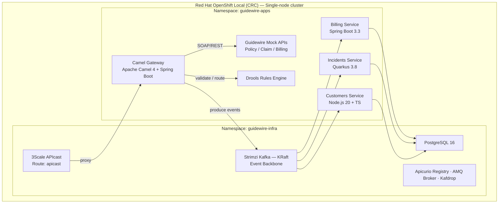

# Guidewire Integration POC

POC de arquitectura de integracion para **Guidewire InsuranceSuite**. Demuestra patrones SOA/MSA/EDA con API-First, contract-driven development y stack enterprise Red Hat sobre un laboratorio aislado con Red Hat OpenShift Local (CRC).

## Que hace cada componente

El sistema se compone de **5 microservicios** y **6 componentes de infraestructura**:

### Microservicios

| Componente | Para que sirve |
|-----------|----------------|
| **[Camel Gateway](openspecs/docs/components/camel-gateway/README.md)** | Hub de integracion. Recibe peticiones SOAP/REST de los sistemas Guidewire (PolicyCenter, ClaimCenter, BillingCenter), las transforma a eventos AVRO y las publica en Kafka. Aplica patrones EIP: Content-Based Router, Message Translator, Dead Letter Channel. |
| **[Drools Engine](openspecs/docs/components/drools-engine/README.md)** | Motor de reglas de negocio. Evalua fraude (riesgo por monto/frecuencia), valida polizas (limites y elegibilidad), calcula comisiones (por producto y canal) y asigna equipos a siniestros segun prioridad. |
| **[Billing Service](openspecs/docs/components/billing-service/README.md)** | Gestion de facturacion. Crea facturas desde eventos Kafka y gestiona su ciclo de vida (PENDING -> PROCESSING -> COMPLETED). Cada transicion emite un evento al bus. |
| **[Incidents Service](openspecs/docs/components/incidents-service/README.md)** | Gestion de siniestros. Registra incidencias desde eventos Kafka y las mueve por el flujo OPEN -> IN_PROGRESS -> RESOLVED -> CLOSED. Implementado en Quarkus como alternativa cloud-native a Spring Boot. |
| **[Customers Service](openspecs/docs/components/customers-service/README.md)** | Gestion de clientes. Servicio poliglota (Node.js/TypeScript) que demuestra interoperabilidad fuera del ecosistema JVM. Registra clientes y gestiona su estado (ACTIVE/INACTIVE/SUSPENDED/BLOCKED). |

### Infraestructura

| Componente | Para que sirve |
|-----------|----------------|
| **[Apache Kafka](openspecs/docs/infra/kafka/README.md)** | Bus de eventos central. 9 topics organizados por dominio con serializacion AVRO. Modo KRaft (sin ZooKeeper), gestionado por Strimzi. |
| **[PostgreSQL](openspecs/docs/infra/postgres/README.md)** | Base de datos relacional. 5 bases logicas aisladas (una por servicio) con el patron database-per-service. |
| **[Apicurio Registry](openspecs/docs/infra/apicurio/README.md)** | Registro de schemas. Gobierna la compatibilidad de los schemas AVRO, OpenAPI y AsyncAPI entre productores y consumidores. |
| **[ActiveMQ Artemis](openspecs/docs/infra/activemq/README.md)** | Broker JMS/AMQP. Complementa Kafka para patrones punto-a-punto y request/reply con sistemas legacy. |
| **[3Scale APIcast](openspecs/docs/infra/threescale/README.md)** | API Gateway empresarial. Autenticacion por API Key, rate limiting (100-200 req/min) y enrutamiento a backends. |
| **[Kafdrop](openspecs/docs/infra/kafka/README.md)** | UI web para inspeccion de topics, consumer groups y mensajes de Kafka. |

> Documentacion detallada de arquitectura, ADRs y flujos de datos: [openspecs/docs/architecture/README.md](openspecs/docs/architecture/README.md)

---

## Arquitectura



### Flujo de datos entre componentes


---

## Estructura del Proyecto

```
guidewire/
├── README.md                          ← Este archivo
├── guia-entrevista-integracion.md     ← Guía de preparación técnica
│
├── openspecs/                         ← Especificaciones (fuente de verdad)
│   ├── README.md
│   ├── spec-index.yml
│   ├── infra/                         ← Specs de infraestructura
│   ├── design/                        ← Specs de contratos API-First
│   ├── components/                    ← Specs de componentes
│   ├── integration/                   ← Specs de integración y testing
│   ├── devops/                        ← Specs de CI/CD
│   └── docs/                          ← Documentación por componente
│
├── contracts/                         ← Contratos API-First
│   ├── openapi/                       ← 6 specs OpenAPI 3.1
│   ├── asyncapi/                      ← 1 spec AsyncAPI 3.0
│   └── avro/                          ← 6 schemas AVRO
│
├── lab/                               ← Laboratorio
│   ├── openshift/                     ← Manifiestos OpenShift/CRC
│   │   ├── namespaces.yml
│   │   ├── operators/
│   │   ├── infra/
│   │   ├── apps/
│   │   └── deploy-all.sh
│   └── podman/                        ← Alternativa legacy (Podman Compose)
│       ├── podman-compose.yml
│       ├── .env
│       └── config/
│
└── components/                        ← Código fuente
    ├── camel-gateway/                 ← Java 21 + Spring Boot + Camel 4
    ├── drools-engine/                 ← Java 21 + Spring Boot + Drools 8
    ├── billing-service/               ← Java 21 + Spring Boot 3.3
    ├── incidents-service/             ← Java 21 + Quarkus 3.8
    └── customers-service/             ← Node.js 20 + TypeScript
```

---

## Documentación

### Especificaciones (OpenSpecs)

| Documento | Descripción |
|-----------|-------------|
| [Índice de Specs](openspecs/spec-index.yml) | Índice maestro con todos los módulos y orden de implementación |
| [OpenSpecs README](openspecs/README.md) | Guía completa del sistema de specs, tablas de estado y quick start |

### Infraestructura

| Componente | Spec | Documentación |
|-----------|------|---------------|
| PostgreSQL | [spec.yml](openspecs/infra/postgres/spec.yml) | [docs](openspecs/docs/infra/postgres/README.md) |
| Kafka (KRaft) | [spec.yml](openspecs/infra/kafka/spec.yml) | [docs](openspecs/docs/infra/kafka/README.md) |
| ActiveMQ Artemis | [spec.yml](openspecs/infra/activemq/spec.yml) | [docs](openspecs/docs/infra/activemq/README.md) |
| 3Scale API Gateway | [spec.yml](openspecs/infra/threescale/spec.yml) | [docs](openspecs/docs/infra/threescale/README.md) |
| Apicurio Registry | [spec.yml](openspecs/infra/apicurio/spec.yml) | [docs](openspecs/docs/infra/apicurio/README.md) |
| Lab Environment | [spec.yml](openspecs/infra/lab-environment/spec.yml) | [docs](openspecs/docs/infra/lab-environment/README.md) · [**INSTALL**](openspecs/docs/infra/lab-environment/INSTALL.md) |

### Contratos API-First

| Tipo | Recursos | Documentación |
|------|----------|---------------|
| OpenAPI 3.1 | [policycenter](contracts/openapi/policycenter-api.yml) · [claimcenter](contracts/openapi/claimcenter-api.yml) · [billingcenter](contracts/openapi/billingcenter-api.yml) · [billing-svc](contracts/openapi/billing-service-api.yml) · [incidents-svc](contracts/openapi/incidents-service-api.yml) · [customers-svc](contracts/openapi/customers-service-api.yml) | [docs](openspecs/docs/design/openapi/README.md) |
| AsyncAPI 3.0 | [guidewire-events](contracts/asyncapi/guidewire-events.yml) | [docs](openspecs/docs/design/asyncapi/README.md) |
| AVRO Schemas | [InvoiceCreated](contracts/avro/InvoiceCreated.avsc) · [InvoiceStatusChanged](contracts/avro/InvoiceStatusChanged.avsc) · [IncidentCreated](contracts/avro/IncidentCreated.avsc) · [IncidentStatusChanged](contracts/avro/IncidentStatusChanged.avsc) · [CustomerRegistered](contracts/avro/CustomerRegistered.avsc) · [CustomerStatusChanged](contracts/avro/CustomerStatusChanged.avsc) | [docs](openspecs/docs/design/avro/README.md) |

#### Specs de diseño (detalle de modelos y campos)

| Contrato | Spec |
|----------|------|
| PolicyCenter | [spec.yml](openspecs/design/openapi/guidewire-policycenter/spec.yml) |
| ClaimCenter | [spec.yml](openspecs/design/openapi/guidewire-claimcenter/spec.yml) |
| BillingCenter | [spec.yml](openspecs/design/openapi/guidewire-billingcenter/spec.yml) |
| Billing Service | [spec.yml](openspecs/design/openapi/billing-service/spec.yml) |
| Incidents Service | [spec.yml](openspecs/design/openapi/incidents-service/spec.yml) |
| Customers Service | [spec.yml](openspecs/design/openapi/customers-service/spec.yml) |
| Eventos Kafka (AsyncAPI) | [spec.yml](openspecs/design/asyncapi/guidewire-events/spec.yml) |
| AVRO — Billing Events | [spec.yml](openspecs/design/avro/billing-events/spec.yml) |
| AVRO — Incidents Events | [spec.yml](openspecs/design/avro/incidents-events/spec.yml) |
| AVRO — Customers Events | [spec.yml](openspecs/design/avro/customers-events/spec.yml) |

### Componentes

| Componente | Tech Stack | Spec | Documentación | Código |
|-----------|-----------|------|---------------|--------|
| Camel Gateway | Java 21 · Spring Boot 3.3 · Camel 4 | [spec.yml](openspecs/components/camel-gateway/spec.yml) | [docs](openspecs/docs/components/camel-gateway/README.md) | [src](components/camel-gateway/) |
| Drools Engine | Java 21 · Spring Boot 3.3 · Drools 8 | [spec.yml](openspecs/components/drools-engine/spec.yml) | [docs](openspecs/docs/components/drools-engine/README.md) | [src](components/drools-engine/) |
| Billing Service | Java 21 · Spring Boot 3.3 · JPA · Kafka | [spec.yml](openspecs/components/billing-service/spec.yml) | [docs](openspecs/docs/components/billing-service/README.md) | [src](components/billing-service/) |
| Incidents Service | Java 21 · Quarkus 3.8 · Panache · Kafka | [spec.yml](openspecs/components/incidents-service/spec.yml) | [docs](openspecs/docs/components/incidents-service/README.md) | [src](components/incidents-service/) |
| Customers Service | Node.js 20 · TypeScript · Prisma · KafkaJS | [spec.yml](openspecs/components/customers-service/spec.yml) | [docs](openspecs/docs/components/customers-service/README.md) | [src](components/customers-service/) |

### Integración y DevOps

| Módulo | Spec | Documentación |
|--------|------|---------------|
| 3Scale API Registration | [spec.yml](openspecs/integration/threescale-registration/spec.yml) | [docs](openspecs/docs/integration/README.md) |
| Postman E2E Tests | [spec.yml](openspecs/integration/postman-e2e/spec.yml) | [docs](openspecs/docs/integration/README.md) |
| CI/CD Pipeline | [spec.yml](openspecs/devops/ci-cd/spec.yml) | [docs](openspecs/docs/devops/README.md) |
| Arquitectura (ADRs) | [spec.yml](openspecs/docs/architecture/spec.yml) | — |

### Laboratorio

| Archivo | Descripción |
|---------|-------------|
| [deploy-all.sh](lab/openshift/deploy-all.sh) | Script de despliegue completo en CRC |
| [namespaces.yml](lab/openshift/namespaces.yml) | Namespaces: guidewire-infra, guidewire-apps |
| [operators/](lab/openshift/operators/) | Subscriptions: Strimzi, AMQ Broker, Apicurio |
| [infra/](lab/openshift/infra/) | Manifiestos de infraestructura |
| [apps/](lab/openshift/apps/) | Manifiestos de aplicaciones (BuildConfig + Deployment) |
| [podman-compose.yml](lab/podman/podman-compose.yml) | Alternativa legacy con Podman Compose |

---

## Quick Start

```bash
# 1. Instalar CRC (Red Hat OpenShift Local)
# Descargar desde: https://console.redhat.com/openshift/create/local
crc setup
crc start --cpus 8 --memory 20480 --disk-size 80

# 2. Configurar oc CLI
eval $(crc oc-env)
oc login -u developer -p developer https://api.crc.testing:6443

# 3. Desplegar el stack completo
cd lab/openshift
./deploy-all.sh

# 4. Verificar
oc get pods -n guidewire-infra
oc get pods -n guidewire-apps

# 5. Acceder desde tu navegador
#    oc get routes -n guidewire-infra
#    oc get routes -n guidewire-apps
```

---

## Routes (OpenShift)

| Servicio | Route | URL |
|----------|-------|-----|
| 3Scale API Gateway | apicast | https://apicast-guidewire-infra.apps-crc.testing |
| Apicurio Registry | apicurio | https://apicurio-guidewire-infra.apps-crc.testing |
| Kafdrop | kafdrop | https://kafdrop-guidewire-infra.apps-crc.testing |
| ActiveMQ Console | activemq-console | https://activemq-console-guidewire-infra.apps-crc.testing |
| Billing Service | billing-service | https://billing-service-guidewire-apps.apps-crc.testing |
| Camel Gateway | camel-gateway | https://camel-gateway-guidewire-apps.apps-crc.testing |
| Incidents Service | incidents-service | https://incidents-service-guidewire-apps.apps-crc.testing |
| Customers Service | customers-service | https://customers-service-guidewire-apps.apps-crc.testing |
| Drools KIE Server | drools-engine | https://drools-engine-guidewire-apps.apps-crc.testing |

---

## Stack Tecnológico

| Capa | Tecnología | Versión |
|------|-----------|---------|
| Plataforma | Red Hat OpenShift Local (CRC) | 4.x |
| Orquestación | Kubernetes / OpenShift | 4.x |
| API Gateway | Red Hat 3Scale (APIcast) | latest |
| Integración | Apache Camel | 4.4 |
| Event Streaming | Apache Kafka (KRaft) | 4.0 (Strimzi v0.50.0) |
| Mensajería JMS | Apache ActiveMQ Artemis | 2.33 |
| Reglas de Negocio | Drools / KIE Server | 8.x |
| Schema Registry | Apicurio Service Registry | 2.5 |
| Base de Datos | PostgreSQL | 16 |
| Runtime Java | Eclipse Temurin | 21 |
| Runtime Node.js | Node.js LTS | 20 |
| Frameworks | Spring Boot 3.3 · Quarkus 3.8 · Express 4 | — |
| Specs | OpenAPI 3.1 · AsyncAPI 3.0 · Apache AVRO | — |

---

## Metodología

**Spec-Driven Development con IA**: las especificaciones YAML en `openspecs/` son la fuente de verdad. El código, contratos y documentación se generan y validan contra ellas.

1. **Spec** → Define completamente cada componente
2. **Contracts** → OpenAPI, AsyncAPI, AVRO generados desde los specs
3. **Code** → Scaffolds generados desde contratos y specs
4. **Docs** → Documentación sincronizada con la implementación
5. **Test** → Postman E2E valida el flujo completo

---

## Issues

El proyecto se gestiona con [GitHub Issues](../../issues). Los 41 issues abiertos (#29-#69) definen cada tarea de implementación, organizados por fase:

| Fase | Issues | Descripción |
|------|--------|-------------|
| Infraestructura | [#29](../../issues/29)-[#34](../../issues/34) | Kafka, Apicurio, 3Scale, ActiveMQ, PostgreSQL, Docker Compose |
| Diseño | [#35](../../issues/35)-[#44](../../issues/44) | OpenAPI, AsyncAPI, AVRO |
| Camel Gateway | [#45](../../issues/45)-[#51](../../issues/51) | Rutas SOAP/REST, transformaciones, Kafka |
| Drools | [#52](../../issues/52)-[#53](../../issues/53) | Reglas de fraude, validaciones, comisiones |
| Microservicios | [#54](../../issues/54)-[#65](../../issues/65) | Billing, Incidents, Customers |
| Cross-cutting | [#66](../../issues/66)-[#69](../../issues/69) | 3Scale registration, Postman E2E, Docs, CI/CD |
