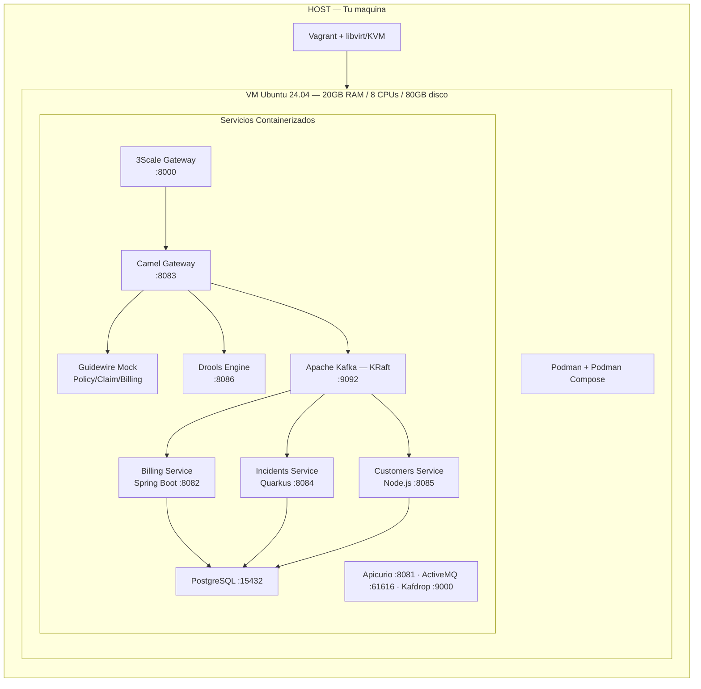

# Guidewire Integration POC — OpenSpecs

Especificaciones como fuente de verdad para el desarrollo Spec-Driven con IA del laboratorio de integración Guidewire.

---

## Arquitectura del Laboratorio



---

## Estructura del Proyecto

```
openspecs/
├── README.md                          ← Este archivo
├── spec-index.yml                     ← Índice maestro de specs
│
├── infra/                             ← Especificaciones de infraestructura
│   ├── kafka/spec.yml
│   ├── apicurio/spec.yml
│   ├── threescale/spec.yml
│   ├── activemq/spec.yml
│   ├── postgres/spec.yml
│   └── lab-environment/spec.yml
│
├── design/                            ← Contratos API-First
│   ├── openapi/
│   │   ├── guidewire-policycenter/spec.yml
│   │   ├── guidewire-claimcenter/spec.yml
│   │   ├── guidewire-billingcenter/spec.yml
│   │   ├── billing-service/spec.yml
│   │   ├── incidents-service/spec.yml
│   │   └── customers-service/spec.yml
│   ├── asyncapi/
│   │   └── guidewire-events/spec.yml
│   └── avro/
│       ├── billing-events/spec.yml
│       ├── incidents-events/spec.yml
│       └── customers-events/spec.yml
│
├── components/                        ← Componentes aplicativos
│   ├── camel-gateway/spec.yml
│   ├── drools-engine/spec.yml
│   ├── billing-service/spec.yml
│   ├── incidents-service/spec.yml
│   └── customers-service/spec.yml
│
├── integration/                       ← Testing y registro de APIs
│   ├── threescale-registration/spec.yml
│   └── postman-e2e/spec.yml
│
├── devops/                            ← CI/CD
│   └── ci-cd/spec.yml
│
└── docs/                             ← Documentación detallada
    ├── infra/
    │   ├── kafka/
    │   ├── apicurio/
    │   ├── threescale/
    │   ├── activemq/
    │   ├── postgres/
    │   └── lab-environment/
    ├── components/
    │   ├── camel-gateway/
    │   ├── drools-engine/
    │   ├── billing-service/
    │   ├── incidents-service/
    │   └── customers-service/
    ├── design/
    │   ├── openapi/
    │   ├── asyncapi/
    │   └── avro/
    ├── integration/
    └── devops/
```

---

## Specs por Módulo

### Infraestructura

| Componente | Spec | Documentación | Issue | Estado |
|-----------|------|---------------|-------|--------|
| PostgreSQL | [spec.yml](infra/postgres/spec.yml) | [docs/infra/postgres/](docs/infra/postgres/) | [#33](../../issues/33) | Pendiente |
| Kafka (AMQ Streams) | [spec.yml](infra/kafka/spec.yml) | [docs/infra/kafka/](docs/infra/kafka/) | [#29](../../issues/29) | Pendiente |
| ActiveMQ Artemis | [spec.yml](infra/activemq/spec.yml) | [docs/infra/activemq/](docs/infra/activemq/) | [#32](../../issues/32) | Pendiente |
| 3Scale API Gateway | [spec.yml](infra/threescale/spec.yml) | [docs/infra/threescale/](docs/infra/threescale/) | [#31](../../issues/31) | Pendiente |
| Apicurio Registry | [spec.yml](infra/apicurio/spec.yml) | [docs/infra/apicurio/](docs/infra/apicurio/) | [#30](../../issues/30) | Pendiente |
| Lab Environment | [spec.yml](infra/lab-environment/spec.yml) | [docs/infra/lab-environment/](docs/infra/lab-environment/) | [#34](../../issues/34) | Pendiente |

### Contratos API-First (Design)

#### OpenAPI — APIs REST

| Contrato | Spec | Documentación | Issue | Estado |
|----------|------|---------------|-------|--------|
| PolicyCenter (Guidewire) | [spec.yml](design/openapi/guidewire-policycenter/spec.yml) | [docs/design/openapi/](docs/design/openapi/) | [#35](../../issues/35) | Pendiente |
| ClaimCenter (Guidewire) | [spec.yml](design/openapi/guidewire-claimcenter/spec.yml) | [docs/design/openapi/](docs/design/openapi/) | [#36](../../issues/36) | Pendiente |
| BillingCenter (Guidewire) | [spec.yml](design/openapi/guidewire-billingcenter/spec.yml) | [docs/design/openapi/](docs/design/openapi/) | [#37](../../issues/37) | Pendiente |
| Billing Service | [spec.yml](design/openapi/billing-service/spec.yml) | [docs/design/openapi/](docs/design/openapi/) | [#42](../../issues/42) | Pendiente |
| Incidents Service | [spec.yml](design/openapi/incidents-service/spec.yml) | [docs/design/openapi/](docs/design/openapi/) | [#43](../../issues/43) | Pendiente |
| Customers Service | [spec.yml](design/openapi/customers-service/spec.yml) | [docs/design/openapi/](docs/design/openapi/) | [#44](../../issues/44) | Pendiente |

#### AsyncAPI — Eventos

| Contrato | Spec | Documentación | Issue | Estado |
|----------|------|---------------|-------|--------|
| Guidewire Events | [spec.yml](design/asyncapi/guidewire-events/spec.yml) | [docs/design/asyncapi/](docs/design/asyncapi/) | [#38](../../issues/38) | Pendiente |

#### AVRO — Schemas de Eventos

| Schema | Spec | Documentación | Issue | Estado |
|--------|------|---------------|-------|--------|
| Billing Events | [spec.yml](design/avro/billing-events/spec.yml) | [docs/design/avro/](docs/design/avro/) | [#39](../../issues/39) | Pendiente |
| Incidents Events | [spec.yml](design/avro/incidents-events/spec.yml) | [docs/design/avro/](docs/design/avro/) | [#40](../../issues/40) | Pendiente |
| Customers Events | [spec.yml](design/avro/customers-events/spec.yml) | [docs/design/avro/](docs/design/avro/) | [#41](../../issues/41) | Pendiente |

### Componentes Aplicativos

| Componente | Tech | Spec | Documentación | Issues | Estado |
|-----------|------|------|---------------|--------|--------|
| Camel Gateway | Java 21 + Spring Boot + Camel 4 | [spec.yml](components/camel-gateway/spec.yml) | [docs/components/camel-gateway/](docs/components/camel-gateway/) | [#45-#51](../../issues/45) | Pendiente |
| Drools Engine | Java 21 + Drools 8 + KIE Server | [spec.yml](components/drools-engine/spec.yml) | [docs/components/drools-engine/](docs/components/drools-engine/) | [#52-#53](../../issues/52) | Pendiente |
| Billing Service | Java 21 + Spring Boot 3.3 | [spec.yml](components/billing-service/spec.yml) | [docs/components/billing-service/](docs/components/billing-service/) | [#54-#57](../../issues/54) | Pendiente |
| Incidents Service | Java 21 + Quarkus 3.8 | [spec.yml](components/incidents-service/spec.yml) | [docs/components/incidents-service/](docs/components/incidents-service/) | [#58-#61](../../issues/58) | Pendiente |
| Customers Service | Node.js 20 + TypeScript + Express | [spec.yml](components/customers-service/spec.yml) | [docs/components/customers-service/](docs/components/customers-service/) | [#62-#65](../../issues/62) | Pendiente |

### Integración y Cross-Cutting

| Módulo | Spec | Documentación | Issue | Estado |
|--------|------|---------------|-------|--------|
| 3Scale Registration | [spec.yml](integration/threescale-registration/spec.yml) | [docs/integration/](docs/integration/) | [#66](../../issues/66) | Pendiente |
| Postman E2E Tests | [spec.yml](integration/postman-e2e/spec.yml) | [docs/integration/](docs/integration/) | [#67](../../issues/67) | Pendiente |
| CI/CD Pipeline | [spec.yml](devops/ci-cd/spec.yml) | [docs/devops/](docs/devops/) | [#69](../../issues/69) | Pendiente |

---

## Orden de Implementación

El desarrollo sigue un orden estricto basado en dependencias:

```
Fase 1: Infraestructura         Fase 2: Contratos            Fase 3: Componentes
─────────────────────           ──────────────────           ────────────────────
PostgreSQL ──────────┐          AVRO Schemas ─────┐          Camel Gateway
Kafka ───────────────┤          OpenAPI Specs ─────┤          Drools Engine
ActiveMQ ────────────┤──→       AsyncAPI Spec ─────┤──→       Billing Service
3Scale ──────────────┤                             │          Incidents Service
Apicurio ────────────┤                             │          Customers Service
Lab Environment ─────┘                             │
                                                   │
                                    Fase 4: Integración       Fase 5: DevOps
                                    ────────────────────      ──────────────
                                    3Scale Registration       CI/CD Pipeline
                                    Postman E2E Tests         Documentación
```

---

## Metodología: Spec-Driven Development con IA

1. **Spec es la fuente de verdad** — Cada `spec.yml` define completamente un componente
2. **IA genera desde specs** — El código se genera y valida contra las especificaciones
3. **Docs se actualizan al implementar** — Cada carpeta en `docs/` se documenta al completar el componente
4. **Issues vinculados** — Cada spec referencia su issue de GitHub para trazabilidad
5. **Estado centralizado** — Este README refleja el progreso global del proyecto

---

## Quick Start

```bash
# 1. Solo necesitas esto en tu máquina:
sudo apt install vagrant qemu-kvm libvirt-daemon-system virt-manager
vagrant plugin install vagrant-libvirt

# 2. Clonar y levantar:
git clone <repo-url>
cd lab-guidewire
vagrant up          # Crea VM, instala Podman, baja imágenes

# 3. Entrar a la VM y levantar servicios:
vagrant ssh
cd ~/lab-guidewire/podman
podman-compose up -d

# 4. Verificar:
podman-compose ps   # Todos los servicios corriendo

# 5. Acceder desde tu navegador:
# http://localhost:8081  → Apicurio Registry
# http://localhost:9000  → Kafdrop (Kafka UI)
# http://localhost:8161  → ActiveMQ Console
# http://localhost:8000  → 3Scale Gateway

# 6. Apagar todo:
podman-compose down  # Detiene contenedores
exit                 # Sale de la VM
vagrant halt         # Apaga la VM
```

---

## Puertos del Laboratorio

| Puerto | Servicio | URL |
|--------|----------|-----|
| 8000 | 3Scale API Gateway | http://localhost:8000 |
| 8001 | 3Scale Management | http://localhost:8001 |
| 8081 | Apicurio Registry UI | http://localhost:8081 |
| 8082 | Billing Service | http://localhost:8082/api/v1/invoices |
| 8083 | Camel Gateway | http://localhost:8083/api/v1 |
| 8084 | Incidents Service | http://localhost:8084/api/v1/incidents |
| 8085 | Customers Service | http://localhost:8085/api/v1/customers |
| 8086 | Drools KIE Server | http://localhost:8086 |
| 8161 | ActiveMQ Console | http://localhost:8161/console |
| 9000 | Kafdrop UI | http://localhost:9000 |
| 9092 | Kafka Broker | localhost:9092 |
| 15432 | PostgreSQL | localhost:15432 |
| 61616 | ActiveMQ AMQP/JMS | localhost:61616 |

---

## Stack Tecnológico

| Capa | Tecnología | Versión |
|------|-----------|---------|
| Virtualización | Vagrant + libvirt/KVM | 2.4+ |
| Contenedores | Podman + Podman Compose | 4.9+ |
| API Gateway | Red Hat 3Scale (APIcast) | 3.11 |
| Integración | Apache Camel | 4.x |
| Event Streaming | Apache Kafka (KRaft) | 3.7 |
| Mensajería | Apache ActiveMQ Artemis | 2.33 |
| Reglas de Negocio | Drools / KIE Server | 8.x |
| Schema Registry | Apicurio Service Registry | 2.5 |
| Base de Datos | PostgreSQL | 16 |
| Specs | OpenAPI 3.1, AsyncAPI 3.0, AVRO | - |
