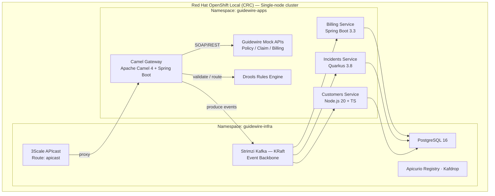
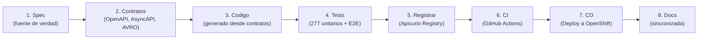

# Guidewire Integration POC — OpenSpecs

> [Volver al README principal](../README.md)

Especificaciones como fuente de verdad para el desarrollo Spec-Driven con IA del laboratorio de integracion Guidewire.

---

## Navegacion rapida

| Seccion | Descripcion |
|---------|-------------|
| [Arquitectura](docs/architecture/README.md) | Diagramas, ADRs, flujos de datos |
| [Infraestructura](#infraestructura) | Kafka, PostgreSQL, Apicurio, 3Scale |
| [Contratos API-First](#contratos-api-first-design) | OpenAPI, AsyncAPI, AVRO |
| [Componentes](#componentes-aplicativos) | 5 microservicios |
| [Integracion y DevOps](#integracion-y-cross-cutting) | CI/CD, E2E, 3Scale |
| [Resoluciones](docs/resolutions/README.md) | Guias paso a paso para issues |

---

## Arquitectura del Laboratorio



---

## Estructura del Proyecto

```
openspecs/
├── README.md                          ← Este archivo (indice central de specs)
├── spec-index.yml                     ← Indice maestro de specs
│
├── infra/                             ← Especificaciones de infraestructura
│   ├── kafka/spec.yml
│   ├── apicurio/spec.yml
│   ├── threescale/spec.yml
│   ├── postgres/spec.yml
│   └── lab-environment/spec.yml
│
├── design/                            ← Contratos API-First
│   ├── openapi/
│   │   ├── guidewire-policycenter/spec.yml
│   │   ├── guidewire-claimcenter/spec.yml
│   │   ├── guidewire-billingcenter/spec.yml
│   │   ├── billing-service/spec.yml
│   │   ├── incidents-service/spec.yml
│   │   └── customers-service/spec.yml
│   ├── asyncapi/
│   │   └── guidewire-events/spec.yml
│   └── avro/
│       ├── billing-events/spec.yml
│       ├── incidents-events/spec.yml
│       └── customers-events/spec.yml
│
├── components/                        ← Componentes aplicativos
│   ├── camel-gateway/spec.yml
│   ├── drools-engine/spec.yml
│   ├── billing-service/spec.yml
│   ├── incidents-service/spec.yml
│   └── customers-service/spec.yml
│
├── integration/                       ← Testing y registro de APIs
│   ├── threescale-registration/spec.yml
│   └── postman-e2e/spec.yml
│
├── devops/                            ← CI/CD
│   └── ci-cd/spec.yml
│
└── docs/                             ← Documentacion detallada
    ├── architecture/                  ← ADRs, diagramas, flujos
    ├── infra/                         ← Kafka, Apicurio, 3Scale, PostgreSQL, Lab
    ├── components/                    ← 5 microservicios
    ├── design/                        ← OpenAPI, AsyncAPI, AVRO
    ├── integration/                   ← E2E, 3Scale registration
    ├── devops/                        ← CI/CD pipelines
    └── resolutions/                   ← Guias de resolucion de issues
```

---

## Specs por Modulo

### Infraestructura

| Componente | Spec | Documentacion | Issue |
|-----------|------|---------------|-------|
| PostgreSQL | [spec.yml](infra/postgres/spec.yml) | [docs](docs/infra/postgres/README.md) | [#33](../../issues/33) |
| Kafka (Strimzi KRaft) | [spec.yml](infra/kafka/spec.yml) | [docs](docs/infra/kafka/README.md) | [#29](../../issues/29) |
| 3Scale API Gateway | [spec.yml](infra/threescale/spec.yml) | [docs](docs/infra/threescale/README.md) | [#31](../../issues/31) |
| Apicurio Registry | [spec.yml](infra/apicurio/spec.yml) | [docs](docs/infra/apicurio/README.md) | [#30](../../issues/30) |
| Entorno Lab (CRC) | [spec.yml](infra/lab-environment/spec.yml) | [docs](docs/infra/lab-environment/README.md) · [INSTALL](docs/infra/lab-environment/INSTALL.md) | [#34](../../issues/34) |

### Contratos API-First (Design)

#### OpenAPI — APIs REST

| Contrato | Spec | Documentacion | Issue |
|----------|------|---------------|-------|
| PolicyCenter (Guidewire) | [spec.yml](design/openapi/guidewire-policycenter/spec.yml) | [docs](docs/design/openapi/README.md) | [#35](../../issues/35) |
| ClaimCenter (Guidewire) | [spec.yml](design/openapi/guidewire-claimcenter/spec.yml) | [docs](docs/design/openapi/README.md) | [#36](../../issues/36) |
| BillingCenter (Guidewire) | [spec.yml](design/openapi/guidewire-billingcenter/spec.yml) | [docs](docs/design/openapi/README.md) | [#37](../../issues/37) |
| Billing Service | [spec.yml](design/openapi/billing-service/spec.yml) | [docs](docs/design/openapi/README.md) | [#42](../../issues/42) |
| Incidents Service | [spec.yml](design/openapi/incidents-service/spec.yml) | [docs](docs/design/openapi/README.md) | [#43](../../issues/43) |
| Customers Service | [spec.yml](design/openapi/customers-service/spec.yml) | [docs](docs/design/openapi/README.md) | [#44](../../issues/44) |

#### AsyncAPI — Eventos Kafka

| Contrato | Spec | Documentacion | Issue |
|----------|------|---------------|-------|
| Guidewire Events | [spec.yml](design/asyncapi/guidewire-events/spec.yml) | [docs](docs/design/asyncapi/README.md) | [#38](../../issues/38) |

#### AVRO — Schemas de Eventos

| Schema | Spec | Documentacion | Issue |
|--------|------|---------------|-------|
| Billing Events | [spec.yml](design/avro/billing-events/spec.yml) | [docs](docs/design/avro/README.md) | [#39](../../issues/39) |
| Incidents Events | [spec.yml](design/avro/incidents-events/spec.yml) | [docs](docs/design/avro/README.md) | [#40](../../issues/40) |
| Customers Events | [spec.yml](design/avro/customers-events/spec.yml) | [docs](docs/design/avro/README.md) | [#41](../../issues/41) |

### Componentes Aplicativos

| Componente | Tech | Spec | Documentacion | Issues |
|-----------|------|------|---------------|--------|
| Camel Gateway | Java 21 + Spring Boot + Camel 4 | [spec.yml](components/camel-gateway/spec.yml) | [docs](docs/components/camel-gateway/README.md) | [#45-#51](../../issues/45) |
| Drools Engine | Java 21 + Drools 8 | [spec.yml](components/drools-engine/spec.yml) | [docs](docs/components/drools-engine/README.md) | [#52-#53](../../issues/52) |
| Billing Service | Java 21 + Spring Boot 3.3 | [spec.yml](components/billing-service/spec.yml) | [docs](docs/components/billing-service/README.md) | [#54-#57](../../issues/54) |
| Incidents Service | Java 21 + Quarkus 3.8 | [spec.yml](components/incidents-service/spec.yml) | [docs](docs/components/incidents-service/README.md) | [#58-#61](../../issues/58) |
| Customers Service | Node.js 20 + TypeScript + Express | [spec.yml](components/customers-service/spec.yml) | [docs](docs/components/customers-service/README.md) | [#62-#65](../../issues/62) |

### Integracion y Cross-Cutting

| Modulo | Spec | Documentacion | Issue |
|--------|------|---------------|-------|
| 3Scale Registration | [spec.yml](integration/threescale-registration/spec.yml) | [docs](docs/integration/README.md) | [#66](../../issues/66) |
| Postman E2E Tests | [spec.yml](integration/postman-e2e/spec.yml) | [docs](docs/integration/README.md) | [#67](../../issues/67) |
| CI/CD Pipeline | [spec.yml](devops/ci-cd/spec.yml) | [docs](docs/devops/README.md) | [#69](../../issues/69) |

---

## Orden de Implementacion

```mermaid
graph LR
    subgraph Fase1["Fase 1: Infraestructura"]
        PG["PostgreSQL"]
        KF["Kafka"]
        TS["3Scale"]
        AP["Apicurio"]
        LAB["Lab Environment"]
    end

    subgraph Fase2["Fase 2: Contratos"]
        AVRO["AVRO Schemas"]
        OAPI["OpenAPI Specs"]
        AAPI["AsyncAPI Spec"]
    end

    subgraph Fase3["Fase 3: Componentes"]
        CG["Camel Gateway"]
        DR["Drools Engine"]
        BS["Billing Service"]
        IS["Incidents Service"]
        CS["Customers Service"]
    end

    subgraph Fase4["Fase 4: Integracion"]
        TSR["3Scale Registration"]
        E2E["Postman E2E Tests"]
    end

    subgraph Fase5["Fase 5: DevOps"]
        CICD["CI/CD Pipeline"]
        DOCS["Documentacion"]
    end

    Fase1 --> Fase2 --> Fase3 --> Fase4 --> Fase5
```



---

## Metodologia: Spec-Driven Development con IA



1. **Spec es la fuente de verdad** — Cada `spec.yml` define completamente un componente
2. **Contratos primero** — OpenAPI, AsyncAPI y AVRO se definen antes de implementar
3. **Codigo generado** — Interfaces y tipos se regeneran en cada build (contract-first)
4. **Tests automaticos** — 277 tests unitarios + E2E con Postman/Newman
5. **Registro de contratos** — 15 contratos registrados automaticamente en Apicurio Registry
6. **CI valida** — Build, tests, linting de contratos y seguridad en cada push
7. **CD despliega** — Deploy automatico a OpenShift con image tagging por git SHA
8. **Docs sincronizadas** — Issues vinculados, estado centralizado en este README

---

## Routes del Laboratorio (OpenShift)

| Servicio | Route |
|----------|-------|
| OpenShift Console | `https://console-openshift-console.apps-crc.testing` |
| 3Scale API Gateway | `https://apicast-guidewire-infra.apps-crc.testing` |
| Apicurio Registry UI | `https://apicurio-guidewire-infra.apps-crc.testing` |
| Kafdrop UI | `https://kafdrop-guidewire-infra.apps-crc.testing` |
| Billing Service | `https://billing-service-guidewire-apps.apps-crc.testing/api/v1/invoices` |
| Camel Gateway | `https://camel-gateway-guidewire-apps.apps-crc.testing/api/v1` |
| Incidents Service | `https://incidents-service-guidewire-apps.apps-crc.testing/api/v1/incidents` |
| Customers Service | `https://customers-service-guidewire-apps.apps-crc.testing/api/v1/customers` |
| Drools Engine | `https://drools-engine-guidewire-apps.apps-crc.testing/api/v1/rules` |

> **Nota:** Dentro del cluster, los servicios se comunican via DNS interno:
> `<service>.guidewire-infra.svc.cluster.local` / `<service>.guidewire-apps.svc.cluster.local`

---

## Stack Tecnologico

| Capa | Tecnologia | Version |
|------|-----------|---------|
| Plataforma | Red Hat OpenShift Local (CRC) | 4.x |
| Orquestacion | Kubernetes / OpenShift | 4.x |
| API Gateway | Red Hat 3Scale (APIcast) | latest |
| Integracion | Apache Camel | 4.4 |
| Event Streaming | Apache Kafka (KRaft) | 4.0 (Strimzi v0.50.0) |
| Reglas de Negocio | Drools | 8.x |
| Schema Registry | Apicurio Service Registry | 2.5 |
| Base de Datos | PostgreSQL | 16 |
| Runtime Java | Eclipse Temurin | 21 |
| Runtime Node.js | Node.js LTS | 20 |
| Frameworks | Spring Boot 3.3 · Quarkus 3.8 · Express 4 | — |
| Specs | OpenAPI 3.1 · AsyncAPI 3.0 · Apache AVRO | — |

---

## Quick Start

```bash
# 1. Instalar CRC (Red Hat OpenShift Local)
# Descargar desde: https://console.redhat.com/openshift/create/local
crc setup
crc start --cpus 8 --memory 20480 --disk-size 80

# 2. Configurar oc CLI
eval $(crc oc-env)
oc login -u developer -p developer https://api.crc.testing:6443

# 3. Desplegar el stack completo
cd lab/openshift
./deploy-all.sh

# 4. Verificar
oc get pods -n guidewire-infra
oc get pods -n guidewire-apps
```

> Para mas detalle: [INSTALL.md](docs/infra/lab-environment/INSTALL.md) · [UNINSTALL.md](../lab/openshift/UNINSTALL.md)
