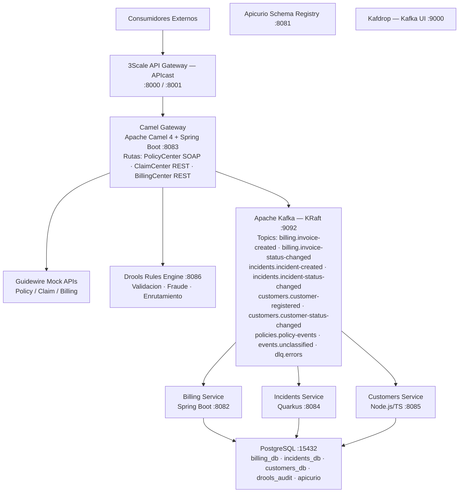
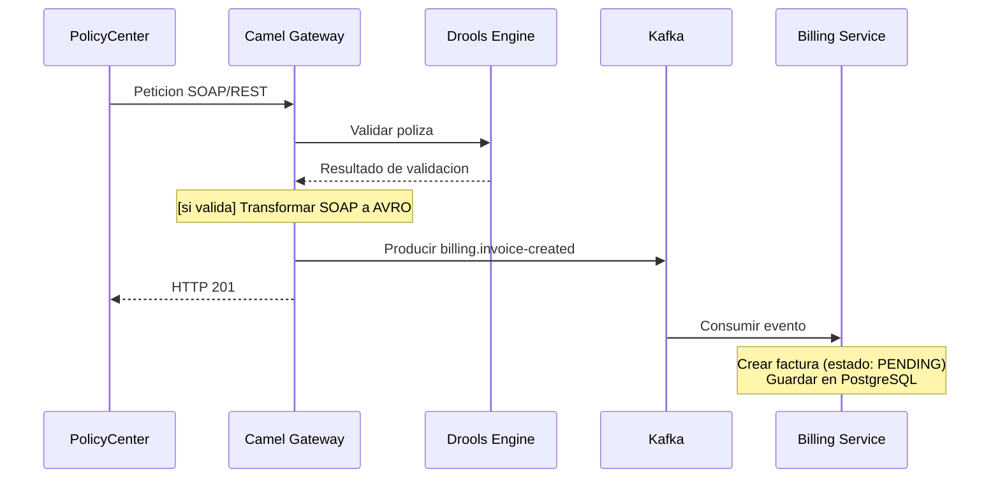
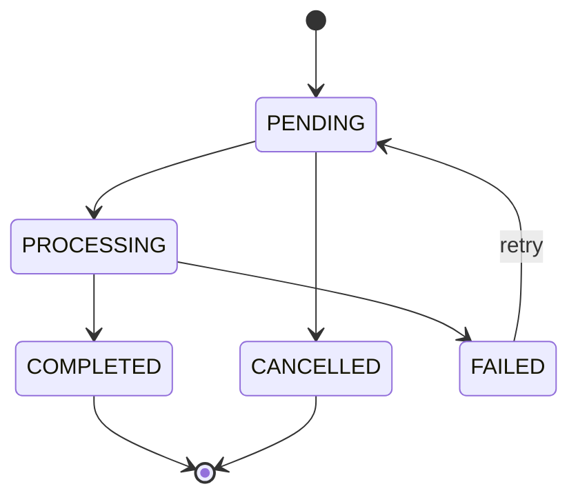
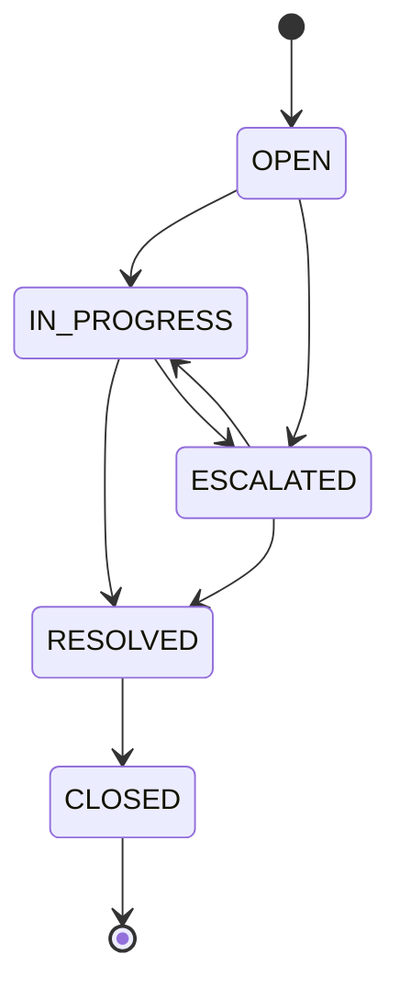
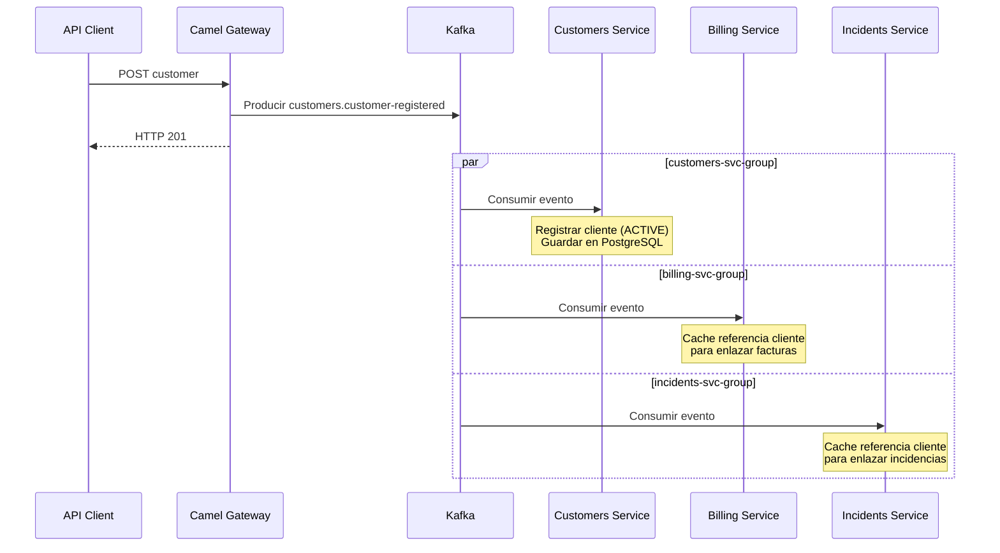
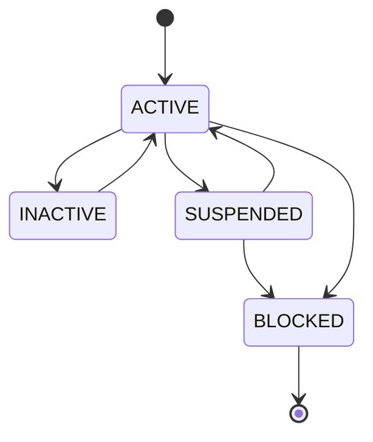

# Documentacion de Arquitectura

> [Volver a OpenSpecs](../../README.md) · [Volver al README principal](../../../README.md)

Referencia arquitectonica de la plataforma de integracion Guidewire.

---

## Tabla de Contenidos

1. [Vision General](#vision-general)
2. [Diagrama de Componentes](#diagrama-de-componentes)
3. [Componentes del Sistema](#componentes-del-sistema)
4. [Flujos de Datos](#flujos-de-datos)
5. [Decisiones de Arquitectura (ADRs)](#decisiones-de-arquitectura-adrs)
6. [Stack Tecnologico](#stack-tecnologico)

---

## Vision General

Este POC demuestra patrones de integracion para **Guidewire InsuranceSuite** (PolicyCenter, ClaimCenter, BillingCenter) usando una arquitectura de microservicios poliglota con comunicacion orientada a eventos.

Principios arquitectonicos:

- **API-First / Contract-Driven**: Todas las interfaces definidas via OpenAPI 3.1, AsyncAPI 3.0 y schemas AVRO antes de implementar
- **Arquitectura Orientada a Eventos (EDA)**: Apache Kafka como backbone de eventos para comunicacion asincrona y desacoplada
- **Microservicios Poliglota**: Cada servicio elige la tecnologia optima para su dominio
- **Infraestructura como Codigo**: Entorno reproducible via Red Hat OpenShift Local (CRC) + manifiestos Kubernetes

---

## Diagrama de Componentes

---

## Componentes del Sistema

El POC se compone de **5 servicios de aplicacion** y **5 componentes de infraestructura**, desplegados en dos namespaces separados de OpenShift.

### Servicios de Aplicacion (namespace: guidewire-apps)

#### [Camel Gateway](../components/camel-gateway/README.md) — Hub de Integracion

Punto de entrada al ecosistema. Apache Camel 4 actua como mediador de protocolos entre los sistemas Guidewire (SOAP/REST) y la arquitectura interna basada en eventos. Implementa los Enterprise Integration Patterns (EIP): Content-Based Router, Message Translator, Dead Letter Channel y Wire Tap. Expone endpoints CXF para PolicyCenter, ClaimCenter y BillingCenter, transforma los mensajes a formato AVRO y los publica en los topics Kafka correspondientes.

- **Stack**: Java 21, Spring Boot 3.3, Apache Camel 4.4
- **Puerto**: 8083
- **Codigo**: [`components/camel-gateway/`](../../../components/camel-gateway/)

#### [Drools Engine](../components/drools-engine/README.md) — Motor de Reglas de Negocio

Centraliza las reglas de negocio del dominio asegurador en archivos DRL declarativos. Expone 4 conjuntos de reglas via REST: deteccion de fraude, validacion de polizas, calculo de comisiones y enrutamiento de siniestros. Cada evaluacion se registra en una base de datos de auditoria.

- **Stack**: Java 21, Spring Boot 3.3, Drools 8
- **Puerto**: 8086
- **Codigo**: [`components/drools-engine/`](../../../components/drools-engine/)

#### [Billing Service](../components/billing-service/README.md) — Gestion de Facturacion

Microservicio de facturacion que gestiona el ciclo de vida completo de las facturas. Las facturas se crean desde eventos Kafka y progresan a traves de una maquina de estados (PENDING -> PROCESSING -> COMPLETED/FAILED/CANCELLED). Cada transicion publica un evento AVRO.

- **Stack**: Java 21, Spring Boot 3.3, JPA/Hibernate, Spring Kafka
- **Puerto**: 8082
- **Codigo**: [`components/billing-service/`](../../../components/billing-service/)

#### [Incidents Service](../components/incidents-service/README.md) — Gestion de Siniestros

Microservicio cloud-native para incidencias/siniestros. Demuestra Quarkus como alternativa a Spring Boot, con Panache ORM y SmallRye Reactive Messaging para Kafka. Los siniestros siguen el ciclo OPEN -> IN_PROGRESS -> RESOLVED -> CLOSED.

- **Stack**: Java 21, Quarkus 3.8, Hibernate Panache, SmallRye Reactive Messaging
- **Puerto**: 8084
- **Codigo**: [`components/incidents-service/`](../../../components/incidents-service/)

#### [Customers Service](../components/customers-service/README.md) — Gestion de Clientes

Microservicio poliglota que demuestra interoperabilidad fuera del ecosistema JVM. Gestiona el registro y ciclo de vida de clientes (ACTIVE/INACTIVE/SUSPENDED/BLOCKED). Usa Prisma como ORM y KafkaJS para eventos.

- **Stack**: Node.js 20, TypeScript, Express 4, Prisma ORM, KafkaJS
- **Puerto**: 8085
- **Codigo**: [`components/customers-service/`](../../../components/customers-service/)

### Infraestructura (namespace: guidewire-infra)

#### [Apache Kafka](../infra/kafka/README.md) — Backbone de Eventos

Bus de eventos central. Opera en modo KRaft (sin ZooKeeper) gestionado por Strimzi. 9 topics organizados por dominio con serializacion AVRO. Retencion de 7 dias por defecto.

- **Stack**: Apache Kafka 4.0 (Strimzi v0.50.0, KafkaNodePool CRD)
- **Puerto**: 9092

#### [PostgreSQL](../infra/postgres/README.md) — Base de Datos Relacional

Instancia compartida que implementa el patron database-per-service a nivel logico. 5 bases de datos aisladas (billing, incidents, customers, drools_audit, apicurio).

- **Stack**: PostgreSQL 16 Alpine
- **Puerto**: 5432 (interno), 15432 (expuesto)

#### [Apicurio Schema Registry](../infra/apicurio/README.md) — Gobernanza de Schemas

Registro centralizado de schemas que garantiza la compatibilidad de los contratos de eventos. Almacena 6 schemas AVRO, 8 specs OpenAPI y 1 spec AsyncAPI. Aplica compatibilidad FULL.

- **Stack**: Apicurio Service Registry 2.5.11 (backend PostgreSQL)
- **Puerto**: 8081

#### [3Scale API Gateway](../infra/threescale/README.md) — Gestion de APIs

Gateway empresarial que protege todos los endpoints publicos. Autenticacion por API Key, rate limiting diferenciado (100-200 req/min) y enrutamiento a backends.

- **Stack**: Red Hat 3Scale APIcast
- **Puerto**: 8000 (proxy), 8001 (management)

#### [Kafdrop](../infra/kafka/README.md#monitoreo--kafdrop) — UI de Kafka

Interfaz web para inspeccion de topics, consumer groups y mensajes de Kafka.

- **Stack**: Kafdrop 4.0.1
- **Puerto**: 9000

---

## Flujos de Datos

### Flujo 1: Creacion de Poliza y Facturacion

#### Maquina de Estados — Facturas

### Flujo 2: Procesamiento de Siniestros

#### Maquina de Estados — Incidencias

### Flujo 3: Registro de Cliente (Cross-Domain)

#### Maquina de Estados — Clientes

---

## Decisiones de Arquitectura (ADRs)

### ADR-001: Desarrollo API-First / Contract-Driven

**Estado**: Aceptada

**Contexto**: La integracion entre Guidewire InsuranceSuite y los microservicios internos requiere interfaces bien definidas. Los equipos necesitan contratos estables para desarrollar en paralelo sin acoplamiento.

**Decision**: Adoptar desarrollo API-First donde todas las interfaces (APIs REST, eventos asincronos, schemas de datos) se definen como contratos legibles por maquina (OpenAPI 3.1, AsyncAPI 3.0, Apache AVRO) antes de cualquier implementacion.

**Consecuencias**:
- Positivo: Desarrollo paralelo posible desde el dia uno
- Positivo: Validacion de contratos automatizable en CI/CD (Spectral, AsyncAPI CLI)
- Positivo: Generacion de codigo desde contratos reduce boilerplate y drift
- Positivo: Apicurio Schema Registry aplica compatibilidad AVRO en runtime
- Negativo: Mayor esfuerzo de diseno inicial
- Negativo: Cambios de contrato requieren coordinacion entre equipos

---

### ADR-002: Red Hat OpenShift Local (CRC) en lugar de Vagrant + Podman Compose

**Estado**: Aceptada (reemplaza ADR-002 original: Podman sobre Docker)

**Contexto**: El POC necesita un entorno local que replique produccion con OpenShift. El enfoque original con Vagrant + Podman Compose no ejercitaba primitivas Kubernetes/OpenShift (Operators, Routes, Services, BuildConfigs).

**Decision**: Usar Red Hat OpenShift Local (CRC) como plataforma de desarrollo local.

**Consecuencias**:
- Positivo: Entorno real OpenShift (Operators, Routes, RBAC, SCC)
- Positivo: Strimzi y Apicurio via OLM gestionan el ciclo de vida de infraestructura
- Positivo: Service discovery cross-namespace via DNS Kubernetes
- Positivo: BuildConfig + ImageStream proporcionan pipeline nativo de builds
- Negativo: CRC requiere cuenta Red Hat gratuita para el pull secret
- Negativo: Baseline de recursos alto (~9GB RAM minimo para CRC)

---

### ADR-003: Apache Kafka como backbone de eventos

**Estado**: Aceptada

**Contexto**: El sistema necesita un backbone de eventos para comunicacion asincrona entre el Camel Gateway y los microservicios downstream. Los eventos representan cambios de estado de dominio que pueden necesitar replay, auditoria y patrones multi-consumidor.

**Decision**: Usar Apache Kafka en modo KRaft (sin ZooKeeper) con serializacion AVRO y Apicurio Schema Registry para gobernanza de schemas. Guidewire Cloud Platform usa Kafka nativamente (Application Events Service, Integration Gateway, Data Platform), por lo que Kafka es la eleccion natural.

**Consecuencias**:
- Positivo: Log de eventos durable, ordenado y replayable
- Positivo: Multiples consumer groups consumen los mismos eventos independientemente (fan-out)
- Positivo: KRaft elimina la dependencia de ZooKeeper
- Positivo: AVRO + Schema Registry habilita evolucion de schemas con compatibilidad
- Negativo: Mayor complejidad operacional que alternativas simples de pub/sub
- Negativo: Serializacion AVRO anade complejidad vs JSON plano

---

### ADR-004: Microservicios Poliglota

**Estado**: Aceptada

**Contexto**: El POC debe demostrar que los microservicios pueden usar diferentes stacks tecnologicos manteniendo interoperabilidad a traves de contratos bien definidos.

**Decision**: Implementar microservicios con tres stacks diferentes:
- **Billing Service**: Java 21 + Spring Boot 3.3 (framework enterprise mainstream)
- **Incidents Service**: Java 21 + Quarkus 3.8 (cloud-native, arranque rapido, bajo consumo)
- **Customers Service**: Node.js 20 + TypeScript + Express (alternativa no-JVM)
- **Camel Gateway**: Java 21 + Spring Boot 3.3 + Apache Camel 4 (patrones de integracion)
- **Drools Engine**: Java 21 + Spring Boot 3.3 + Drools 8 (reglas de negocio)

**Consecuencias**:
- Positivo: Demuestra independencia real de microservicios
- Positivo: Prueba que los contratos API-First habilitan heterogeneidad tecnologica
- Positivo: Node.js demuestra que servicios no-JVM se integran via Kafka + REST
- Negativo: Se requiere un conjunto mas amplio de habilidades
- Negativo: Cada servicio tiene su propio pipeline de build y gestion de dependencias

---

### ADR-005: AVRO para serializacion de eventos

**Estado**: Aceptada

**Contexto**: Los eventos Kafka necesitan un formato de serializacion que soporte evolucion de schemas, sea compacto en la red e integre bien con Apicurio.

**Decision**: Usar Apache AVRO como formato de serializacion para todos los eventos Kafka. Los schemas se almacenan en `contracts/avro/` y se registran en Apicurio.

**Consecuencias**:
- Positivo: AVRO es el estandar de facto en el ecosistema Kafka
- Positivo: Soporte nativo en Apicurio (validacion de compatibilidad, versionado)
- Positivo: Codificacion binaria compacta y eficiente
- Negativo: Schemas AVRO son mas verbosos que definiciones Protobuf
- Negativo: Schema registry se convierte en dependencia critica de infraestructura

---

### ADR-006: 3Scale API Gateway

**Estado**: Aceptada

**Contexto**: El POC necesita un API Gateway para rate limiting, autenticacion y gestion de APIs. El entorno objetivo usa middleware Red Hat.

**Decision**: Usar Red Hat 3Scale (APIcast) como API Gateway, configurado declarativamente via JSON.

**Consecuencias**:
- Positivo: Alineacion con el stack enterprise Red Hat (OpenShift, Fuse, AMQ)
- Positivo: APIcast soporta configuracion declarativa (sin base de datos para POC)
- Positivo: Funcionalidades de gestion de APIs enterprise (rate limiting, analytics)
- Negativo: Footprint mayor que alternativas ligeras (Traefik, Envoy)

---

### ADR-007: Apache Camel como Gateway de Integracion

**Estado**: Aceptada

**Contexto**: La integracion con Guidewire requiere mediacion de protocolos (SOAP a REST), transformacion de mensajes, enrutamiento basado en contenido y manejo de errores. Son patrones clasicos de Enterprise Integration Patterns (EIP).

**Decision**: Usar Apache Camel 4 (embebido en Spring Boot) como capa de integracion entre los sistemas Guidewire y los topics Kafka internos.

**Consecuencias**:
- Positivo: Camel implementa 60+ Enterprise Integration Patterns nativamente
- Positivo: Soporte nativo para SOAP, REST, Kafka y cientos de otros protocolos
- Positivo: Definiciones de rutas declarativas y testeables
- Positivo: Alineacion con Red Hat Fuse / Camel K para despliegue en produccion
- Negativo: Curva de aprendizaje pronunciada para desarrolladores sin experiencia EIP

---

## Stack Tecnologico

| Capa | Tecnologia | Version | Proposito |
|------|-----------|---------|-----------|
| Plataforma | Red Hat OpenShift Local (CRC) | 4.x | Cluster OpenShift single-node |
| Orquestacion | Kubernetes / OpenShift | 4.x | Scheduling de pods, service discovery, routes |
| API Gateway | Red Hat 3Scale (APIcast) | latest | Rate limiting, autenticacion, gestion de APIs |
| Integracion | Apache Camel 4 | 4.4 | EIP, mediacion de protocolos, enrutamiento |
| Event Streaming | Apache Kafka (KRaft) | 4.0 | Backbone de eventos, log durable (Strimzi v0.50.0) |
| Motor de Reglas | Drools 8 | 8.x | Reglas de negocio, deteccion de fraude, validacion |
| Schema Registry | Apicurio Service Registry | 2.5 | Gobernanza de schemas AVRO, validacion de compatibilidad |
| Base de Datos | PostgreSQL | 16 | Almacenamiento relacional para todos los microservicios |
| Runtime Java | Eclipse Temurin | 21 | Distribucion LTS de Java |
| Runtime Node.js | Node.js LTS | 20 | Runtime JavaScript/TypeScript |
| Framework Java 1 | Spring Boot | 3.3 | Billing, Camel Gateway, Drools |
| Framework Java 2 | Quarkus | 3.8 | Incidents Service (cloud-native) |
| Framework Node.js | Express 4 + TypeScript | 4.x | Customers Service |
| Specs API | OpenAPI 3.1 | 3.1 | Contratos REST |
| Specs Eventos | AsyncAPI 3.0 | 3.0 | Contratos de eventos asincronos |
| Serializacion | Apache AVRO | 1.9+ | Serializacion de mensajes Kafka |
| UI Kafka | Kafdrop | 4.0 | Inspeccion de topics y mensajes |
