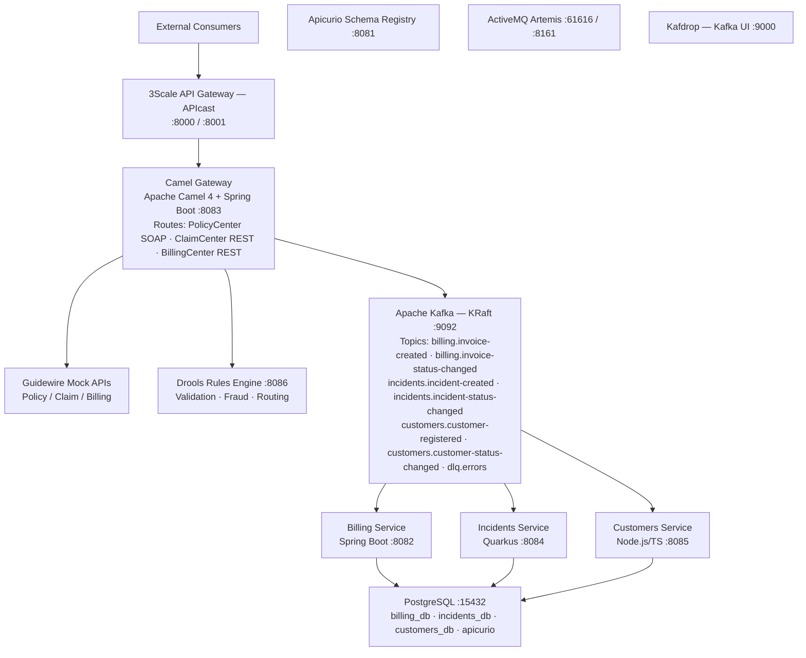
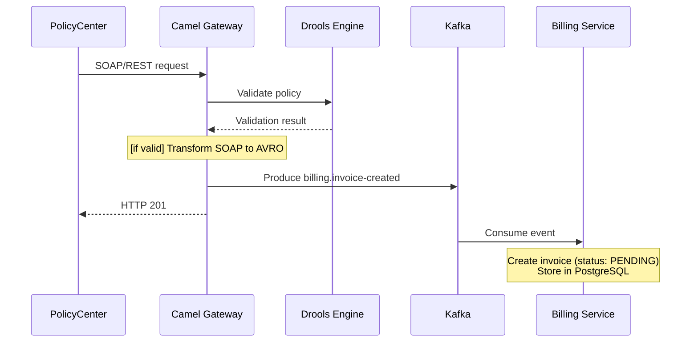
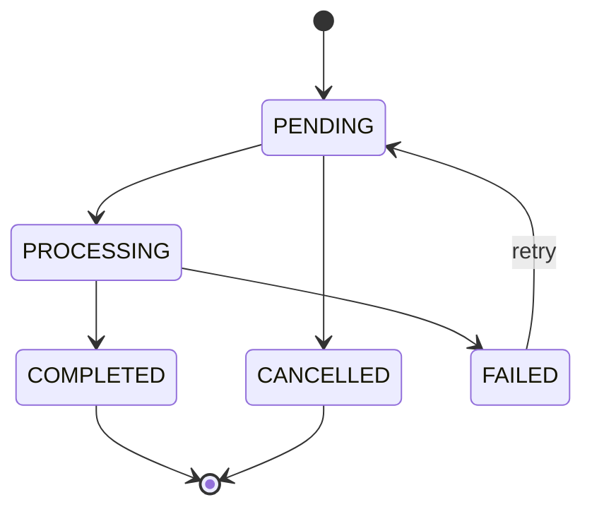
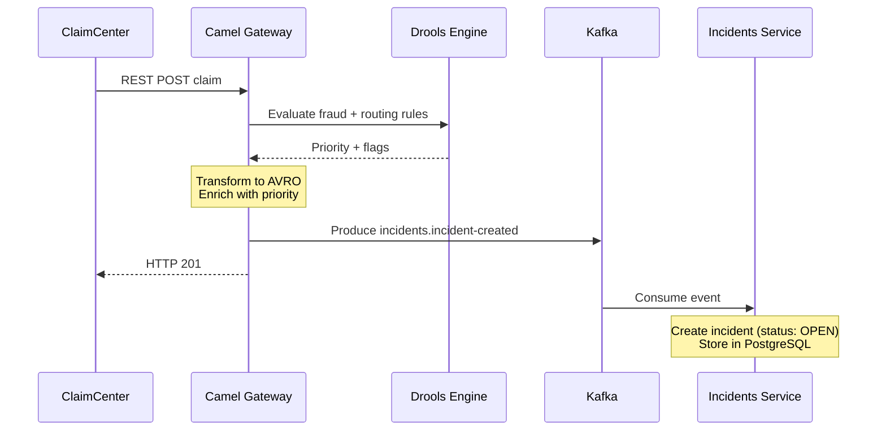
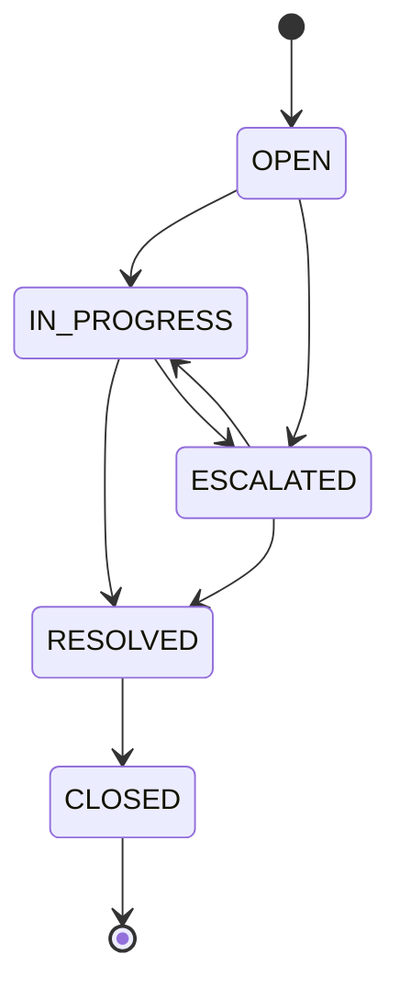
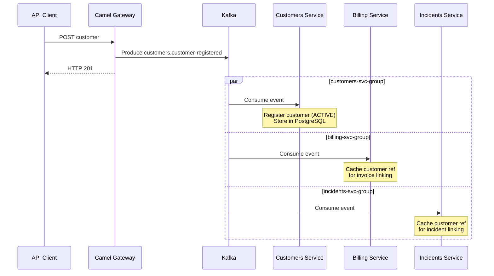
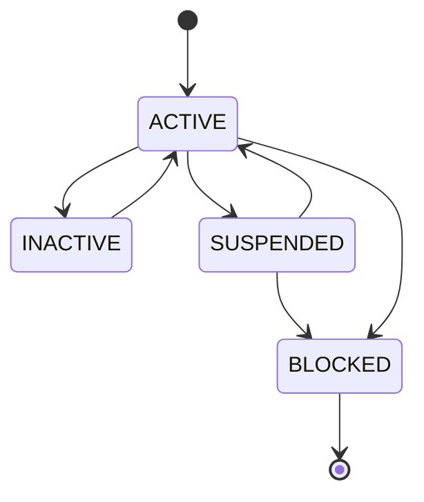

# Architecture Documentation

Guidewire Integration POC -- Architecture reference for the insurance integration platform.

---

## Table of Contents

1. [Architecture Overview](#architecture-overview)
2. [Component Interaction Diagram](#component-interaction-diagram)
3. [Data Flow Diagrams](#data-flow-diagrams)
4. [Architecture Decision Records (ADRs)](#architecture-decision-records-adrs)
5. [Technology Stack Summary](#technology-stack-summary)

---

## Architecture Overview

This POC demonstrates integration patterns for **Guidewire InsuranceSuite** (PolicyCenter, ClaimCenter, BillingCenter) using a polyglot microservices architecture with event-driven communication.

The system follows these architectural principles:

- **API-First / Contract-Driven**: All interfaces defined via OpenAPI 3.1, AsyncAPI 3.0, and AVRO schemas before implementation
- **Event-Driven Architecture (EDA)**: Apache Kafka as the event backbone for asynchronous, decoupled communication
- **Polyglot Microservices**: Each service chooses the best technology for its domain
- **Infrastructure as Code**: Reproducible lab environment via Vagrant + Podman Compose

---

## Component Interaction Diagram

---

## Data Flow Diagrams

### Flow 1: Policy Creation and Billing

This flow demonstrates how a policy created in PolicyCenter triggers invoice creation in the billing microservice.

#### Invoice State Machine

### Flow 2: Claim Processing and Incident Management

This flow shows how a claim from ClaimCenter creates an incident, goes through fraud detection rules, and progresses through the incident lifecycle.

#### Incident State Machine

### Flow 3: Customer Registration (Cross-Domain)

This flow illustrates customer registration and how the event is consumed by multiple services for cross-domain data synchronization.

#### Customer State Machine

---

## Architecture Decision Records (ADRs)

### ADR-001: API-First / Contract-Driven Development

**Status**: Accepted

**Context**: The integration between Guidewire InsuranceSuite and internal microservices requires well-defined interfaces. Teams working on different services need stable contracts to develop in parallel without tight coupling.

**Decision**: Adopt API-First development where all interfaces (REST APIs, async events, data schemas) are defined as machine-readable contracts (OpenAPI 3.1, AsyncAPI 3.0, Apache AVRO) before any implementation begins. Contracts live in the `contracts/` directory and serve as the single source of truth.

**Consequences**:
- Positive: Parallel team development is possible from day one
- Positive: Contract validation can be automated in CI/CD (Spectral, AsyncAPI CLI)
- Positive: Code generation from contracts reduces boilerplate and drift
- Positive: Apicurio Schema Registry enforces AVRO schema compatibility at runtime
- Negative: Upfront design effort is higher
- Negative: Contract changes require coordination across teams

---

### ADR-002: Podman over Docker

**Status**: Accepted

**Context**: The POC needs a containerized local development environment. The target production platform is Red Hat OpenShift / Kubernetes. Docker Desktop licensing changed in 2022 for enterprise use.

**Decision**: Use Podman + Podman Compose instead of Docker + Docker Compose for all container orchestration in the local lab environment.

**Consequences**:
- Positive: Podman is daemonless and rootless by default, improving security posture
- Positive: OCI-compliant -- images and containers are portable to any OCI runtime
- Positive: Native alignment with Red Hat ecosystem (OpenShift, RHEL)
- Positive: No licensing cost for enterprise use
- Positive: CLI is Docker-compatible (`alias docker=podman` works for most cases)
- Negative: Some Docker Compose features have slight behavioral differences in Podman Compose
- Negative: Ecosystem tooling (Docker Desktop UI, extensions) is not available
- Negative: Networking model differs slightly (pod-based vs bridge-based)

---

### ADR-003: Apache Kafka over RabbitMQ

**Status**: Accepted

**Context**: The system needs an event backbone for asynchronous communication between the Camel Gateway and downstream microservices. The events represent domain state changes (invoices, incidents, customers) that may need replay, auditing, and multi-consumer patterns.

**Decision**: Use Apache Kafka (in KRaft mode, without ZooKeeper) as the primary event streaming platform. Use AVRO serialization with Apicurio Schema Registry for schema governance.

**Consequences**:
- Positive: Kafka provides durable, ordered, replayable event log -- essential for event sourcing patterns
- Positive: Multiple consumer groups can independently consume the same events (fan-out)
- Positive: KRaft mode eliminates ZooKeeper dependency, simplifying operations
- Positive: AVRO + Schema Registry enables schema evolution with backward/forward compatibility
- Positive: Kafka is the industry standard for event-driven architectures at scale
- Positive: Kafdrop provides a web UI for topic inspection and debugging
- Negative: Higher operational complexity compared to RabbitMQ for simple pub/sub
- Negative: KRaft is relatively newer (GA since Kafka 3.3) compared to ZooKeeper mode
- Negative: AVRO serialization adds complexity vs plain JSON

**Note**: ActiveMQ Artemis is also included in the stack for JMS-based messaging with legacy systems that require point-to-point or traditional request/reply patterns.

---

### ADR-004: Polyglot Microservices

**Status**: Accepted

**Context**: The POC needs to demonstrate that microservices in an insurance integration platform can use different technology stacks while maintaining interoperability through well-defined contracts and Kafka events.

**Decision**: Implement microservices using three different technology stacks:
- **Billing Service**: Java 21 + Spring Boot 3.3 (mainstream enterprise framework)
- **Incidents Service**: Java 21 + Quarkus 3.8 (cloud-native, fast startup, low memory)
- **Customers Service**: Node.js 20 + TypeScript + Express (non-JVM alternative)
- **Camel Gateway**: Java 21 + Spring Boot 3.3 + Apache Camel 4 (integration patterns)
- **Drools Engine**: Java 21 + Spring Boot 3.3 + Drools 8 (business rules)

**Consequences**:
- Positive: Demonstrates true microservice independence -- each team can pick their best tool
- Positive: Proves that API-First contracts enable technology heterogeneity
- Positive: Quarkus demonstrates cloud-native Java benefits (fast boot, low RSS)
- Positive: Node.js shows that non-JVM services integrate seamlessly via Kafka + REST
- Positive: Validates the contract-driven approach across language boundaries
- Negative: Broader skill set required from the team
- Negative: Shared tooling (monitoring, logging, tracing) must be language-agnostic
- Negative: Each service has its own build pipeline and dependency management

---

### ADR-005: AVRO over Protobuf / JSON Schema for Event Serialization

**Status**: Accepted

**Context**: Kafka events need a serialization format that supports schema evolution, is compact on the wire, and integrates well with the chosen Schema Registry (Apicurio).

**Decision**: Use Apache AVRO as the serialization format for all Kafka events. Schemas are stored in `contracts/avro/` and registered in Apicurio Schema Registry.

**Consequences**:
- Positive: AVRO is the de facto standard in the Kafka ecosystem
- Positive: Native support in Apicurio Schema Registry (compatibility checks, versioning)
- Positive: Binary encoding is compact and efficient
- Positive: Schema evolution rules (backward, forward, full) are well-defined
- Positive: Both Java (Camel, Spring Kafka) and Node.js (kafkajs + schema-registry) have mature AVRO support
- Negative: AVRO schemas are more verbose than Protobuf definitions
- Negative: Debugging binary messages requires schema-aware tooling (Kafdrop with registry integration)
- Negative: Schema registry becomes a critical infrastructure dependency

---

### ADR-006: 3Scale API Gateway over Kong / Traefik

**Status**: Accepted

**Context**: The POC needs an API Gateway for rate limiting, authentication, and API management. The target enterprise environment uses Red Hat middleware.

**Decision**: Use Red Hat 3Scale (APIcast) as the API Gateway, configured declaratively via JSON.

**Consequences**:
- Positive: Full alignment with Red Hat enterprise stack (OpenShift, Fuse, AMQ)
- Positive: APIcast supports declarative configuration (no database required for POC)
- Positive: Production-grade API management features (rate limiting, analytics, developer portal)
- Positive: Demonstrates enterprise API governance patterns
- Negative: Heavier footprint than lightweight alternatives (Traefik, Envoy)
- Negative: Less community documentation compared to Kong or Traefik
- Negative: APIcast configuration model is specific to 3Scale

---

### ADR-007: Apache Camel as Integration Gateway

**Status**: Accepted

**Context**: Integration with Guidewire requires protocol mediation (SOAP to REST), message transformation, content-based routing, and error handling. These are classic Enterprise Integration Patterns (EIP).

**Decision**: Use Apache Camel 4 (embedded in Spring Boot) as the integration gateway layer between external Guidewire systems and internal Kafka topics.

**Consequences**:
- Positive: Camel implements 60+ Enterprise Integration Patterns natively
- Positive: Built-in support for SOAP, REST, Kafka, JMS, and hundreds of other protocols
- Positive: Spring Boot integration provides familiar configuration and management
- Positive: Strong alignment with Red Hat Fuse / Camel K for production deployment
- Positive: Route definitions are declarative and testable
- Negative: Camel has a steep learning curve for developers unfamiliar with EIP
- Negative: Debugging complex routes with multiple transformations can be challenging
- Negative: Adds an additional service to the deployment topology

---

## Technology Stack Summary

| Layer               | Technology                  | Version | Purpose                                      |
|---------------------|-----------------------------|---------|----------------------------------------------|
| Virtualization      | Vagrant + libvirt/KVM       | 2.4+    | Isolated, reproducible lab environment        |
| Containers          | Podman + Podman Compose     | 4.9+    | OCI container runtime (daemonless, rootless)  |
| API Gateway         | Red Hat 3Scale (APIcast)    | 3.11    | Rate limiting, auth, API management           |
| Integration         | Apache Camel 4              | 4.x     | EIP, protocol mediation, routing              |
| Event Streaming     | Apache Kafka (KRaft)        | 3.7     | Event backbone, durable log                   |
| JMS Messaging       | Apache ActiveMQ Artemis     | 2.33    | Point-to-point messaging, legacy integration  |
| Rules Engine        | Drools 8                    | 8.x     | Business rules, fraud detection, validation   |
| Schema Registry     | Apicurio Service Registry   | 2.5     | AVRO schema governance, compatibility checks  |
| Database            | PostgreSQL                  | 16      | Relational storage for all microservices      |
| Java Runtime        | Eclipse Temurin             | 21      | LTS Java distribution                         |
| Node.js Runtime     | Node.js LTS                 | 20      | JavaScript/TypeScript runtime                 |
| Java Framework 1    | Spring Boot                 | 3.3     | Billing, Camel Gateway, Drools                |
| Java Framework 2    | Quarkus                     | 3.8     | Incidents Service (cloud-native)              |
| Node.js Framework   | Express 4 + TypeScript      | 4.x     | Customers Service                             |
| API Specs           | OpenAPI 3.1                 | 3.1     | REST API contracts                            |
| Event Specs         | AsyncAPI 3.0                | 3.0     | Async event contracts                         |
| Serialization       | Apache AVRO                 | 1.9+    | Kafka message serialization                   |
| Kafka UI            | Kafdrop                     | 4.0     | Topic inspection, message browsing            |
