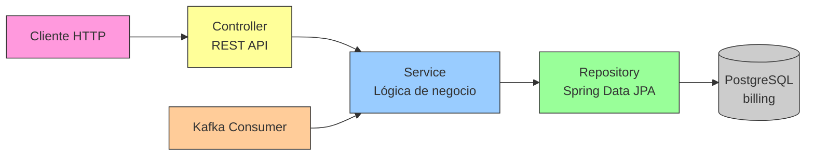
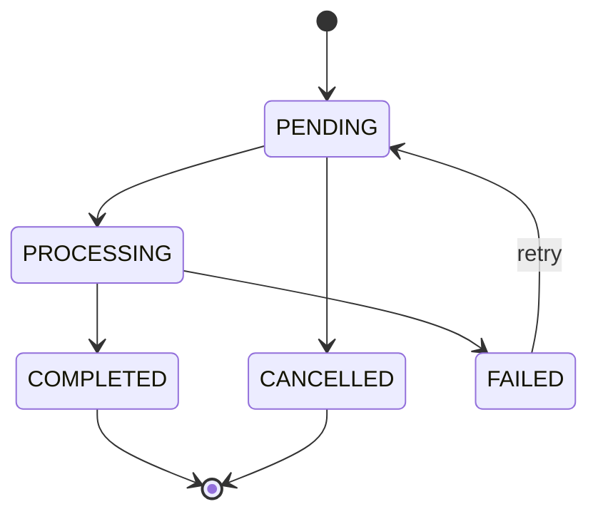

# Billing Service — Documentación

## Descripción

Microservicio de facturación implementado con Spring Boot 3.3. Gestiona facturas internas alimentadas por eventos de Guidewire BillingCenter via Kafka.

## Stack Tecnológico

| Capa | Tecnología |
|------|-----------|
| Runtime | Java 21 |
| Framework | Spring Boot 3.3.x |
| ORM | Spring Data JPA / Hibernate |
| DB | PostgreSQL 16 (base: `billing`) |
| Migración | Flyway |
| Kafka | Spring Kafka + AVRO |
| Puerto | **8082** |

## API REST

| Método | Endpoint | Descripción |
|--------|----------|-------------|
| GET | `/api/v1/invoices` | Listar facturas (paginado, filtrable) |
| GET | `/api/v1/invoices/{id}` | Obtener factura por ID |
| POST | `/api/v1/invoices` | Crear factura |
| PATCH | `/api/v1/invoices/{id}` | Actualizar factura |

### Filtros disponibles (query params)

`status`, `policyId`, `customerId`, `dateFrom`, `dateTo`, `page`, `size`

## Modelo de Datos

### Tabla `invoices`

| Columna | Tipo | Descripción |
|---------|------|-------------|
| id | UUID (PK) | Identificador único |
| policy_id | UUID | Póliza asociada |
| customer_id | UUID | Cliente |
| status | VARCHAR(20) | Estado actual |
| total_amount | DECIMAL(10,2) | Monto total |
| currency | VARCHAR(3) | Moneda (default MXN) |
| source_event | VARCHAR(255) | ID del evento Kafka origen |
| created_at | TIMESTAMP | Fecha de creación |
| updated_at | TIMESTAMP | Última actualización |

### Tabla `invoice_items`

| Columna | Tipo | Descripción |
|---------|------|-------------|
| id | UUID (PK) | Identificador |
| invoice_id | UUID (FK) | Referencia a factura |
| description | VARCHAR(255) | Descripción del ítem |
| quantity | INTEGER | Cantidad |
| unit_price | DECIMAL(10,2) | Precio unitario |
| subtotal | DECIMAL(10,2) | Subtotal |

## Arquitectura de Capas



## Estados y Transiciones

```
PENDING → PROCESSING → COMPLETED
   ↓          ↓
CANCELLED   FAILED → PENDING (retry)
```



## Kafka Consumers

| Topic | Acción |
|-------|--------|
| `billing.invoice-created` | Crear factura desde evento BillingCenter |
| `customers.customer-registered` | Registrar referencia de cliente |

## Validaciones

- `totalAmount` debe ser > 0
- Al menos un item requerido
- Transiciones de estado validadas (409 si inválida)

## Spec de referencia

- [spec.yml](../../../components/billing-service/spec.yml)
- Issues: [#54](../../../../issues/54) - [#57](../../../../issues/57)
