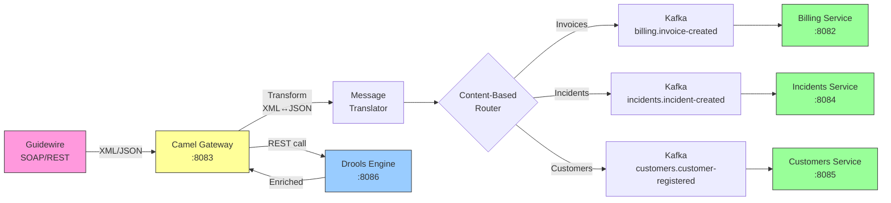

# Camel Integration Gateway — Documentación

## Descripción

Gateway de integración central basado en Apache Camel 4.x + Spring Boot 3.3. Actúa como mediador entre Guidewire (SOAP/REST) y el ecosistema de microservicios. Implementa patrones EIP.

## Stack Tecnológico

| Capa | Tecnología |
|------|-----------|
| Runtime | Java 21 |
| Framework | Spring Boot 3.3.x |
| Integración | Apache Camel 4.x |
| Build | Maven |
| Puerto | **8083** |

## Patrones EIP Implementados

| Patrón | Uso |
|--------|-----|
| Message Translator | Conversión XML ↔ JSON |
| Content-Based Router | Enrutamiento por tipo de operación |
| Protocol Bridge | SOAP ↔ REST |
| Dead Letter Channel | Manejo de errores con DLQ |
| Wire Tap | Logging/auditoría asíncrona |

## Rutas

### REST (expone APIs de Guidewire)

```
GET/POST/PATCH /api/v1/policies   → mock-guidewire (PolicyCenter)
GET/POST/PATCH /api/v1/claims     → mock-guidewire (ClaimCenter)
GET/POST/PATCH /api/v1/gw-invoices → mock-guidewire (BillingCenter)
```

### SOAP (proxying Guidewire legacy)

```
cxf:/ws/policycenter  (dataFormat=PAYLOAD) → REST mock-guidewire + Kafka
cxf:/ws/claimcenter   (dataFormat=PAYLOAD) → REST mock-guidewire + Kafka
cxf:/ws/billingcenter (dataFormat=PAYLOAD) → REST mock-guidewire + Kafka
```

Los endpoints CXF usan `dataFormat=PAYLOAD` sin `serviceClass` — la transformación XML se delega al `transformationProcessor`.

### Kafka Producer

Enrutamiento basado en `header.eventType`:

```
eventType starts with "invoice"   → kafka:billing.invoice-created
eventType starts with "incident"  → kafka:incidents.incident-created
eventType starts with "customer"  → kafka:customers.customer-registered
eventType starts with "policy"    → kafka:policies.policy-events
(default)                         → kafka:events.unclassified
```

Todos los productores usan `valueSerializer=io.apicurio.registry.serde.avro.AvroKafkaSerializer` con registro automático en Apicurio.

### Kafka Consumer

```
kafka:billing.invoice-created     → http:billing-service:8082
kafka:incidents.incident-created  → http:incidents-service:8084
kafka:customers.customer-registered → http:customers-service:8085
```

## Flujo de Rutas Camel



## Integración con Drools

Antes de publicar eventos a Kafka, Camel invoca Drools para enriquecer los mensajes:

```
Guidewire → Camel → Drools (evalúa reglas) → Kafka (evento enriquecido) → Microservicios
```

## Observabilidad

| Feature | Endpoint |
|---------|----------|
| Health (liveness) | `/actuator/health/liveness` |
| Health (readiness) | `/actuator/health/readiness` |
| Métricas Prometheus | `/actuator/prometheus` |
| Info | `/actuator/info` |

## Notas de Build (OpenShift)

El `pom.xml` incluye la propiedad `codegen.skip` (default `false`) que controla la generación de código OpenAPI. En los builds de OpenShift via BuildConfig, el spec OpenAPI no está disponible, por lo que el build se lanza con:

```bash
oc start-build camel-gateway --from-dir=components/camel-gateway -n guidewire-apps
# El Dockerfile ejecuta: mvn package -Dcodegen.skip=true
```

## Dependencias

Requiere: Kafka, Apicurio, ActiveMQ (deben estar healthy antes de arrancar).

### Dependencias Maven relevantes

- `camel-openapi-java-starter` — necesaria para `RestApiProcessorFactory`
- `camel-cxf-soap-starter` — endpoints SOAP/CXF
- `camel-xslt-starter` — transformaciones XSLT
- `camel-kafka-starter` — productor/consumidor Kafka

## Spec de referencia

- [spec.yml](../../../components/camel-gateway/spec.yml)
- Issues: [#45](../../../../issues/45) - [#51](../../../../issues/51)
