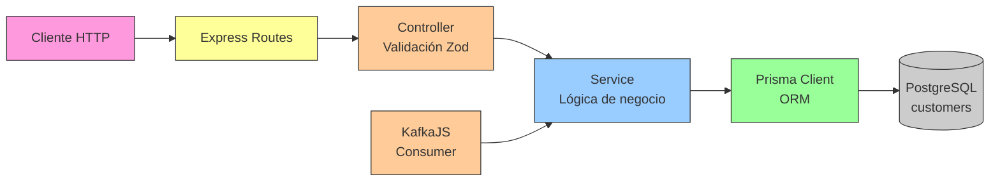
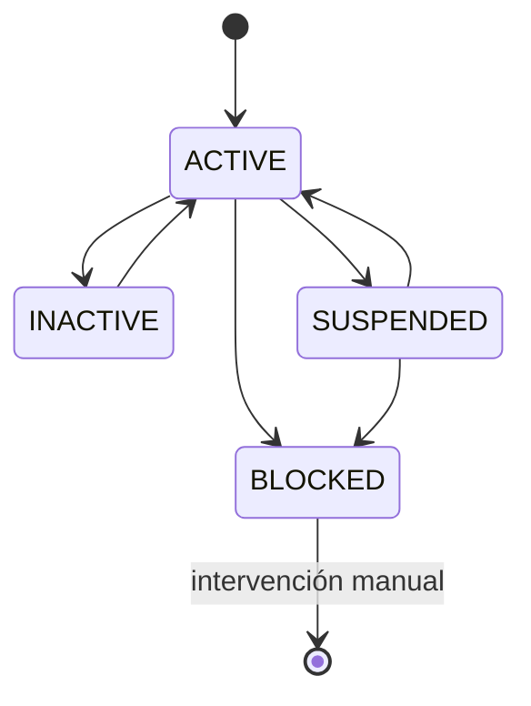

# Customers Service — Documentación

## Descripción

Microservicio de clientes implementado con Node.js 20 y TypeScript. Demuestra la capacidad polyglot del ecosistema de microservicios. Gestiona registro y estado de clientes de seguros.

## Stack Tecnológico

| Capa | Tecnología |
|------|-----------|
| Runtime | Node.js 20 LTS |
| Framework | Express.js 4.x |
| Lenguaje | TypeScript 5.x |
| ORM | Prisma |
| DB | PostgreSQL 16 (base: `customers`) |
| Kafka | KafkaJS |
| Validación | Zod |
| Puerto | **8085** |

## API REST

| Método | Endpoint | Descripción |
|--------|----------|-------------|
| GET | `/api/v1/customers` | Listar clientes (paginado, filtrable) |
| GET | `/api/v1/customers/:id` | Obtener cliente por ID |
| POST | `/api/v1/customers` | Registrar nuevo cliente |
| PATCH | `/api/v1/customers/:id` | Actualizar cliente |

### Filtros disponibles

`status`, `email`, `name` (búsqueda parcial), `page`, `size`

## Modelo de Datos (Prisma)

```prisma
model Customer {
  id             String         @id @default(uuid())
  firstName      String
  lastName       String
  email          String         @unique
  phone          String?
  documentType   DocumentType
  documentNumber String
  status         CustomerStatus @default(ACTIVE)
  street         String?
  city           String?
  state          String?
  zipCode        String?
  country        String         @default("MX")
  sourceEvent    String?
  createdAt      DateTime       @default(now())
  updatedAt      DateTime       @updatedAt

  @@unique([documentType, documentNumber])
}
```

## Arquitectura de Capas



## Estados y Transiciones

```
ACTIVE → INACTIVE, SUSPENDED, BLOCKED
INACTIVE → ACTIVE
SUSPENDED → ACTIVE, BLOCKED
BLOCKED → (requiere intervención manual)
```



## Kafka Consumers (KafkaJS)

| Topic | Group | Acción |
|-------|-------|--------|
| `customers.customer-registered` | `customers-service-group` | Crear/actualizar cliente |
| `customers.customer-status-changed` | `customers-service-group` | Actualizar estado |

## Validaciones (Zod)

- `email`: formato válido, único (409 en duplicado)
- `documentNumber`: único por `documentType` (409 en duplicado)
- `firstName`, `lastName`: requeridos
- `status`: enum validado, transiciones verificadas

## Desarrollo Local

```bash
# Instalar dependencias
npm ci

# Generar Prisma client
npx prisma generate

# Ejecutar migraciones
npx prisma migrate dev

# Modo desarrollo (hot reload)
npm run dev

# Build
npm run build

# Producción
npm start
```

## Spec de referencia

- [spec.yml](../../../components/customers-service/spec.yml)
- Issues: [#62](../../../../issues/62) - [#65](../../../../issues/65)
