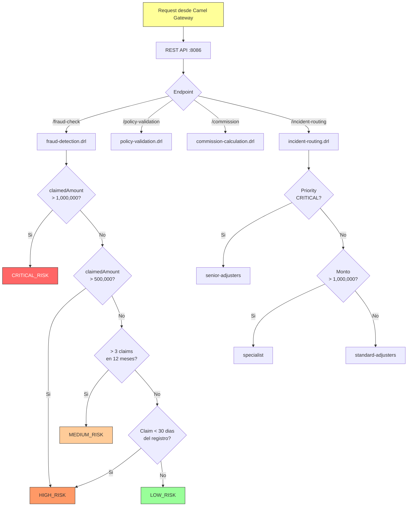

# Drools Rules Engine — Documentación

> [Volver a OpenSpecs](../../README.md) · [Volver al README principal](../../../../README.md)

## Descripción

Motor de reglas de negocio basado en Drools 8.x. Evalúa reglas de fraude, validaciones de pólizas, cálculo de comisiones y enrutamiento de incidencias. Invocado por Camel Gateway via REST.

## Stack Tecnológico

| Capa | Tecnología |
|------|-----------|
| Runtime | Java 21 |
| Framework | Spring Boot 3.3.x |
| Reglas | Drools 8.x |
| Build | Maven |
| Puerto | **8086** |

## API REST

| Método | Endpoint | Descripción |
|--------|----------|-------------|
| POST | `/api/v1/rules/fraud-check` | Evalúa riesgo de fraude |
| POST | `/api/v1/rules/policy-validation` | Valida elegibilidad de póliza |
| POST | `/api/v1/rules/commission` | Calcula comisión |
| POST | `/api/v1/rules/incident-routing` | Asigna equipo a incidencia |

## Reglas de Negocio

### Detección de Fraude (`fraud-detection.drl`)

| Regla | Condición | Resultado |
|-------|-----------|-----------|
| HighAmountClaim | claimedAmount > 500,000 MXN | HIGH_RISK |
| FrequentClaimant | > 3 claims en 12 meses | MEDIUM_RISK |
| NewCustomerImmediateClaim | Claim dentro de 30 días del registro | HIGH_RISK |
| SuspiciousAmount | claimedAmount > 1,000,000 MXN | CRITICAL_RISK |

### Validación de Pólizas (`policy-validation.drl`)

| Regla | Condición | Resultado |
|-------|-----------|-----------|
| MaxAutoLimit | AUTO y prima > 100,000 | Rechazar |
| CustomerNotActive | Status != ACTIVE | Rechazar |

### Comisiones (`commission-calculation.drl`)

| Producto | Base | Directo | Broker |
|----------|------|---------|--------|
| AUTO | 5% | 4% | 7% |
| HOME | 7% | 6% | 9% |
| LIFE | 10% | 9% | 12% |
| HEALTH | 8% | 7% | 10% |
| COMMERCIAL | 6% | 5% | 8% |

### Enrutamiento (`incident-routing.drl`)

| Condición | Equipo Asignado |
|-----------|----------------|
| Priority CRITICAL | senior-adjusters |
| Monto > 1,000,000 MXN | specialist |
| Default | standard-adjusters |

## Flujo de Evaluación de Reglas



## Ejemplo de Invocación

```bash
curl -sk -X POST https://drools-engine-guidewire-apps.apps-crc.testing/api/v1/rules/fraud-check \
  -H "Content-Type: application/json" \
  -d '{
    "claimId": "uuid-here",
    "customerId": "uuid-here",
    "claimedAmount": 750000,
    "claimCount": 5,
    "incidentDate": "2024-06-15",
    "customerRegistrationDate": "2024-06-01"
  }'
```

Respuesta:
```json
{
  "riskLevel": "HIGH",
  "flaggedReasons": ["HighAmountClaim", "FrequentClaimant", "NewCustomerImmediateClaim"]
}
```

## Notas de Implementación

### Safety net: `fireAllRules(100)`

El `RulesService.java` limita la ejecución a un máximo de 100 activaciones de reglas por sesión. Esto previene loops infinitos en caso de reglas mal escritas.

### Reglas DRL — prevención de loops

Las reglas DRL evitan el uso de `update(fact)` que puede causar re-evaluación infinita entre reglas. En su lugar:

- Se usan setters directos (`fact.setField(value)`) para campos que no afectan condiciones de otras reglas
- Se usa `modify(fact) { ... }` solo cuando es necesario propagar cambios al motor
- Las reglas de asignación de nivel de riesgo están consolidadas en una sola regla con lógica Java (`if/else`) para evitar cross-activation

## Base de Datos

El Drools Engine utiliza una base de datos PostgreSQL para almacenar el audit trail de las evaluaciones de reglas.

| Parámetro | Valor |
|-----------|-------|
| Base de datos | `drools_audit` |
| Usuario | `drools_user` |
| Password | `drools123` |
| JDBC URL | `jdbc:postgresql://postgres.guidewire-infra.svc.cluster.local:5432/drools_audit` |

La base se crea automáticamente en el init script de PostgreSQL (`configmap-init-db.yml`).

## Documentacion relacionada

- [Camel Integration Gateway](../camel-gateway/README.md)
- [OpenAPI](../../design/openapi/README.md)

## Spec de referencia

- [spec.yml](../../../components/drools-engine/spec.yml)
- Issues: [#52](../../../../issues/52), [#53](../../../../issues/53)
