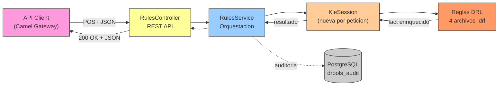
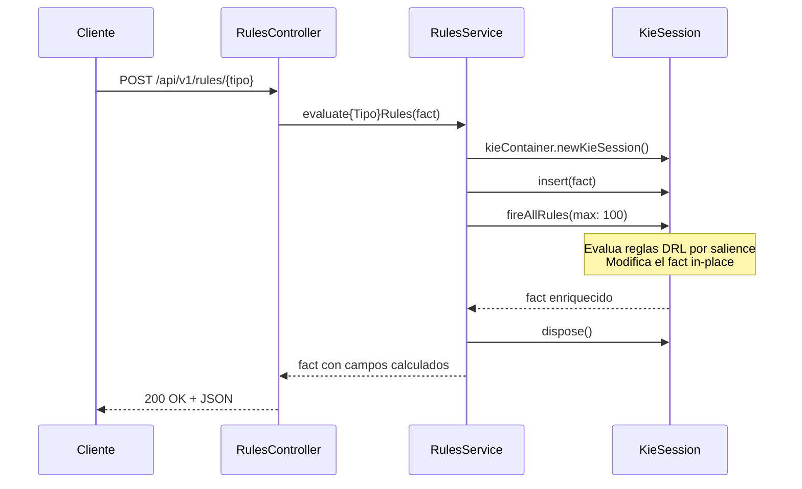
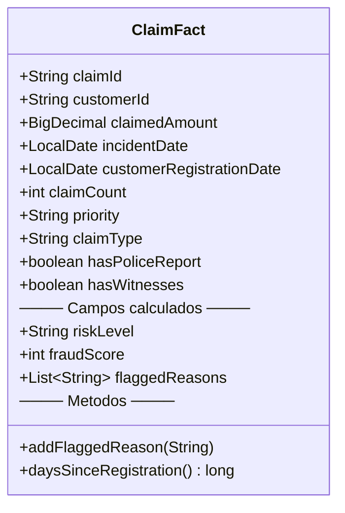
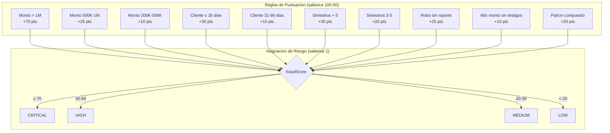
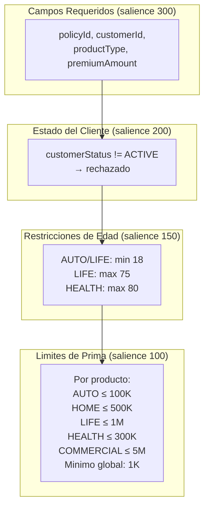
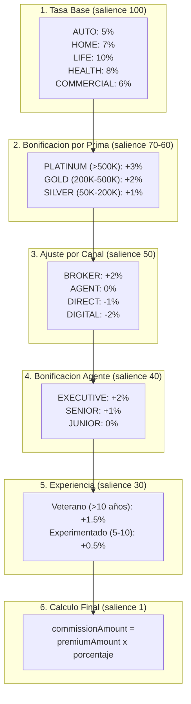
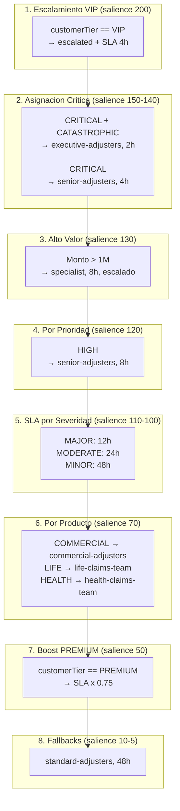

# Drools Rules Engine — Documentacion

> [Volver a OpenSpecs](../../../README.md) · [Volver al README principal](../../../../README.md)

Motor de reglas de negocio centralizado basado en Apache Drools 8. Evalua hechos (facts) contra conjuntos de reglas DRL declarativas y devuelve resultados enriquecidos. Expone 4 endpoints REST para evaluacion de fraude, validacion de polizas, calculo de comisiones y enrutamiento de siniestros.

---

## Tabla de Contenidos

1. [Stack Tecnologico](#stack-tecnologico)
2. [Arquitectura](#arquitectura)
3. [API REST](#api-rest)
4. [Modelos de Datos (Facts)](#modelos-de-datos-facts)
5. [Reglas de Negocio (DRL)](#reglas-de-negocio-drl)
6. [Configuracion](#configuracion)
7. [Build y Despliegue](#build-y-despliegue)
8. [Tests](#tests)
9. [Patrones y Decisiones Tecnicas](#patrones-y-decisiones-tecnicas)
10. [Ejemplos de Uso](#ejemplos-de-uso)
11. [Documentacion relacionada](#documentacion-relacionada)

---

## Stack Tecnologico

| Capa | Tecnologia | Version |
|------|-----------|---------|
| Runtime | Eclipse Temurin | 21 |
| Framework | Spring Boot | 3.3.5 |
| Motor de Reglas | Drools / KIE | 8.44.0.Final |
| ORM | Spring Data JPA / Hibernate | — |
| DB | PostgreSQL 16 (base: `drools_audit`) | — |
| Metricas | Micrometer Prometheus | — |
| Build | Maven + OpenAPI Generator | — |
| Puerto | **8086** | — |

---

## Arquitectura



### Flujo interno de evaluacion



> **Thread safety**: Se crea una KieSession nueva por peticion. No hay estado compartido entre evaluaciones concurrentes. La sesion se cierra siempre en un bloque `finally`.

---

## API REST

| Metodo | Endpoint | Descripcion |
|--------|----------|-------------|
| POST | `/api/v1/rules/fraud-check` | Deteccion de fraude en siniestros |
| POST | `/api/v1/rules/policy-validation` | Validacion de elegibilidad de polizas |
| POST | `/api/v1/rules/commission` | Calculo de comisiones por venta |
| POST | `/api/v1/rules/incident-routing` | Enrutamiento y asignacion de siniestros |

Contrato OpenAPI: [`contracts/openapi/drools-engine-api.yml`](../../../../contracts/openapi/drools-engine-api.yml)

### Observabilidad

| Endpoint | Descripcion |
|----------|-------------|
| `/actuator/health/liveness` | Probe de liveness |
| `/actuator/health/readiness` | Probe de readiness |
| `/actuator/prometheus` | Metricas Prometheus |
| `/actuator/info` | Info de la aplicacion |

---

## Modelos de Datos (Facts)

Cada endpoint recibe un **fact** (POJO con Lombok) que funciona como entrada y salida. Las reglas DRL modifican los campos de salida in-place.

### ClaimFact — Deteccion de Fraude



| Campo | Tipo | Entrada/Salida | Descripcion |
|-------|------|----------------|-------------|
| `claimId` | String | Entrada | ID del siniestro |
| `customerId` | String | Entrada | ID del cliente |
| `claimedAmount` | BigDecimal | Entrada | Monto reclamado (MXN) |
| `incidentDate` | LocalDate | Entrada | Fecha del incidente |
| `customerRegistrationDate` | LocalDate | Entrada | Fecha de registro del cliente |
| `claimCount` | int | Entrada | Siniestros en los ultimos 12 meses |
| `claimType` | String | Entrada | `COLLISION`, `THEFT`, `FIRE`, `FLOOD`, `LIABILITY` |
| `hasPoliceReport` | boolean | Entrada | Tiene reporte policial |
| `hasWitnesses` | boolean | Entrada | Tiene testigos |
| `riskLevel` | String | **Salida** | `CRITICAL`, `HIGH`, `MEDIUM`, `LOW` |
| `fraudScore` | int | **Salida** | Puntuacion acumulativa (0-100+) |
| `flaggedReasons` | List\<String\> | **Salida** | Razones de alerta (auditoria) |

### PolicyFact — Validacion de Polizas

| Campo | Tipo | Entrada/Salida | Descripcion |
|-------|------|----------------|-------------|
| `policyId` | String | Entrada | ID de la poliza |
| `customerId` | String | Entrada | ID del cliente |
| `productType` | String | Entrada | `AUTO`, `HOME`, `LIFE`, `HEALTH`, `COMMERCIAL` |
| `premiumAmount` | BigDecimal | Entrada | Monto de la prima |
| `coverageLimit` | BigDecimal | Entrada | Limite de cobertura |
| `customerStatus` | String | Entrada | `ACTIVE`, `SUSPENDED`, `INACTIVE` |
| `customerAge` | int | Entrada | Edad del cliente |
| `customerName` | String | Entrada | Nombre del cliente |
| `eligible` | boolean | **Salida** | Elegible (default `true`) |
| `rejectionReason` | String | **Salida** | Razon de rechazo (null si elegible) |
| `validationErrors` | List\<String\> | **Salida** | Todos los errores de validacion |

### CommissionFact — Calculo de Comisiones

| Campo | Tipo | Entrada/Salida | Descripcion |
|-------|------|----------------|-------------|
| `productType` | String | Entrada | `AUTO`, `HOME`, `LIFE`, `HEALTH`, `COMMERCIAL` |
| `premiumAmount` | BigDecimal | Entrada | Monto de la prima |
| `salesChannel` | String | Entrada | `DIRECT`, `BROKER`, `DIGITAL`, `AGENT` |
| `agentTier` | String | Entrada | `JUNIOR`, `SENIOR`, `EXECUTIVE` |
| `yearsOfExperience` | int | Entrada | Años de experiencia del agente |
| `commissionPercentage` | double | **Salida** | Porcentaje acumulativo |
| `commissionAmount` | BigDecimal | **Salida** | Monto calculado (prima x %) |
| `commissionTier` | String | **Salida** | `BASE`, `SILVER`, `GOLD`, `PLATINUM` |
| `appliedRules` | List\<String\> | **Salida** | Reglas aplicadas (auditoria) |

### IncidentRoutingFact — Enrutamiento de Siniestros

| Campo | Tipo | Entrada/Salida | Descripcion |
|-------|------|----------------|-------------|
| `priority` | String | Entrada | `LOW`, `MEDIUM`, `HIGH`, `CRITICAL` |
| `severity` | String | Entrada | `MINOR`, `MODERATE`, `MAJOR`, `CATASTROPHIC` |
| `claimedAmount` | BigDecimal | Entrada | Monto reclamado |
| `productType` | String | Entrada | Tipo de producto |
| `customerTier` | String | Entrada | `STANDARD`, `PREMIUM`, `VIP` |
| `assignedTeam` | String | **Salida** | Equipo asignado |
| `slaHours` | int | **Salida** | Horas de SLA de respuesta |
| `escalated` | boolean | **Salida** | Escalado a gestion especial |
| `escalationReason` | String | **Salida** | Razon de escalamiento |
| `routingNotes` | List\<String\> | **Salida** | Notas de enrutamiento |

---

## Reglas de Negocio (DRL)

Las reglas se definen en archivos `.drl` en `src/main/resources/rules/`. Drools las descubre automaticamente al arrancar via `DroolsConfig`.

### 1. Deteccion de Fraude (`fraud-detection.drl`)

**Estrategia**: Puntuacion acumulativa. Cada regla suma puntos al `fraudScore`. Una regla final (salience=1) asigna el `riskLevel` basandose en la puntuacion total.



#### Tabla de reglas

| Salience | Regla | Condicion | Puntos |
|----------|-------|-----------|--------|
| 100 | SuspiciousAmount_Critical | monto > 1,000,000 | +70 |
| 95 | HighAmountClaim | monto 500,001 - 1,000,000 | +25 |
| 90 | MediumAmountClaim | monto 200,001 - 500,000 | +10 |
| 80 | NewCustomerImmediateClaim | antiguedad ≤ 30 dias | +30 |
| 75 | RecentCustomerClaim | antiguedad 31-90 dias | +15 |
| 70 | FrequentClaimant_Extreme | siniestros > 5 (12 meses) | +35 |
| 65 | FrequentClaimant_High | siniestros 3-5 (12 meses) | +20 |
| 60 | TheftWithoutPoliceReport | tipo THEFT sin reporte policial | +25 |
| 55 | HighAmountNoWitnesses | monto > 300K sin testigos (excepto FLOOD) | +15 |
| 50 | NewCustomerHighAmountTheft | ≤ 60 dias + > 500K + THEFT | +20 |
| 1 | AssignRiskLevel | riskLevel == null | Asigna nivel |

#### Umbrales de riesgo

| Nivel | Puntuacion | Accion esperada |
|-------|------------|-----------------|
| **CRITICAL** | ≥ 70 | Investigacion inmediata, bloqueo de pago |
| **HIGH** | 40-69 | Revision manual obligatoria |
| **MEDIUM** | 20-39 | Revision automatizada + flag |
| **LOW** | < 20 | Procesamiento normal |

---

### 2. Validacion de Polizas (`policy-validation.drl`)

**Estrategia**: Reglas con `modify()` para que las validaciones en cascada vean el campo `eligible=false`. Las reglas de campos requeridos tienen la salience mas alta (300).



#### Limites por producto

| Producto | Prima Minima | Prima Maxima | Edad Minima | Edad Maxima |
|----------|-------------|-------------|-------------|-------------|
| AUTO | 1,000 | 100,000 | 18 | — |
| HOME | 1,000 | 500,000 | — | — |
| LIFE | 1,000 | 1,000,000 | 18 | 75 |
| HEALTH | 1,000 | 300,000 | — | 80 |
| COMMERCIAL | 1,000 | 5,000,000 | — | — |

---

### 3. Calculo de Comisiones (`commission-calculation.drl`)

**Estrategia**: Modelo aditivo de porcentaje. Se parte de una tasa base por producto, luego se aplican bonificaciones por prima, canal de venta, nivel del agente y experiencia. La regla final (salience=1) calcula el monto.



#### Ejemplo de calculo

```
Entrada:
  productType: COMMERCIAL
  premiumAmount: 600,000 MXN
  salesChannel: BROKER
  agentTier: EXECUTIVE
  yearsOfExperience: 12

Reglas aplicadas:
  1. CommercialCommission     → 6.0% (BASE)
  2. PlatinumPremiumBonus     → +3.0% = 9.0% (PLATINUM)
  3. BrokerChannelBonus       → +2.0% = 11.0%
  4. ExecutiveAgentBonus      → +2.0% = 13.0%
  5. ExperienceBonus_Veteran  → +1.5% = 14.5%
  6. CalculateCommissionAmount → 600,000 x 0.145 = 87,000 MXN

Resultado: 14.5%, tier PLATINUM, 87,000 MXN
```

---

### 4. Enrutamiento de Siniestros (`incident-routing.drl`)

**Estrategia**: Asignacion por prioridad con escalamiento VIP. Las reglas usan `modify()` para que las condiciones `assignedTeam==null` funcionen correctamente (first-match wins).



#### Equipos de asignacion

| Equipo | Cuando se asigna |
|--------|-----------------|
| `executive-adjusters` | CRITICAL + CATASTROPHIC |
| `senior-adjusters` | CRITICAL o HIGH priority |
| `specialist` | Monto > 1,000,000 |
| `commercial-adjusters` | Producto COMMERCIAL |
| `life-claims-team` | Producto LIFE |
| `health-claims-team` | Producto HEALTH |
| `standard-adjusters` | Fallback por defecto |

#### SLA por nivel

| Trigger | SLA Base | Con PREMIUM (-25%) |
|---------|---------|-------------------|
| CRITICAL + CATASTROPHIC | 2h | 2h |
| CRITICAL | 4h | 3h |
| VIP | 4h | — |
| HIGH / Specialist | 8h | 6h |
| MAJOR severity | 12h | 9h |
| MODERATE severity | 24h | 18h |
| MINOR / Default | 48h | 36h |

---

## Configuracion

### application.yml

```yaml
server:
  port: ${SERVER_PORT:8086}

spring:
  application:
    name: drools-engine
  datasource:
    url: ${DB_URL:jdbc:postgresql://localhost:5432/drools_audit}
    username: ${DB_USERNAME:drools}
    password: ${DB_PASSWORD:drools}
  jpa:
    hibernate:
      ddl-auto: update
    properties:
      hibernate:
        dialect: org.hibernate.dialect.PostgreSQLDialect

drools:
  rules:
    path: rules/

management:
  endpoints:
    web:
      exposure:
        include: health,prometheus,info,metrics
  endpoint:
    health:
      show-details: always
      probes:
        enabled: true
```

### Variables de entorno

| Variable | Default | Descripcion |
|----------|---------|-------------|
| `SERVER_PORT` | 8086 | Puerto del servidor |
| `DB_URL` | `jdbc:postgresql://localhost:5432/drools_audit` | URL de PostgreSQL |
| `DB_USERNAME` | drools | Usuario de BD |
| `DB_PASSWORD` | drools | Password de BD |

### DroolsConfig — Carga de reglas

La clase `DroolsConfig` descubre todos los archivos `*.drl` en `classpath:rules/` al arrancar y construye el KieContainer:

```mermaid
graph LR
    KS["KieServices"] --> KFS["KieFileSystem<br/>(carga .drl)"]
    KFS --> KB["KieBuilder<br/>(compila)"]
    KB --> KM["KieModule"]
    KM --> KC["KieContainer<br/>(bean Spring)"]
    KC -->|newKieSession()| KSE["KieSession<br/>(por peticion)"]
```

Si hay errores de compilacion en las reglas, lanza `IllegalStateException` y la aplicacion no arranca.

---

## Build y Despliegue

### Dependencias principales (pom.xml)

| Dependencia | Version | Proposito |
|-------------|---------|-----------|
| `org.drools:drools-core` | 8.44.0.Final | Motor de reglas |
| `org.drools:drools-compiler` | 8.44.0.Final | Compilacion de DRL |
| `org.drools:drools-mvel` | 8.44.0.Final | Expresiones MVEL en reglas |
| `org.kie:kie-api` | 8.44.0.Final | API de KIE |
| `spring-boot-starter-web` | 3.3.5 | REST API |
| `spring-boot-starter-actuator` | 3.3.5 | Health, metricas |
| `spring-boot-starter-data-jpa` | 3.3.5 | Persistencia |
| `postgresql` | runtime | Driver de BD |
| `micrometer-registry-prometheus` | — | Metricas |
| `openapi-generator-maven-plugin` | 7.20.0 | Generacion de interfaces REST |

### Dockerfile (multi-stage)

```dockerfile
# Stage 1: Build
FROM eclipse-temurin:21-jdk AS builder
WORKDIR /app
COPY pom.xml src ./
RUN mvn clean package -DskipTests -Dcodegen.skip=true -B

# Stage 2: Runtime
FROM eclipse-temurin:21-jre-alpine
RUN addgroup -S appgroup && adduser -S appuser -G appgroup
WORKDIR /app
COPY --from=builder /app/target/*.jar app.jar
USER appuser
EXPOSE 8086
ENV JAVA_OPTS="-XX:+UseContainerSupport -XX:MaxRAMPercentage=75.0"
ENTRYPOINT ["sh", "-c", "java ${JAVA_OPTS} -jar app.jar"]
```

> **Nota**: Se usa `-Dcodegen.skip=true` en Docker porque el contrato OpenAPI no esta disponible en el contexto de build de OpenShift (binary source).

### OpenShift

| Recurso | Valor |
|---------|-------|
| Namespace | guidewire-apps |
| Imagen | `image-registry.openshift-image-registry.svc:5000/guidewire-apps/drools-engine:latest` |
| Replicas | 1 |
| CPU request/limit | 250m / 500m |
| Memoria request/limit | 256Mi / 512Mi |
| Liveness | `/actuator/health/liveness` (initial: 60s, period: 10s) |
| Readiness | `/actuator/health/readiness` (initial: 15s, period: 5s) |
| Route | `drools-engine-guidewire-apps.apps-crc.testing` |
| Estrategia | RollingUpdate (maxSurge=1, maxUnavailable=0) |

---

## Tests

65 tests unitarios + 1 test de contexto = **66 tests totales**.

| Clase de Test | Tests | Cobertura |
|---------------|-------|-----------|
| `FraudDetectionRulesTest` | 5 | Escenarios end-to-end de fraude |
| `FraudDetectionBoundaryTest` | 9 | Umbrales de monto, tiempo, excepciones FLOOD, nulls |
| `PolicyValidationRulesTest` | 7 | Elegibilidad, limites, edad, campos requeridos |
| `PolicyValidationAdditionalTest` | 12 | Limites por producto, restricciones de edad, warnings |
| `CommissionCalculationRulesTest` | 7 | Tasas base, bonificaciones, descuentos, calculo final |
| `IncidentRoutingRulesTest` | 8 | Equipos, SLA, escalamiento VIP, boost PREMIUM |
| `RulesServiceTest` | 8 | Mock de KieSession: insert → fire → dispose |
| `RulesControllerTest` | 4 | @WebMvcTest de los 4 endpoints |
| `ClaimFactTest` | 5 | addFlaggedReason, daysSinceRegistration con nulls |
| `DroolsEngineApplicationTests` | 1 | Carga de contexto (H2) |

### Configuracion de test

```yaml
# application-test.yml — usa H2 in-memory
spring:
  datasource:
    url: jdbc:h2:mem:testdb
    driver-class-name: org.h2.Driver
  jpa:
    hibernate:
      ddl-auto: create-drop
    database-platform: org.hibernate.dialect.H2Dialect
server:
  port: 0
```

### Ejecutar tests

```bash
cd components/drools-engine
mvn test
```

---

## Patrones y Decisiones Tecnicas

### Salience (Prioridad de Reglas)

Las reglas se ejecutan por **salience** (mayor primero). Esto garantiza el orden correcto:

| Rango | Uso |
|-------|-----|
| 200-300 | Validaciones criticas (campos requeridos, VIP) |
| 100-150 | Logica de negocio principal |
| 50-70 | Ajustes y bonificaciones |
| 1-10 | Asignaciones finales y fallbacks |

### modify() vs Setters directos

| Tecnica | Cuando usarla | Ejemplo |
|---------|--------------|---------|
| `modify()` | Cuando otra regla necesita ver el cambio (re-evalua la Rete network) | Validacion: `modify($p) { setEligible(false) }` |
| Setter directo | Cuando no hay dependencias downstream (single-pass) | Fraude: `$c.setFraudScore($c.getFraudScore() + 25)` |

### Guard Conditions

Las reglas usan condiciones de guarda para evitar doble ejecucion:

```drl
// Solo asigna si no hay equipo aun
rule "DefaultTeam"
when $f : IncidentRoutingFact(assignedTeam == null)
then modify($f) { setAssignedTeam("standard-adjusters") }
end

// Solo si todavia es elegible
rule "MaxAutoLimit"
when $p : PolicyFact(eligible == true, productType == "AUTO", premiumAmount > 100000)
then modify($p) { setEligible(false) }
end

// Solo se ejecuta si tier es BASE (mutuamente excluyente)
rule "PlatinumBonus"
when $c : CommissionFact(commissionTier == "BASE", premiumAmount > 500000)
then ...
end
```

### Limite de disparo

```java
kieSession.fireAllRules(100); // max 100 activaciones
```

Previene bucles infinitos en reglas que usen `modify()`. Si una regla modifica un campo que reactiva otra regla ciclicamente, el motor se detiene a las 100 iteraciones.

### Concurrencia y rendimiento

- **KieSession no es singleton** — nueva sesion por peticion (thread-safe)
- **Session dispose en finally** — sin fugas de recursos
- **Sin estado persistente entre peticiones** — stateless por diseno
- **Memoria**: 256Mi request / 512Mi limit en OpenShift (Alpine base)

---

## Ejemplos de Uso

### Deteccion de Fraude

```bash
curl -X POST http://drools-engine-guidewire-apps.apps-crc.testing/api/v1/rules/fraud-check \
  -H "Content-Type: application/json" \
  -d '{
    "claimId": "CLM-2024-001",
    "customerId": "CUST-001",
    "claimedAmount": 750000,
    "incidentDate": "2024-03-01",
    "customerRegistrationDate": "2024-02-01",
    "claimCount": 6,
    "claimType": "THEFT",
    "hasPoliceReport": false,
    "hasWitnesses": false
  }'
```

**Respuesta** (riesgo CRITICAL, score 130):

```json
{
  "claimId": "CLM-2024-001",
  "riskLevel": "CRITICAL",
  "fraudScore": 130,
  "flaggedReasons": [
    "Monto reclamado supera 500,000 MXN",
    "Monto reclamado supera 200,000 MXN",
    "Siniestro abierto dentro de 90 dias del registro",
    "Cliente con mas de 5 siniestros en 12 meses",
    "Siniestro de robo sin reporte policial",
    "COMPOUND: Cliente nuevo + monto alto + robo"
  ]
}
```

### Validacion de Poliza

```bash
curl -X POST http://drools-engine-guidewire-apps.apps-crc.testing/api/v1/rules/policy-validation \
  -H "Content-Type: application/json" \
  -d '{
    "policyId": "POL-001",
    "customerId": "CUST-001",
    "productType": "AUTO",
    "premiumAmount": 45000,
    "coverageLimit": 500000,
    "customerStatus": "ACTIVE",
    "customerAge": 25,
    "customerName": "Maria Garcia"
  }'
```

**Respuesta** (elegible):

```json
{
  "eligible": true,
  "rejectionReason": null,
  "validationErrors": []
}
```

### Calculo de Comision

```bash
curl -X POST http://drools-engine-guidewire-apps.apps-crc.testing/api/v1/rules/commission \
  -H "Content-Type: application/json" \
  -d '{
    "productType": "LIFE",
    "premiumAmount": 250000,
    "salesChannel": "BROKER",
    "agentTier": "SENIOR",
    "yearsOfExperience": 8
  }'
```

**Respuesta** (15.5%, GOLD, 38,750 MXN):

```json
{
  "commissionPercentage": 15.5,
  "commissionAmount": 38750.00,
  "commissionTier": "GOLD",
  "appliedRules": [
    "LifeCommission (base 10%)",
    "GoldPremiumBonus (+2%)",
    "BrokerChannelBonus (+2%)",
    "SeniorAgentBonus (+1%)",
    "ExperienceBonus_Experienced (+0.5%)"
  ]
}
```

### Enrutamiento de Siniestro

```bash
curl -X POST http://drools-engine-guidewire-apps.apps-crc.testing/api/v1/rules/incident-routing \
  -H "Content-Type: application/json" \
  -d '{
    "priority": "CRITICAL",
    "severity": "CATASTROPHIC",
    "claimedAmount": 2000000,
    "productType": "COMMERCIAL",
    "customerTier": "VIP"
  }'
```

**Respuesta** (executive-adjusters, escalado, 2h SLA):

```json
{
  "assignedTeam": "executive-adjusters",
  "slaHours": 2,
  "escalated": true,
  "escalationReason": "Cliente VIP requiere atencion prioritaria",
  "routingNotes": [
    "VIP: escalamiento automatico",
    "CRITICAL + CATASTROPHIC: equipo ejecutivo",
    "Monto > 1M: requiere especialista"
  ]
}
```

---

## Documentacion relacionada

- [Camel Integration Gateway](../camel-gateway/README.md) — invoca Drools para enriquecer eventos antes de publicar a Kafka
- [Contratos OpenAPI](../../design/openapi/README.md) — contrato `drools-engine-api.yml`
- [Arquitectura](../../architecture/README.md) — ADRs, flujos de datos, diagramas de componentes
- [DevOps / CI-CD](../../devops/README.md) — pipelines de build y despliegue

## Spec de referencia

- [spec.yml](../../../components/drools-engine/spec.yml)
- Issues: [#52](../../../../issues/52) - [#53](../../../../issues/53)
