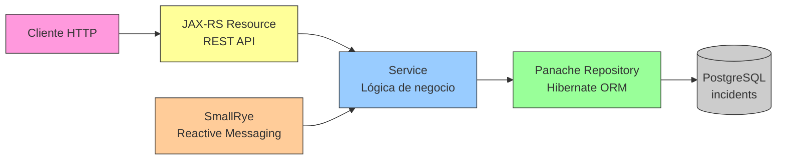
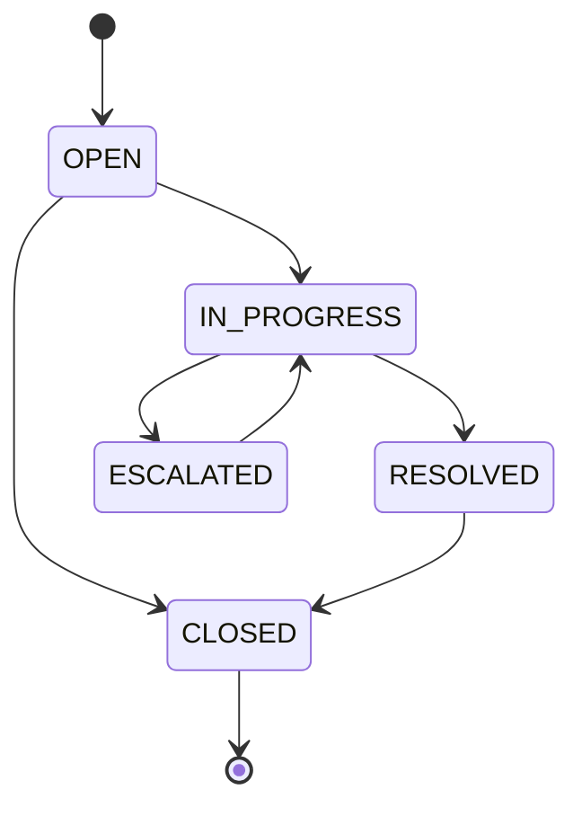

# Incidents Service — Documentación

## Descripción

Microservicio de incidencias implementado con Quarkus 3.8. Gestiona incidencias derivadas de siniestros de ClaimCenter, alimentadas por eventos Kafka.

## Stack Tecnológico

| Capa | Tecnología |
|------|-----------|
| Runtime | Java 21 |
| Framework | Quarkus 3.8.x |
| ORM | Hibernate ORM with Panache |
| DB | PostgreSQL 16 (base: `incidents`) |
| Migración | Flyway |
| Kafka | SmallRye Reactive Messaging |
| Puerto | **8084** |

## API REST (JAX-RS)

| Método | Endpoint | Descripción |
|--------|----------|-------------|
| GET | `/api/v1/incidents` | Listar incidencias (paginado, filtrable) |
| GET | `/api/v1/incidents/{id}` | Obtener incidencia por ID |
| POST | `/api/v1/incidents` | Crear incidencia |
| PATCH | `/api/v1/incidents/{id}` | Actualizar incidencia |

### Filtros disponibles

`status`, `priority`, `claimId`, `customerId`, `page`, `size`

## Modelo de Datos

### Tabla `incidents`

| Columna | Tipo | Descripción |
|---------|------|-------------|
| id | UUID (PK) | Identificador único |
| claim_id | UUID | Siniestro en ClaimCenter |
| customer_id | UUID | Cliente |
| status | VARCHAR(20) | Estado actual |
| priority | VARCHAR(10) | Prioridad |
| title | VARCHAR(255) | Título |
| description | TEXT | Descripción detallada |
| assigned_to | VARCHAR(100) | Responsable asignado |
| resolution | TEXT | Resolución (cuando se cierra) |
| source_event | VARCHAR(255) | ID evento Kafka origen |
| created_at | TIMESTAMP | Creación |
| updated_at | TIMESTAMP | Actualización |

## Arquitectura de Capas



## Estados y Transiciones

```
OPEN → IN_PROGRESS → RESOLVED → CLOSED
  ↓        ↓
  ↓    ESCALATED ↔ IN_PROGRESS
  ↓                    ↓
CLOSED              RESOLVED → CLOSED
```



## Kafka Consumers (SmallRye Reactive Messaging)

| Channel | Topic | Acción |
|---------|-------|--------|
| `incident-created-in` | `incidents.incident-created` | Crear incidencia |
| `customer-registered-in` | `customers.customer-registered` | Registrar cliente |

## Diferencias con Spring Boot (Billing Service)

| Aspecto | Billing (Spring) | Incidents (Quarkus) |
|---------|-----------------|---------------------|
| REST | Spring MVC | JAX-RS (RESTEasy) |
| ORM | Spring Data JPA | Panache |
| Kafka | Spring Kafka (`@KafkaListener`) | SmallRye (`@Incoming`) |
| Config | `application.yml` | `application.properties` |
| Dev mode | `mvn spring-boot:run` | `mvn quarkus:dev` (hot reload) |
| Native | No | Si (GraalVM) |

## Spec de referencia

- [spec.yml](../../../components/incidents-service/spec.yml)
- Issues: [#58](../../../../issues/58) - [#61](../../../../issues/61)
