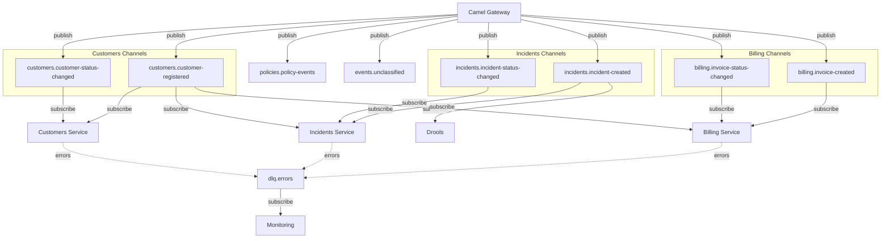

# AsyncAPI Spec — Documentación

> [Volver a OpenSpecs](../../../README.md) · [Volver al README principal](../../../../README.md)

## Descripción

Especificacion AsyncAPI **2.6.0** que documenta todos los canales de eventos Kafka del ecosistema Guidewire. Referencia los schemas AVRO registrados en Apicurio.

> **Nota**: Apicurio 2.5.x no soporta la visualizacion de AsyncAPI 3.0. El archivo en git (`contracts/asyncapi/guidewire-events.yml`) puede estar en 3.0, pero la version registrada en Apicurio es 2.6.0.

## Canales

| Canal | Topic Kafka | Producer | Consumers |
|-------|-------------|----------|-----------|
| billing-invoice-created | `billing.invoice-created` | Camel Gateway | Billing Service |
| billing-invoice-status-changed | `billing.invoice-status-changed` | Camel Gateway | Billing Service |
| incidents-incident-created | `incidents.incident-created` | Camel Gateway | Incidents Service, Drools |
| incidents-incident-status-changed | `incidents.incident-status-changed` | Camel Gateway | Incidents Service |
| customers-customer-registered | `customers.customer-registered` | Camel Gateway | Customers, Billing, Incidents |
| customers-customer-status-changed | `customers.customer-status-changed` | Camel Gateway | Customers Service |
| policies-policy-events | `policies.policy-events` | Camel Gateway | — |
| events-unclassified | `events.unclassified` | Camel Gateway | — (fallback) |
| dlq-errors | `dlq.errors` | Todos | Monitoring |

## Diagrama de Canales

## Serialización

Todos los mensajes usan serialización **AVRO binaria** con schema ID resuelto desde Apicurio Service Registry.

## Herramientas

- **AsyncAPI Studio**: diseño visual de la spec
- **Spectral**: linting con ruleset asyncapi
- **Microcks**: generación de mocks desde la spec

## Spec de referencia

- [spec.yml](../../../design/asyncapi/guidewire-events/spec.yml)
- Issue: [#38](../../../../issues/38)

## Documentacion relacionada

- [Kafka](../../infra/kafka/README.md)
- [AVRO Schemas](../avro/README.md)
- [OpenAPI Specs](../openapi/README.md)
