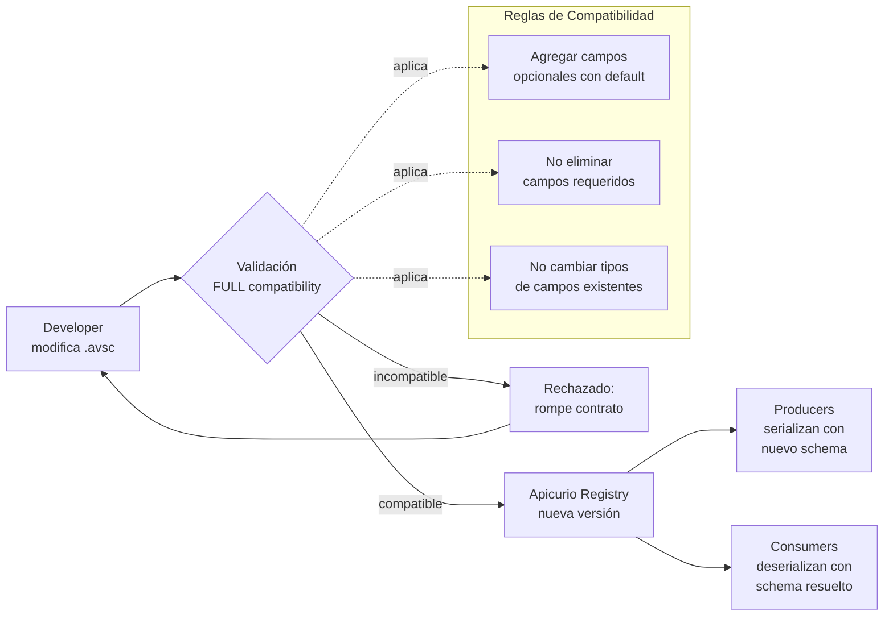

# AVRO Schemas — Documentación

> [Volver a OpenSpecs](../../../README.md) · [Volver al README principal](../../../../../README.md)

## Descripción

6 schemas AVRO (.avsc) para los eventos publicados en Kafka. Registrados en Apicurio bajo el grupo "guidewire". Se usan para serialización/deserialización binaria con type-safety.

## Schemas

### Billing Events

| Schema | Namespace | Topic |
|--------|-----------|-------|
| `InvoiceCreated.avsc` | `com.guidewire.events.billing` | `billing.invoice-created` |
| `InvoiceStatusChanged.avsc` | `com.guidewire.events.billing` | `billing.invoice-status-changed` |

### Incidents Events

| Schema | Namespace | Topic |
|--------|-----------|-------|
| `IncidentCreated.avsc` | `com.guidewire.events.incidents` | `incidents.incident-created` |
| `IncidentStatusChanged.avsc` | `com.guidewire.events.incidents` | `incidents.incident-status-changed` |

### Customers Events

| Schema | Namespace | Topic |
|--------|-----------|-------|
| `CustomerRegistered.avsc` | `com.guidewire.events.customers` | `customers.customer-registered` |
| `CustomerStatusChanged.avsc` | `com.guidewire.events.customers` | `customers.customer-status-changed` |

## Campos Comunes

Todos los schemas incluyen:

| Campo | Tipo | Descripción |
|-------|------|-------------|
| `eventId` | string | UUID único del evento |
| `eventTimestamp` | long (timestamp-millis) | Momento de emisión |
| `source` | string | Sistema origen |

## Generación de Código (Java)

```xml
<plugin>
  <groupId>org.apache.avro</groupId>
  <artifactId>avro-maven-plugin</artifactId>
  <configuration>
    <sourceDirectory>${project.basedir}/../../contracts/avro</sourceDirectory>
    <outputDirectory>${project.build.directory}/generated-sources/avro</outputDirectory>
    <stringType>String</stringType>
    <fieldVisibility>PRIVATE</fieldVisibility>
  </configuration>
</plugin>
```

## Compatibilidad

Regla global en Apicurio: **FULL** (FORWARD + BACKWARD). Al evolucionar un schema:

- Se pueden agregar campos opcionales (con default)
- No se pueden eliminar campos requeridos
- No se pueden cambiar tipos de campos existentes

## Flujo de Evolución de Schemas



## Specs de referencia

- [Billing Events spec.yml](../../../design/avro/billing-events/spec.yml)
- [Incidents Events spec.yml](../../../design/avro/incidents-events/spec.yml)
- [Customers Events spec.yml](../../../design/avro/customers-events/spec.yml)

## Documentacion relacionada

- [Kafka](../../infra/kafka/README.md)
- [AsyncAPI Spec](../asyncapi/README.md)
- [Apicurio Service Registry](../../infra/apicurio/README.md)
