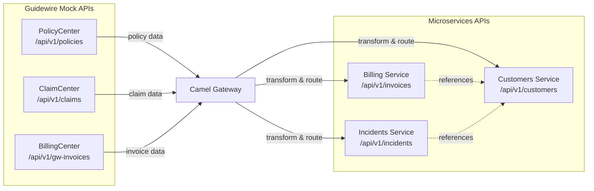

# OpenAPI Specs — Documentación

> [Volver a OpenSpecs](../../../README.md) · [Volver al README principal](../../../../../README.md)

## Descripción

6 especificaciones OpenAPI 3.1 que definen los contratos REST del ecosistema. Se diseñan primero (API-First) y se usa generación de código para crear stubs.

## Specs

### APIs Guidewire (mock)

| API | Archivo | Base Path | Modelos |
|-----|---------|-----------|---------|
| PolicyCenter | `policycenter-api.yml` | `/api/v1/policies` | Policy, CreatePolicyRequest, UpdatePolicyRequest |
| ClaimCenter | `claimcenter-api.yml` | `/api/v1/claims` | Claim, CreateClaimRequest, UpdateClaimRequest |
| BillingCenter | `billingcenter-api.yml` | `/api/v1/gw-invoices` | GwInvoice, GwInvoiceItem |

### APIs Microservicios

| API | Archivo | Base Path | Modelos |
|-----|---------|-----------|---------|
| Billing | `billing-service-api.yml` | `/api/v1/invoices` | Invoice, InvoiceItem |
| Incidents | `incidents-service-api.yml` | `/api/v1/incidents` | Incident |
| Customers | `customers-service-api.yml` | `/api/v1/customers` | Customer, Address |

## Relaciones entre APIs



## Generación de Código

### Java (Spring Boot / Quarkus)

```xml
<!-- pom.xml -->
<plugin>
  <groupId>org.openapitools</groupId>
  <artifactId>openapi-generator-maven-plugin</artifactId>
  <configuration>
    <inputSpec>${project.basedir}/../../contracts/openapi/billing-service-api.yml</inputSpec>
    <generatorName>spring</generatorName>
    <apiPackage>com.guidewire.billing.api</apiPackage>
    <modelPackage>com.guidewire.billing.model</modelPackage>
  </configuration>
</plugin>
```

### TypeScript (Node.js)

```bash
npx openapi-typescript contracts/openapi/customers-service-api.yml -o src/types/api.d.ts
```

## Validación

```bash
# Validar con Spectral
spectral lint contracts/openapi/*.yml
```

## Registro en Apicurio

Los specs se registran en Apicurio por servicio (ej: `guidewire.billing-service`, `guidewire.customers-service`). Ver [Apicurio docs](../../infra/apicurio/README.md).

## Specs de referencia

- [PolicyCenter spec.yml](../../../design/openapi/guidewire-policycenter/spec.yml)
- [ClaimCenter spec.yml](../../../design/openapi/guidewire-claimcenter/spec.yml)
- [BillingCenter spec.yml](../../../design/openapi/guidewire-billingcenter/spec.yml)
- [Billing Service spec.yml](../../../design/openapi/billing-service/spec.yml)
- [Incidents Service spec.yml](../../../design/openapi/incidents-service/spec.yml)
- [Customers Service spec.yml](../../../design/openapi/customers-service/spec.yml)

## Documentacion relacionada

- [Apicurio Service Registry](../../infra/apicurio/README.md)
- [AsyncAPI Spec](../asyncapi/README.md)
- [AVRO Schemas](../avro/README.md)
