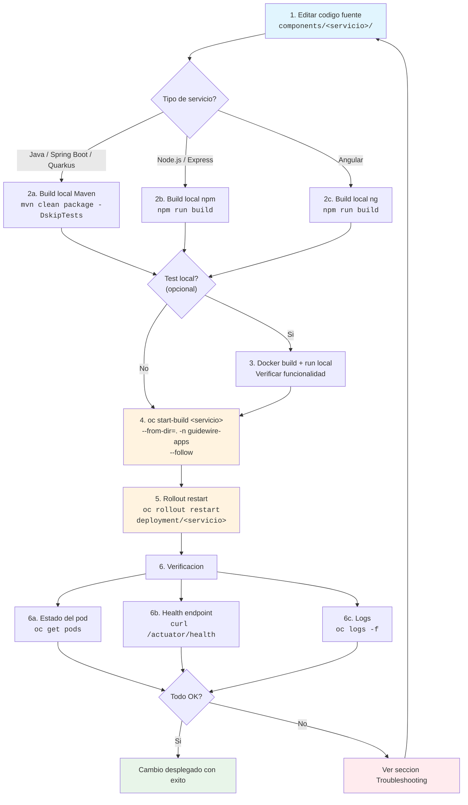
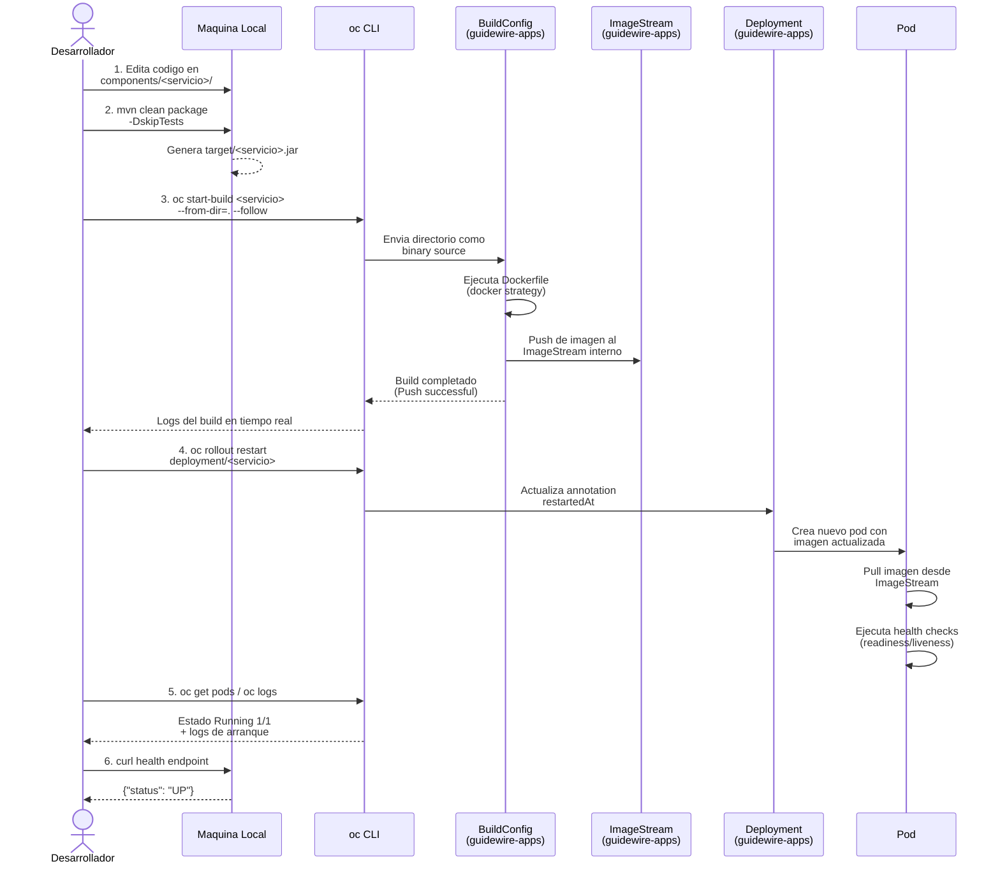

# Flujo de Cambios en Componentes

> [Inicio](../../../README.md) > [Specs](../../README.md) > [Development](./CHANGE-FLOW.md)

---

## Tabla de Contenidos

1. [Vision General](#vision-general)
2. [Diagrama de Flujo Completo](#diagrama-de-flujo-completo)
3. [Pasos en Detalle](#pasos-en-detalle)
4. [Detalles por Servicio](#detalles-por-servicio)
5. [Diagrama de Secuencia](#diagrama-de-secuencia)
6. [Comandos Utiles](#comandos-utiles)
7. [Troubleshooting](#troubleshooting)

---

## Vision General

Este documento describe el ciclo de vida completo que debe seguirse al realizar un cambio en cualquier componente del proyecto Guidewire POC. El entorno de despliegue es **Red Hat OpenShift Local (CRC)** con dos namespaces:

- **`guidewire-infra`** — Infraestructura (Kafka, PostgreSQL, Apicurio Registry, 3Scale APIcast)
- **`guidewire-apps`** — Aplicaciones (los 5 microservicios + simulador Angular)

El flujo utiliza **Binary Builds** de OpenShift: el codigo fuente se compila localmente y se envia al cluster, donde un `BuildConfig` con estrategia Docker construye la imagen y la publica en un `ImageStream` interno. Luego se reinicia el `Deployment` para que tome la nueva imagen.

> **Nota:** No existe pipeline CI/CD automatico contra CRC (issue #129). Todo despliegue al cluster es manual mediante comandos `oc`.

---

## Diagrama de Flujo Completo



---

## Pasos en Detalle

### Paso 1 — Editar el codigo fuente

Todos los componentes residen bajo `components/<servicio>/`. Realiza los cambios necesarios en el codigo fuente, configuracion (`application.yml`, `.env`, etc.) o recursos estaticos.

```bash
# Ejemplo: editar el billing-service
cd /home/monghit/git/pocs/guidewire/components/billing-service
# ... editar archivos ...
```

### Paso 2 — Build local

#### Servicios Java (Maven)

Aplica a: `drools-engine`, `billing-service`, `camel-gateway`, `incidents-service`.

```bash
cd /home/monghit/git/pocs/guidewire/components/<servicio>
mvn clean package -DskipTests
```

El artefacto resultante (JAR o runner) queda en `target/`.

#### Servicio Node.js

Aplica a: `customers-service`.

```bash
cd /home/monghit/git/pocs/guidewire/components/customers-service
npm install
npm run build
```

#### Aplicacion Angular

Aplica a: `guidewire-simulator` (si existe).

```bash
cd /home/monghit/git/pocs/guidewire/components/guidewire-simulator
npm install
npm run build
```

El resultado queda en `dist/`.

### Paso 3 — Test local (opcional)

Para verificar que la imagen Docker funciona antes de enviarla a OpenShift:

```bash
cd /home/monghit/git/pocs/guidewire/components/<servicio>
docker build -t <servicio>:test .
docker run --rm -p <puerto>:<puerto> <servicio>:test
```

Verificar con:

```bash
curl http://localhost:<puerto>/<health-endpoint>
```

### Paso 4 — Binary Build en OpenShift

Este es el paso principal. Se envia el directorio completo del servicio al `BuildConfig` de OpenShift, que ejecuta el `Dockerfile` dentro del cluster.

```bash
export KUBECONFIG=/home/monghit/.crc/machines/crc/kubeconfig
OC=/home/monghit/.crc/bin/oc/oc

cd /home/monghit/git/pocs/guidewire/components/<servicio>
$OC start-build <servicio> --from-dir=. -n guidewire-apps --follow
```

> **Importante:** El `--from-dir=.` envia todo el contenido del directorio actual. Asegurate de estar en el directorio raiz del servicio y de que el build local haya finalizado correctamente.

El flag `--follow` muestra los logs del build en tiempo real. Espera a ver el mensaje `Push successful` antes de continuar.

### Paso 5 — Rollout del Deployment

Una vez completado el build, reinicia el deployment para que tome la nueva imagen:

```bash
$OC rollout restart deployment/<servicio> -n guidewire-apps
```

Monitorea el progreso:

```bash
$OC rollout status deployment/<servicio> -n guidewire-apps
```

### Paso 6 — Verificacion

#### 6a. Estado del pod

```bash
$OC get pods -n guidewire-apps -l app=<servicio>
```

El pod debe estar en estado `Running` con `1/1 READY`.

#### 6b. Health endpoint

Accede al endpoint de salud a traves de la ruta de OpenShift:

```bash
curl -k https://<servicio>-guidewire-apps.apps-crc.testing/<health-endpoint>
```

#### 6c. Logs

```bash
$OC logs -f deployment/<servicio> -n guidewire-apps
```

Buscar errores de arranque, fallos de conexion a base de datos o a Kafka, etc.

---

## Detalles por Servicio

| Servicio | Stack | Puerto | Health Endpoint | Swagger / UI | Build Command |
|---|---|---|---|---|---|
| `drools-engine` | Spring Boot 3 + Drools 8 | 8086 | `/actuator/health` | `/swagger-ui.html` | `mvn clean package -DskipTests` |
| `billing-service` | Spring Boot 3 + Kafka | 8082 | `/actuator/health` | `/swagger-ui.html` | `mvn clean package -DskipTests` |
| `camel-gateway` | Spring Boot 3 + Apache Camel 4 | 8080 | `/actuator/health` | `/swagger-ui.html` | `mvn clean package -DskipTests` |
| `incidents-service` | Quarkus 3 | 8083 | `/q/health` | `/q/swagger-ui` | `mvn clean package -DskipTests` |
| `customers-service` | Node.js + Express + Prisma | 3000 | `/health` | _(no tiene)_ | `npm install && npm run build` |
| `guidewire-simulator` | Angular 21 + nginx | 4200 (dev) / 8080 (prod) | _(SPA estatica)_ | _(no aplica)_ | `npm run build` |

### Notas especificas por servicio

- **camel-gateway**: Usa `valueSerializer` (no `serializerClass`) en configuracion Kafka (Camel 4). Requiere `camel-openapi-java-starter` para Swagger.
- **customers-service**: Prisma en Alpine/OpenShift necesita target `linux-musl-openssl-3.0.x` y `apk add openssl`. El Dockerfile debe incluir `chmod -R g+rwX /app && chgrp -R 0 /app` para UIDs aleatorios de OpenShift.
- **incidents-service**: Quarkus usa endpoints distintos (`/q/health`, `/q/swagger-ui`) a los de Spring Boot.
- **guidewire-simulator**: En produccion se sirve con nginx en puerto 8080. El build Angular genera los archivos en `dist/` que se copian al contenedor nginx.

---

## Diagrama de Secuencia



---

## Comandos Utiles

### Variables de entorno

```bash
export KUBECONFIG=/home/monghit/.crc/machines/crc/kubeconfig
export OC=/home/monghit/.crc/bin/oc/oc
```

### Contexto y login

```bash
# Verificar conexion al cluster
$OC whoami
$OC status

# Cambiar al namespace de aplicaciones
$OC project guidewire-apps
```

### Build y despliegue

```bash
# Build de un servicio (ejecutar desde el directorio del servicio)
$OC start-build <servicio> --from-dir=. -n guidewire-apps --follow

# Rollout
$OC rollout restart deployment/<servicio> -n guidewire-apps
$OC rollout status deployment/<servicio> -n guidewire-apps
```

### Verificacion

```bash
# Todos los pods de aplicaciones
$OC get pods -n guidewire-apps

# Pods de infraestructura
$OC get pods -n guidewire-infra

# Logs en tiempo real
$OC logs -f deployment/<servicio> -n guidewire-apps

# Logs de un build especifico
$OC logs build/<servicio>-<numero> -n guidewire-apps

# Health endpoint via ruta
curl -k https://<servicio>-guidewire-apps.apps-crc.testing/<health-endpoint>

# Describir un pod (eventos, estado de contenedores)
$OC describe pod <nombre-pod> -n guidewire-apps
```

### ImageStreams y Builds

```bash
# Ver ImageStreams
$OC get is -n guidewire-apps

# Ver historial de builds
$OC get builds -n guidewire-apps

# Ver BuildConfigs
$OC get bc -n guidewire-apps

# Ver detalle de un BuildConfig
$OC describe bc/<servicio> -n guidewire-apps
```

### Rutas

```bash
# Listar todas las rutas
$OC get routes -n guidewire-apps

# Obtener la URL de un servicio
$OC get route <servicio> -n guidewire-apps -o jsonpath='{.spec.host}'
```

---

## Troubleshooting

### El build falla con "Push successful" ausente

**Causa:** Error en el Dockerfile o en la compilacion dentro del cluster.

```bash
# Ver logs del ultimo build
$OC logs build/<servicio>-<ultimo-numero> -n guidewire-apps

# Listar builds para ver el numero
$OC get builds -n guidewire-apps | grep <servicio>
```

### El pod queda en `CrashLoopBackOff`

**Causa:** La aplicacion falla al arrancar (conexion a BD, Kafka, configuracion incorrecta).

```bash
# Ver logs del pod que falla
$OC logs deployment/<servicio> -n guidewire-apps --previous

# Ver eventos del pod
$OC describe pod -l app=<servicio> -n guidewire-apps
```

**Soluciones comunes:**
- Verificar que PostgreSQL y Kafka estan corriendo en `guidewire-infra`
- Revisar variables de entorno en el Deployment (ConfigMaps, Secrets)
- Para `customers-service`: verificar que Prisma puede conectar a PostgreSQL

### El pod queda en `ImagePullBackOff`

**Causa:** El ImageStream no tiene la imagen o el nombre esta mal.

```bash
# Verificar que el ImageStream tiene tags
$OC get is/<servicio> -n guidewire-apps -o yaml

# Verificar que el build termino correctamente
$OC get builds -n guidewire-apps | grep <servicio>
```

### Error `Permission denied` en el contenedor

**Causa:** OpenShift ejecuta contenedores con UID aleatorio (no root).

**Solucion:** Asegurar que el Dockerfile incluya:

```dockerfile
RUN chmod -R g+rwX /app && chgrp -R 0 /app
```

### El health check falla (pod en `Running` pero `0/1 READY`)

**Causa:** La aplicacion tarda en arrancar o el endpoint de salud no responde.

```bash
# Ver configuracion de probes
$OC get deployment/<servicio> -n guidewire-apps -o yaml | grep -A 10 readinessProbe

# Ver logs para identificar si la app arranco
$OC logs deployment/<servicio> -n guidewire-apps | tail -50
```

**Soluciones:**
- Aumentar `initialDelaySeconds` en el readinessProbe
- Para servicios Java: verificar que el puerto configurado coincide con el del Deployment

### El servicio no es accesible desde fuera del cluster

**Causa:** Falta la `Route` o el `Service` no apunta al puerto correcto.

```bash
# Verificar que existe la ruta
$OC get route <servicio> -n guidewire-apps

# Verificar que el Service tiene endpoints
$OC get endpoints <servicio> -n guidewire-apps

# Crear una ruta si no existe
$OC expose svc/<servicio> -n guidewire-apps
```

### Nombres de imagenes no calificados

**Causa:** OpenShift requiere nombres de imagen completamente calificados (FQDN).

**Ejemplo incorrecto:** `FROM maven:3.9-eclipse-temurin-21`
**Ejemplo correcto:** `FROM docker.io/library/maven:3.9-eclipse-temurin-21`

### Kafka: el servicio no produce/consume mensajes

```bash
# Verificar que Kafka esta corriendo
$OC get pods -n guidewire-infra | grep kafka

# Verificar topics
$OC exec -n guidewire-infra kafka-cluster-dual-role-0 -- \
  bin/kafka-topics.sh --bootstrap-server localhost:9092 --list
```

---

> **Documento creado:** 2026-02-22
> **Ultima actualizacion:** 2026-02-22
