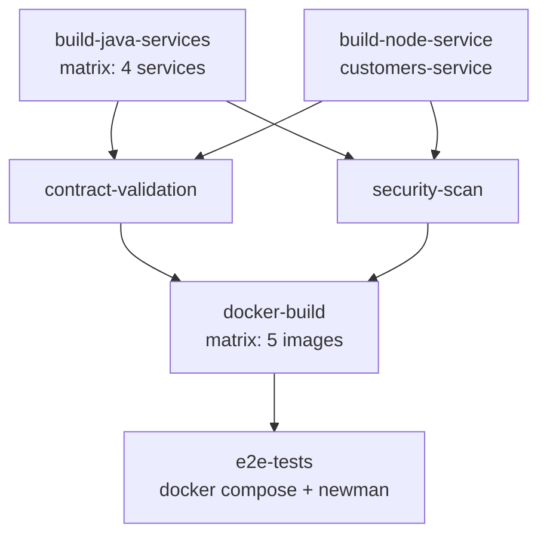

# DevOps / CI-CD — Documentación

> [Volver a OpenSpecs](../../README.md) · [Volver al README principal](../../../README.md)

## Pipeline CI/CD (GitHub Actions)

### Trigger

- Push a `main` o `develop`
- Pull request hacia `main`

### Jobs



### Validación de Contratos

```bash
# OpenAPI
spectral lint contracts/openapi/*.yml

# AsyncAPI
asyncapi validate contracts/asyncapi/*.yml

# AVRO
avro-tools compile schema contracts/avro/ /tmp/avro-output
```

### Seguridad

- **OWASP Dependency Check**: vulnerabilidades en dependencias
- **Trivy**: vulnerabilidades en imágenes Docker
- **Gitleaks**: detección de secrets en el código

## Spec de referencia

- [spec.yml](../../devops/ci-cd/spec.yml)
- Issue: [#69](../../../issues/69)

## Pipelines implementados

| Pipeline | Archivo | Descripcion |
|----------|---------|-------------|
| CI | [ci.yml](../../../.github/workflows/ci.yml) | Build, test, lint, validacion de contratos, seguridad |
| CD | [cd.yml](../../../.github/workflows/cd.yml) | Deploy a OpenShift, tagging de imagenes, registro de contratos |
| Dependabot | [dependabot.yml](../../../.github/dependabot.yml) | Actualizacion automatica de dependencias |
| PR Template | [pull_request_template.md](../../../.github/pull_request_template.md) | Template para Pull Requests |

## Documentacion relacionada

- [Integracion y Testing E2E](../integration/README.md)
- [Arquitectura](../architecture/README.md)
