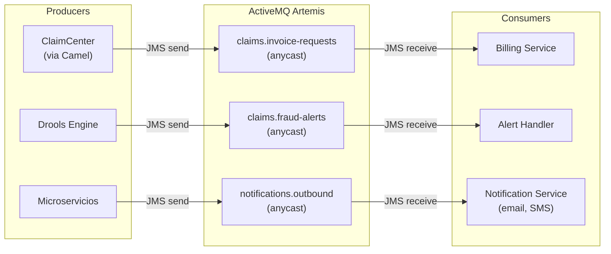

# ActiveMQ Artemis — Documentación

## Descripción

Broker de mensajería JMS/AMQP para patrones request/reply, transacciones y colas de trabajo. Complementa a Kafka para casos que requieren entrega garantizada punto a punto.

## Cuándo usar ActiveMQ vs Kafka

| Caso | ActiveMQ | Kafka |
|------|----------|-------|
| Request/Reply síncrono | Si | No |
| Transacciones JTA/XA | Si | No |
| Prioridad de mensajes | Si | No |
| Cola de trabajo (un solo consumer) | Si | Posible |
| Event streaming (múltiples consumers) | No | Si |
| Alta retención (días/semanas) | No | Si |
| Replay de eventos | No | Si |

## Configuración

| Parámetro | Valor |
|-----------|-------|
| Imagen | `apache/activemq-artemis:2.33.0` |
| Puerto broker | **61616** (AMQP/JMS) |
| Puerto consola | **8161** (Hawtio) |
| Usuario | `admin` / `admin123` |
| Protocolos | AMQP 1.0, JMS, STOMP, MQTT, OpenWire |

## DNS (OpenShift)

| Contexto | Dirección |
|----------|-----------|
| Mismo namespace (AMQP) | `activemq-broker-hdls-svc:61616` |
| Cross-namespace (AMQP) | `activemq-broker-hdls-svc.guidewire-infra.svc.cluster.local:61616` |
| Consola (Route) | `https://activemq-console-guidewire-infra.apps-crc.testing` |

## Colas

| Cola | Tipo | Descripción |
|------|------|-------------|
| `claims.invoice-requests` | anycast | Solicitudes de facturación desde ClaimCenter |
| `claims.fraud-alerts` | anycast | Alertas de fraude generadas por Drools |
| `notifications.outbound` | anycast | Notificaciones salientes (email, SMS) |

## Diagrama de Colas y Flujo JMS



## Consola Web (Hawtio)

- URL: https://activemq-console-guidewire-infra.apps-crc.testing/console
- Credenciales: `admin` / `admin123`
- Permite: ver colas, enviar mensajes de prueba, inspeccionar consumers

## Conexión desde Camel

```yaml
# application.yml del Camel Gateway
activemq:
  broker-url: tcp://activemq-broker-hdls-svc.guidewire-infra.svc.cluster.local:61616
  user: admin
  password: admin123
```

```java
// Camel route
from("jms:queue:claims.invoice-requests")
    .to("direct:process-invoice-request");
```

## Spec de referencia

- [spec.yml](../../../infra/activemq/spec.yml)
- Issue: [#32](../../../../issues/32)
