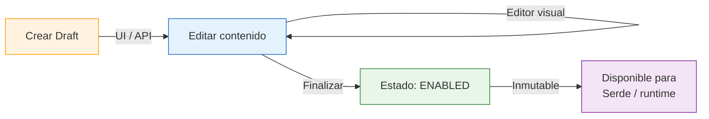
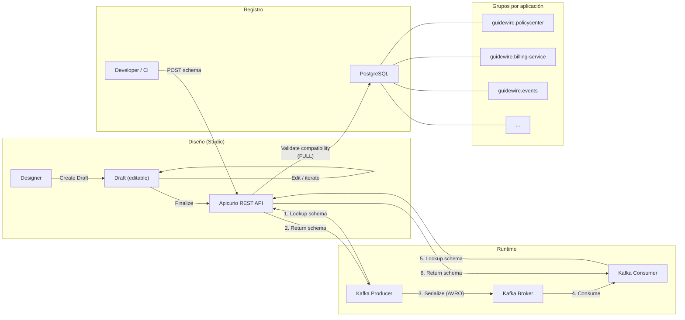

# Apicurio Service Registry — Documentación

> [Volver a OpenSpecs](../../../README.md) · [Volver al README principal](../../../../README.md)

## Descripción

Registro centralizado de contratos y esquemas del ecosistema Guidewire.
Almacena OpenAPI, AsyncAPI y AVRO schemas. Fuente de verdad para validación
de contratos en compilación y runtime.

Desde la versión 3.x, Apicurio Registry integra **Apicurio Studio** como
feature opt-in, permitiendo diseñar y editar APIs directamente desde la UI
del registry mediante artefactos en estado **Draft**.

## Configuración

| Parámetro | Valor |
|-----------|-------|
| Imagen (backend) | `apicurio/apicurio-registry:3.1.7` |
| Imagen (UI) | `apicurio/apicurio-registry-ui:3.1.7` |
| Puerto | **8080** (container) |
| Storage | PostgreSQL (base de datos `apicurio`) |
| UI | https://apicurio-guidewire-infra.apps-crc.testing |
| API REST v3 | https://apicurio-api-guidewire-infra.apps-crc.testing/apis/registry/v3 |
| API REST v2 (deprecated) | https://apicurio-api-guidewire-infra.apps-crc.testing/apis/registry/v2 |

## DNS (OpenShift)

| Contexto | Dirección |
|----------|-----------|
| Backend (mismo namespace) | `apicurio-registry:8080` |
| Backend (cross-namespace) | `apicurio-registry.guidewire-infra.svc.cluster.local:8080` |
| UI (Route) | `https://apicurio-guidewire-infra.apps-crc.testing` |
| API (Route) | `https://apicurio-api-guidewire-infra.apps-crc.testing` |

---

## Apicurio Studio (Editor de APIs)

A partir de Registry 3.x, la funcionalidad de **Apicurio Studio** (antes un
producto independiente, deprecado en octubre 2025) está integrada directamente
en el Registry como feature opt-in llamada **"Drafts"**.

### ¿Qué es el feature de Drafts?

Cuando se habilita la variable `APICURIO_REST_MUTABILITY_ARTIFACT__VERSION__CONTENT_ENABLED=true`,
los artefactos pueden crearse en estado **DRAFT**. En este estado:

- El contenido del artefacto es **editable** (mutable)
- Se puede usar el **editor visual** integrado en la UI para diseñar OpenAPI, AsyncAPI, etc.
- Los schemas en Draft **no son accesibles** para los clientes Serde en runtime

### Flujo de diseño



### Crear y editar un Draft desde la UI

1. Acceder a la UI: https://apicurio-guidewire-infra.apps-crc.testing
2. Click en **"Create artifact"**
3. Seleccionar tipo (OpenAPI, AsyncAPI, Avro, etc.)
4. El artefacto se crea en estado **DRAFT** — editable
5. Usar el **editor integrado** para diseñar el contrato
6. Cuando esté listo, click en **"Finalize"** para pasar a estado **ENABLED** (inmutable)

### Crear un Draft desde la API

```bash
APICURIO=https://apicurio-api-guidewire-infra.apps-crc.testing/apis/registry/v3

curl -X POST "$APICURIO/groups/guidewire.billing-service/artifacts" \
  -H "Content-Type: application/json" \
  -d '{
    "artifactId": "my-new-api",
    "artifactType": "OPENAPI",
    "firstVersion": {
      "version": "1.0.0",
      "content": {
        "contentType": "application/x-yaml",
        "content": "openapi: 3.1.0\ninfo:\n  title: My API\n  version: 1.0.0\npaths: {}"
      },
      "isDraft": true
    }
  }'
```

---

## Organización de artefactos

### Grupos (por aplicación)

Todos los artefactos se organizan bajo el prefijo `guidewire.<aplicacion>`:

| Grupo | Contenido | Artefactos |
|-------|-----------|------------|
| `guidewire.policycenter` | API REST del sistema core PolicyCenter | policycenter-api (OPENAPI) |
| `guidewire.claimcenter` | API REST del sistema core ClaimCenter | claimcenter-api (OPENAPI) |
| `guidewire.billingcenter` | API REST del sistema core BillingCenter | billingcenter-api (OPENAPI) |
| `guidewire.camel-gateway` | API REST del gateway de integración | camel-gateway-api (OPENAPI) |
| `guidewire.billing-service` | Microservicio de facturación | billing-service-api (OPENAPI), InvoiceCreated (AVRO), InvoiceStatusChanged (AVRO) |
| `guidewire.incidents-service` | Microservicio de incidencias | incidents-service-api (OPENAPI), IncidentCreated (AVRO), IncidentStatusChanged (AVRO) |
| `guidewire.customers-service` | Microservicio de clientes | customers-service-api (OPENAPI), CustomerRegistered (AVRO), CustomerStatusChanged (AVRO) |
| `guidewire.drools-engine` | Motor de reglas de negocio | drools-engine-api (OPENAPI) |
| `guidewire.events` | Especificación global de eventos Kafka | guidewire-events (ASYNCAPI) |

### Labels

Cada artefacto tiene labels para búsqueda y filtrado:

| Label | Valores posibles | Descripción |
|-------|------------------|-------------|
| `communication` | `sync`, `async` | Tipo de comunicación |
| `type` | `openapi`, `asyncapi`, `avro` | Tipo de especificación |
| `layer` | `core-guidewire`, `gateway`, `microservice`, `events` | Capa arquitectónica |
| `domain` | `policies`, `claims`, `billing`, `customers`, `incidents`, `rules`, `integration`, `all` | Dominio funcional |

### Convención obligatoria

> **Toda API diseñada, añadida o modificada debe registrarse en Apicurio Registry**
> con su grupo, nombre, descripción y labels correspondientes.
> Véase issue [#88](../../../../issues/88) para automatización CI/CD.

---

## Búsqueda por labels

### Desde la UI

En la interfaz web de Apicurio, usar el campo "Labels" del buscador:

- Escribir el label completo: `communication:sync`
- Se puede combinar con el filtro de grupo del dropdown

### Desde la API REST

```bash
# === API v3 (recomendada) ===
APICURIO=https://apicurio-api-guidewire-infra.apps-crc.testing/apis/registry/v3

# Buscar artefactos por nombre
curl -sk "$APICURIO/search/artifacts?name=billing"

# Buscar por grupo
curl -sk "$APICURIO/groups/guidewire.billing-service/artifacts"

# === API v2 (deprecated, sigue funcionando por compatibilidad) ===
APICURIO_V2=https://apicurio-api-guidewire-infra.apps-crc.testing/apis/registry/v2

# Solo APIs síncronas (REST)
curl -sk "$APICURIO_V2/search/artifacts?labels=communication:sync"

# Solo APIs asíncronas (eventos Kafka)
curl -sk "$APICURIO_V2/search/artifacts?labels=communication:async"

# Solo OpenAPI
curl -sk "$APICURIO_V2/search/artifacts?labels=type:openapi"

# Solo AsyncAPI
curl -sk "$APICURIO_V2/search/artifacts?labels=type:asyncapi"

# Solo Avro schemas
curl -sk "$APICURIO_V2/search/artifacts?labels=type:avro"

# Todo lo relacionado con billing (API REST + schemas Avro)
curl -sk "$APICURIO_V2/search/artifacts?labels=domain:billing"

# Solo microservicios
curl -sk "$APICURIO_V2/search/artifacts?labels=layer:microservice"

# Todos los artefactos de billing-service
curl -sk "$APICURIO_V2/search/artifacts?group=guidewire.billing-service"

# Schemas Avro del dominio billing
curl -sk "$APICURIO_V2/search/artifacts?labels=type:avro&labels=domain:billing"

# APIs síncronas de la capa microservice
curl -sk "$APICURIO_V2/search/artifacts?labels=communication:sync&labels=layer:microservice"
```

---

## Registrar artefactos

### API v3 (recomendada para nuevos registros)

```bash
APICURIO=https://apicurio-api-guidewire-infra.apps-crc.testing/apis/registry/v3

# Registrar spec OpenAPI
curl -X POST "$APICURIO/groups/guidewire.<aplicacion>/artifacts" \
  -H "Content-Type: application/json" \
  -d '{
    "artifactId": "<nombre>-api",
    "artifactType": "OPENAPI",
    "firstVersion": {
      "version": "1.0.0",
      "content": {
        "contentType": "application/x-yaml",
        "content": "'"$(cat contracts/openapi/<nombre>-api.yml)"'"
      }
    }
  }'
```

### API v2 (deprecated, sigue funcionando)

El script `register-contracts.sh` utiliza la API v2 por compatibilidad:

```bash
APICURIO_V2=https://apicurio-api-guidewire-infra.apps-crc.testing/apis/registry/v2

# Registrar spec OpenAPI
curl -X POST $APICURIO_V2/groups/guidewire.<aplicacion>/artifacts \
  -H "Content-Type: application/x-yaml" \
  -H "X-Registry-ArtifactId: <nombre>-api" \
  -H "X-Registry-ArtifactType: OPENAPI" \
  --data-binary @contracts/openapi/<nombre>-api.yml

# Registrar schema Avro
curl -X POST $APICURIO_V2/groups/guidewire.<aplicacion>/artifacts \
  -H "Content-Type: application/json" \
  -H "X-Registry-ArtifactId: <topic>-value" \
  -H "X-Registry-ArtifactType: AVRO" \
  -H "X-Registry-Name: <NombreSchema>" \
  --data-binary @contracts/avro/<NombreSchema>.avsc

# Registrar spec AsyncAPI
curl -X POST $APICURIO_V2/groups/guidewire.events/artifacts \
  -H "Content-Type: application/x-yaml" \
  -H "X-Registry-ArtifactId: guidewire-events" \
  -H "X-Registry-ArtifactType: ASYNCAPI" \
  --data-binary @contracts/asyncapi/guidewire-events.yml
```

### Actualizar versión existente (API v2)

```bash
curl -X POST $APICURIO_V2/groups/guidewire.<app>/artifacts/<id>/versions \
  -H "Content-Type: application/x-yaml" \
  --data-binary @contracts/openapi/<nombre>-api.yml
```

---

## Integración con Kafka (Serde)

Los clientes Kafka usan el serializer/deserializer de Apicurio para resolver schemas automáticamente.
Los Serde libraries 2.x son compatibles con Registry 3.x a través de la API v2 deprecated:

```yaml
# Producer
spring.kafka.producer.value-serializer: io.apicurio.registry.serde.avro.AvroKafkaSerializer

# Consumer
spring.kafka.consumer.value-deserializer: io.apicurio.registry.serde.avro.AvroKafkaDeserializer

# Registry URL (usa API v2 para compatibilidad con Serde 2.x)
apicurio.registry.url: http://apicurio-registry.guidewire-infra.svc.cluster.local:8080/apis/registry/v2
```

## Reglas de compatibilidad

| Regla | Nivel | Descripción |
|-------|-------|-------------|
| **FULL** | Global | Nuevos schemas deben ser FORWARD + BACKWARD compatibles |

Esto garantiza que producers y consumers antiguos y nuevos puedan coexistir durante actualizaciones.

## Limitaciones conocidas

- **`$ref` externos** en AsyncAPI (ej: `../avro/InvoiceCreated.avsc`) no resuelven en Apicurio → inlinear los schemas Avro en el payload
- **PUT de metadata** (API v2) reemplaza todos los campos → siempre enviar el objeto completo
- **Versiones finalizadas** no se pueden modificar → solo los Drafts son editables
- **API v2** está deprecated en Registry 3.x → funciona por compatibilidad pero el formato de request cambió en v3 (JSON envelope)
- **Serde 2.x** sigue funcionando con Registry 3.x via API v2 → migración a Serde 3.x es opcional

## Diagrama de flujo



## API REST útil

```bash
# === API v3 (recomendada) ===
APICURIO=https://apicurio-api-guidewire-infra.apps-crc.testing/apis/registry/v3

# Listar grupos
curl -sk "$APICURIO/groups?limit=30"

# Listar artefactos de un grupo
curl -sk "$APICURIO/groups/guidewire.billing-service/artifacts"

# Obtener contenido de un artefacto (última versión)
curl -sk "$APICURIO/groups/guidewire.billing-service/artifacts/billing-service-api/versions/branch=latest/content"

# Listar versiones
curl -sk "$APICURIO/groups/guidewire.billing-service/artifacts/billing-service-api/versions"

# Buscar artefactos
curl -sk "$APICURIO/search/artifacts?name=billing"

# === API v2 (deprecated, sigue funcionando) ===
APICURIO_V2=https://apicurio-api-guidewire-infra.apps-crc.testing/apis/registry/v2

# Listar todos los artefactos
curl -sk "$APICURIO_V2/search/artifacts?limit=30"

# Obtener contenido de un artefacto
curl -sk "$APICURIO_V2/groups/guidewire.billing-service/artifacts/billing-service-api"

# Buscar por label
curl -sk "$APICURIO_V2/search/artifacts?labels=communication:sync"
```

## Migración v2 → v3

La base de datos de Apicurio 2.x **no es compatible** con 3.x. Al desplegar
Registry 3.x, la base de datos `apicurio` se recrea automáticamente con el
nuevo schema. Los contratos se re-registran ejecutando:

```bash
lab/openshift/scripts/register-contracts.sh http://apicurio-api-guidewire-infra.apps-crc.testing
```

Este script usa la API v2 (compatible en 3.x). Los microservicios no requieren
cambios de código ya que sus Serde libraries usan `/apis/registry/v2` que sigue
disponible como capa de compatibilidad.

## Spec de referencia

- [spec.yml](../../../infra/apicurio/spec.yml)
- Issue: [#30](../../../../issues/30)
- CI/CD: [#88](../../../../issues/88)

---

## Documentación relacionada

- [Kafka](../kafka/README.md) — Broker de eventos cuyo serde se integra con Apicurio
- [Contratos OpenAPI](../../../../contracts/openapi/) — Specs REST registradas en el registry
- [Contratos AVRO](../../../../contracts/avro/) — Schemas Avro registrados en el registry
- [Contratos AsyncAPI](../../../../contracts/asyncapi/) — Spec de eventos Kafka registrada en el registry
