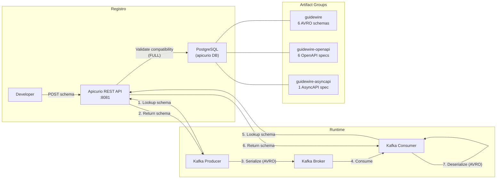

# Apicurio Service Registry — Documentación

## Descripción

Registro centralizado de contratos y esquemas. Almacena OpenAPI, AsyncAPI y AVRO schemas. Fuente de verdad para validación de contratos en compilación y runtime.

## Configuración

| Parámetro | Valor |
|-----------|-------|
| Imagen | `apicurio/apicurio-registry-sql:2.5.11.Final` |
| Puerto | **8081** |
| Storage | PostgreSQL (base de datos `apicurio`) |
| UI | https://apicurio-guidewire-infra.apps-crc.testing |
| API REST | https://apicurio-guidewire-infra.apps-crc.testing/apis/registry/v2 |

## DNS (OpenShift)

| Contexto | Dirección |
|----------|-----------|
| Mismo namespace | `apicurio-registry:8080` |
| Cross-namespace | `apicurio-registry.guidewire-infra.svc.cluster.local:8080` |
| UI (Route) | `https://apicurio-guidewire-infra.apps-crc.testing` |

## Grupos de Artefactos

| Grupo | Tipo | Contenido |
|-------|------|-----------|
| `guidewire` | AVRO | Schemas de eventos Kafka (6 schemas) |
| `guidewire-openapi` | OpenAPI | Specs REST de APIs (6 specs) |
| `guidewire-asyncapi` | AsyncAPI | Spec de eventos asincrónicos (1 spec) |

## Reglas de Compatibilidad

| Regla | Nivel | Descripción |
|-------|-------|-------------|
| **FULL** | Global | Nuevos schemas deben ser FORWARD + BACKWARD compatibles |

Esto garantiza que producers y consumers antiguos y nuevos puedan coexistir durante actualizaciones.

## Registrar un Schema

```bash
# Via Route
APICURIO_URL=https://apicurio-guidewire-infra.apps-crc.testing

# Registrar schema AVRO
curl -X POST $APICURIO_URL/apis/registry/v2/groups/guidewire/artifacts \
  -H "Content-Type: application/json; artifactType=AVRO" \
  -H "X-Registry-ArtifactId: InvoiceCreated" \
  -d @contracts/avro/InvoiceCreated.avsc

# Registrar spec OpenAPI
curl -X POST $APICURIO_URL/apis/registry/v2/groups/guidewire-openapi/artifacts \
  -H "Content-Type: application/json; artifactType=OPENAPI" \
  -H "X-Registry-ArtifactId: policycenter-api" \
  -d @contracts/openapi/policycenter-api.yml
```

## Integración con Kafka (Serde)

Los clientes Kafka usan el `KafkaAvroSerializer` / `KafkaAvroDeserializer` de Apicurio para resolver schemas automáticamente:

```yaml
# Producer
spring.kafka.producer.value-serializer: io.apicurio.registry.serde.avro.AvroKafkaSerializer

# Consumer
spring.kafka.consumer.value-deserializer: io.apicurio.registry.serde.avro.AvroKafkaDeserializer

# Registry URL
apicurio.registry.url: http://apicurio-registry.guidewire-infra.svc.cluster.local:8080/apis/registry/v2
```

## Diagrama de Flujo del Schema Registry



## Momentos de Validación

1. **Registro** — Al subir un schema, se valida contra reglas de compatibilidad
2. **Build** — El plugin Maven descarga schemas y genera código (opcional)
3. **Runtime** — El serializer valida contra el schema del registry

## API REST útil

```bash
APICURIO_URL=https://apicurio-guidewire-infra.apps-crc.testing

# Listar artefactos de un grupo
curl $APICURIO_URL/apis/registry/v2/groups/guidewire/artifacts

# Obtener schema por ID
curl $APICURIO_URL/apis/registry/v2/groups/guidewire/artifacts/InvoiceCreated

# Listar versiones
curl $APICURIO_URL/apis/registry/v2/groups/guidewire/artifacts/InvoiceCreated/versions
```

## Spec de referencia

- [spec.yml](../../../infra/apicurio/spec.yml)
- Issue: [#30](../../../../issues/30)
