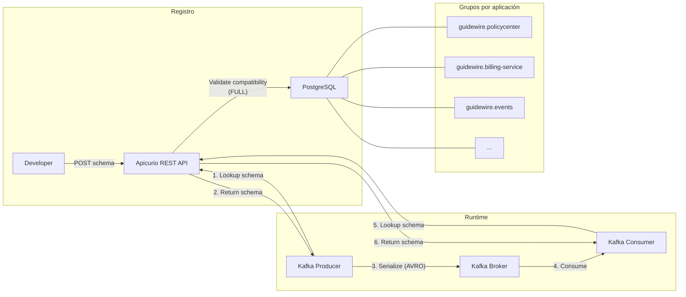

# Apicurio Service Registry — Documentación

## Descripción

Registro centralizado de contratos y esquemas del ecosistema Guidewire.
Almacena OpenAPI, AsyncAPI y AVRO schemas. Fuente de verdad para validación
de contratos en compilación y runtime.

## Configuración

| Parámetro | Valor |
|-----------|-------|
| Imagen | `apicurio/apicurio-registry-sql:2.5.11.Final` |
| Puerto | **8080** (container) / **8081** (host) |
| Storage | PostgreSQL (base de datos `apicurio`) |
| UI | https://apicurio-guidewire-infra.apps-crc.testing |
| API REST | https://apicurio-guidewire-infra.apps-crc.testing/apis/registry/v2 |

## DNS (OpenShift)

| Contexto | Dirección |
|----------|-----------|
| Mismo namespace | `apicurio-registry:8080` |
| Cross-namespace | `apicurio-registry.guidewire-infra.svc.cluster.local:8080` |
| UI (Route) | `https://apicurio-guidewire-infra.apps-crc.testing` |

---

## Organización de artefactos

### Grupos (por aplicación)

Todos los artefactos se organizan bajo el prefijo `guidewire.<aplicacion>`:

| Grupo | Contenido | Artefactos |
|-------|-----------|------------|
| `guidewire.policycenter` | API REST del sistema core PolicyCenter | policycenter-api (OPENAPI) |
| `guidewire.claimcenter` | API REST del sistema core ClaimCenter | claimcenter-api (OPENAPI) |
| `guidewire.billingcenter` | API REST del sistema core BillingCenter | billingcenter-api (OPENAPI) |
| `guidewire.camel-gateway` | API REST del gateway de integración | camel-gateway-api (OPENAPI) |
| `guidewire.billing-service` | Microservicio de facturación | billing-service-api (OPENAPI), InvoiceCreated (AVRO), InvoiceStatusChanged (AVRO) |
| `guidewire.incidents-service` | Microservicio de incidencias | incidents-service-api (OPENAPI), IncidentCreated (AVRO), IncidentStatusChanged (AVRO) |
| `guidewire.customers-service` | Microservicio de clientes | customers-service-api (OPENAPI), CustomerRegistered (AVRO), CustomerStatusChanged (AVRO) |
| `guidewire.drools-engine` | Motor de reglas de negocio | drools-engine-api (OPENAPI) |
| `guidewire.events` | Especificación global de eventos Kafka | guidewire-events (ASYNCAPI) |

### Labels

Cada artefacto tiene labels para búsqueda y filtrado:

| Label | Valores posibles | Descripción |
|-------|------------------|-------------|
| `communication` | `sync`, `async` | Tipo de comunicación |
| `type` | `openapi`, `asyncapi`, `avro` | Tipo de especificación |
| `layer` | `core-guidewire`, `gateway`, `microservice`, `events` | Capa arquitectónica |
| `domain` | `policies`, `claims`, `billing`, `customers`, `incidents`, `rules`, `integration`, `all` | Dominio funcional |

### Convención obligatoria

> **Toda API diseñada, añadida o modificada debe registrarse en Apicurio Registry**
> con su grupo, nombre, descripción y labels correspondientes.
> Véase issue [#88](../../../../issues/88) para automatización CI/CD.

---

## Búsqueda por labels

### Desde la UI

En la interfaz web de Apicurio, usar el campo "Labels" del buscador:

- Escribir el label completo: `communication:sync`
- Se puede combinar con el filtro de grupo del dropdown

### Desde la API REST

```bash
APICURIO=https://apicurio-guidewire-infra.apps-crc.testing/apis/registry/v2

# === Filtrar por tipo de comunicación ===

# Solo APIs síncronas (REST)
curl -sk "$APICURIO/search/artifacts?labels=communication:sync"

# Solo APIs asíncronas (eventos Kafka)
curl -sk "$APICURIO/search/artifacts?labels=communication:async"

# === Filtrar por tipo de especificación ===

# Solo OpenAPI
curl -sk "$APICURIO/search/artifacts?labels=type:openapi"

# Solo AsyncAPI
curl -sk "$APICURIO/search/artifacts?labels=type:asyncapi"

# Solo Avro schemas
curl -sk "$APICURIO/search/artifacts?labels=type:avro"

# === Filtrar por dominio funcional ===

# Todo lo relacionado con billing (API REST + schemas Avro)
curl -sk "$APICURIO/search/artifacts?labels=domain:billing"

# Todo lo relacionado con incidents
curl -sk "$APICURIO/search/artifacts?labels=domain:incidents"

# === Filtrar por capa arquitectónica ===

# Solo microservicios
curl -sk "$APICURIO/search/artifacts?labels=layer:microservice"

# Solo sistemas core Guidewire
curl -sk "$APICURIO/search/artifacts?labels=layer:core-guidewire"

# Solo eventos
curl -sk "$APICURIO/search/artifacts?labels=layer:events"

# === Filtrar por grupo (aplicación) ===

# Todos los artefactos de billing-service
curl -sk "$APICURIO/search/artifacts?group=guidewire.billing-service"

# === Combinar filtros ===

# Schemas Avro del dominio billing
curl -sk "$APICURIO/search/artifacts?labels=type:avro&labels=domain:billing"

# APIs síncronas de la capa microservice
curl -sk "$APICURIO/search/artifacts?labels=communication:sync&labels=layer:microservice"
```

---

## Registrar artefactos

### Registrar spec OpenAPI

```bash
curl -X POST $APICURIO/groups/guidewire.<aplicacion>/artifacts \
  -H "Content-Type: application/x-yaml" \
  -H "X-Registry-ArtifactId: <nombre>-api" \
  -H "X-Registry-ArtifactType: OPENAPI" \
  --data-binary @contracts/openapi/<nombre>-api.yml
```

### Registrar schema Avro

```bash
curl -X POST $APICURIO/groups/guidewire.<aplicacion>/artifacts \
  -H "Content-Type: application/json" \
  -H "X-Registry-ArtifactId: <topic>-value" \
  -H "X-Registry-ArtifactType: AVRO" \
  -H "X-Registry-Name: <NombreSchema>" \
  --data-binary @contracts/avro/<NombreSchema>.avsc
```

### Registrar spec AsyncAPI

```bash
curl -X POST $APICURIO/groups/guidewire.events/artifacts \
  -H "Content-Type: application/x-yaml" \
  -H "X-Registry-ArtifactId: guidewire-events" \
  -H "X-Registry-ArtifactType: ASYNCAPI" \
  --data-binary @contracts/asyncapi/guidewire-events.yml
```

### Asignar metadata (nombre, descripción y labels)

Después de registrar, asignar metadata completa:

```bash
curl -X PUT $APICURIO/groups/guidewire.<app>/artifacts/<id>/meta \
  -H "Content-Type: application/json" \
  -d '{
    "name": "Nombre legible",
    "description": "Descripción breve del artefacto.",
    "labels": [
      "communication:sync",
      "type:openapi",
      "layer:microservice",
      "domain:billing"
    ]
  }'
```

> **Importante:** el PUT de metadata reemplaza todos los campos (no hace merge).
> Siempre incluir name, description y todos los labels en cada actualización.

### Actualizar versión existente

```bash
curl -X POST $APICURIO/groups/guidewire.<app>/artifacts/<id>/versions \
  -H "Content-Type: application/x-yaml" \
  --data-binary @contracts/openapi/<nombre>-api.yml
```

> Las versiones anteriores no se pueden eliminar (Apicurio es inmutable por diseño).

---

## Integración con Kafka (Serde)

Los clientes Kafka usan el serializer/deserializer de Apicurio para resolver schemas automáticamente:

```yaml
# Producer
spring.kafka.producer.value-serializer: io.apicurio.registry.serde.avro.AvroKafkaSerializer

# Consumer
spring.kafka.consumer.value-deserializer: io.apicurio.registry.serde.avro.AvroKafkaDeserializer

# Registry URL
apicurio.registry.url: http://apicurio-registry.guidewire-infra.svc.cluster.local:8080/apis/registry/v2
```

## Reglas de compatibilidad

| Regla | Nivel | Descripción |
|-------|-------|-------------|
| **FULL** | Global | Nuevos schemas deben ser FORWARD + BACKWARD compatibles |

Esto garantiza que producers y consumers antiguos y nuevos puedan coexistir durante actualizaciones.

## Limitaciones conocidas

- **AsyncAPI 3.0** no es soportado para visualización por Apicurio 2.5.x → usar **AsyncAPI 2.6.0**
- **`$ref` externos** en AsyncAPI (ej: `../avro/InvoiceCreated.avsc`) no resuelven en Apicurio → inlinear los schemas Avro en el payload
- **PUT de metadata** reemplaza todos los campos → siempre enviar el objeto completo
- **Versiones individuales** no se pueden eliminar → la última versión es siempre la "latest"

## Diagrama de flujo



## API REST útil

```bash
APICURIO=https://apicurio-guidewire-infra.apps-crc.testing/apis/registry/v2

# Listar todos los artefactos
curl -sk "$APICURIO/search/artifacts?limit=30"

# Listar artefactos de un grupo
curl -sk "$APICURIO/search/artifacts?group=guidewire.billing-service"

# Obtener contenido de un artefacto
curl -sk "$APICURIO/groups/guidewire.billing-service/artifacts/billing-service-api"

# Listar versiones
curl -sk "$APICURIO/groups/guidewire.billing-service/artifacts/billing-service-api/versions"

# Obtener metadata
curl -sk "$APICURIO/groups/guidewire.billing-service/artifacts/billing-service-api/meta"

# Buscar por label
curl -sk "$APICURIO/search/artifacts?labels=communication:sync"

# Buscar combinando labels
curl -sk "$APICURIO/search/artifacts?labels=type:avro&labels=domain:billing"
```

## Spec de referencia

- [spec.yml](../../../infra/apicurio/spec.yml)
- Issue: [#30](../../../../issues/30)
- CI/CD: [#88](../../../../issues/88)
