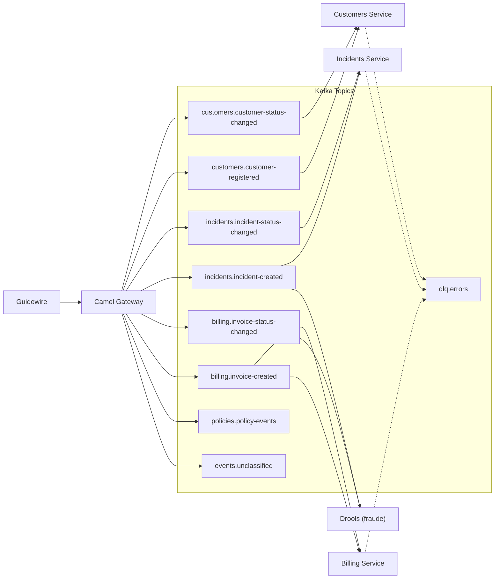

# Apache Kafka (KRaft) — Documentación

## Descripción

Broker de eventos en modo **KRaft** (sin ZooKeeper). Actúa como backbone de la arquitectura event-driven (EDA). Todos los eventos del ecosistema Guidewire fluyen por Kafka.

## Configuración

| Parámetro | Valor |
|-----------|-------|
| Operador | Strimzi v0.50.0 (via OLM) |
| Versión Kafka | **4.0.0** |
| API CRD | `kafka.strimzi.io/v1` |
| Modo | KRaft (controller + broker en un nodo, via KafkaNodePool) |
| Puerto | **9092** |
| Retención | 7 días (168 horas) |
| Particiones por defecto | 3 |
| Auto-create topics | **Deshabilitado** |

### KafkaNodePool

Strimzi v0.50.0 requiere un recurso `KafkaNodePool` para definir réplicas, roles y almacenamiento. El CR `Kafka` ya no acepta estos campos inline.

```yaml
apiVersion: kafka.strimzi.io/v1
kind: KafkaNodePool
metadata:
  name: kafka-pool
  labels:
    strimzi.io/cluster: kafka-cluster
spec:
  replicas: 1
  roles: [controller, broker]
  storage:
    type: persistent-claim
    size: 5Gi
```

El CR `Kafka` debe incluir las anotaciones de KRaft:

```yaml
annotations:
  strimzi.io/kraft: enabled
  strimzi.io/node-pools: enabled
```

## DNS (OpenShift)

| Contexto | Dirección |
|----------|-----------|
| Mismo namespace | `kafka-cluster-kafka-bootstrap:9092` |
| Cross-namespace | `kafka-cluster-kafka-bootstrap.guidewire-infra.svc.cluster.local:9092` |

## Topics

| Topic | Particiones | Retención | Descripción |
|-------|-------------|-----------|-------------|
| `billing.invoice-created` | 3 | 7 días | Factura creada en BillingCenter |
| `billing.invoice-status-changed` | 3 | 7 días | Cambio de estado de factura |
| `incidents.incident-created` | 3 | 7 días | Siniestro abierto en ClaimCenter |
| `incidents.incident-status-changed` | 3 | 7 días | Cambio de estado de siniestro |
| `customers.customer-registered` | 3 | 7 días | Nuevo cliente registrado |
| `customers.customer-status-changed` | 3 | 7 días | Cambio de estado de cliente |
| `policies.policy-events` | 3 | 7 días | Eventos de pólizas desde PolicyCenter |
| `events.unclassified` | 1 | 30 días | Eventos no clasificados (fallback) |
| `dlq.errors` | 1 | 30 días | Dead Letter Queue |

## Flujo de eventos



## Monitoreo — Kafdrop

| Parámetro | Valor |
|-----------|-------|
| Imagen | `docker.io/obsidiandynamics/kafdrop:4.0.1` |
| Puerto | **9000** |
| URL | https://kafdrop-guidewire-infra.apps-crc.testing |

Kafdrop permite inspeccionar topics, particiones, consumer groups y mensajes individuales.

## Comandos útiles (oc CLI)

> **Nota**: Con Strimzi + KafkaNodePool el pod se llama `kafka-cluster-kafka-pool-0` (no `kafka-cluster-kafka-0`).

```bash
# Listar topics
oc exec -n guidewire-infra kafka-cluster-kafka-pool-0 -- bin/kafka-topics.sh --bootstrap-server localhost:9092 --list

# Describir un topic
oc exec -n guidewire-infra kafka-cluster-kafka-pool-0 -- bin/kafka-topics.sh --bootstrap-server localhost:9092 --describe --topic billing.invoice-created

# Producir mensaje de prueba
echo '{"test": true}' | oc exec -i -n guidewire-infra kafka-cluster-kafka-pool-0 -- bin/kafka-console-producer.sh --bootstrap-server localhost:9092 --topic billing.invoice-created

# Consumir mensajes
oc exec -n guidewire-infra kafka-cluster-kafka-pool-0 -- bin/kafka-console-consumer.sh --bootstrap-server localhost:9092 --topic billing.invoice-created --from-beginning

# Ver consumer groups
oc exec -n guidewire-infra kafka-cluster-kafka-pool-0 -- bin/kafka-consumer-groups.sh --bootstrap-server localhost:9092 --list
```

## Garantías de entrega

| Configuración | Valor | Descripción |
|--------------|-------|-------------|
| `acks` | `all` | Todos los replicas confirman |
| `min.insync.replicas` | `1` | POC (en prod: 2+) |
| `enable.auto.commit` | `false` | Commit manual de offsets |
| `auto.offset.reset` | `earliest` | Consumir desde el inicio |

## Spec de referencia

- [spec.yml](../../../infra/kafka/spec.yml)
- Issue: [#29](../../../../issues/29)
