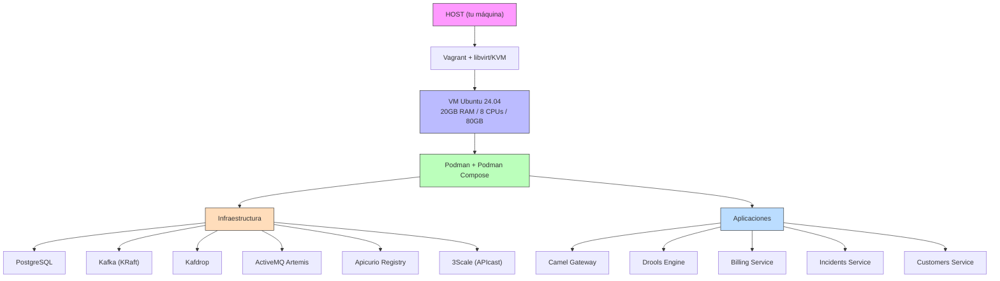

# Lab Environment — Documentación

## Descripción

Entorno de laboratorio completamente aislado. Nada se instala en el host excepto Vagrant + libvirt/KVM. Dentro de la VM corre todo con Podman + Podman Compose.

## Arquitectura



## Requisitos del Host

Solo necesitas instalar:

```bash
# Ubuntu/Debian
sudo apt install vagrant qemu-kvm libvirt-daemon-system virt-manager
vagrant plugin install vagrant-libvirt

# Fedora
sudo dnf install vagrant libvirt qemu-kvm virt-manager
vagrant plugin install vagrant-libvirt
```

**NO necesitas**: Docker, Java, Node.js, Maven, ni ninguna herramienta de desarrollo.

## Ciclo de Vida

### Desde el HOST

| Acción | Comando | Descripción |
|--------|---------|-------------|
| Encender | `vagrant up` | Crea/enciende la VM |
| Apagar | `vagrant halt` | Apaga la VM (datos persisten) |
| Suspender | `vagrant suspend` | Congela en memoria |
| Reanudar | `vagrant resume` | Retoma instantáneamente |
| Destruir | `vagrant destroy -f` | Elimina la VM |
| SSH | `vagrant ssh` | Entrar a la VM |

### Dentro de la VM

| Acción | Comando |
|--------|---------|
| Levantar stack | `cd ~/lab-guidewire/podman && podman-compose up -d` |
| Detener stack | `podman-compose down` |
| Ver logs | `podman-compose logs -f [servicio]` |
| Estado | `podman-compose ps` |
| Reconstruir | `podman-compose up -d --build [servicio]` |
| Limpiar todo | `podman-compose down -v && podman system prune -af` |

## Snapshots (puntos de restauración)

```bash
# Guardar estado
virsh snapshot-create-as lab-guidewire_default snap-infra-ok

# Listar snapshots
virsh snapshot-list lab-guidewire_default

# Restaurar
virsh snapshot-revert lab-guidewire_default snap-infra-ok
```

## Puertos Accesibles

Todos los puertos están forwarded al host. Accede desde tu navegador:

| Puerto | Servicio | URL |
|--------|----------|-----|
| 8000 | 3Scale Gateway | http://localhost:8000 |
| 8081 | Apicurio UI | http://localhost:8081 |
| 8161 | ActiveMQ Console | http://localhost:8161/console |
| 9000 | Kafdrop | http://localhost:9000 |

## Recursos

| Recurso | VM | Contenedores | Libre |
|---------|-----|-------------|-------|
| RAM | 20 GB | ~5.5 GB | ~14.5 GB |
| CPU | 8 cores | ~4 cores | ~4 cores |
| Disco | 80 GB | ~10 GB | ~70 GB |

## Estructura de Archivos

```
lab/
├── Vagrantfile
├── provision/
│   ├── setup.sh                 # Provisioning base (Podman)
│   └── install-dev-tools.sh     # Herramientas dev (opcional)
└── podman/
    ├── podman-compose.yml       # Stack completo
    ├── .env                     # Variables de entorno
    └── config/
        ├── init-db.sql          # Init PostgreSQL
        ├── create-topics.sh     # Crear topics Kafka
        └── apicast-config.json  # Config 3Scale
```

## Spec de referencia

- [spec.yml](../../../infra/lab-environment/spec.yml)
- Issue: [#34](../../../../issues/34)
