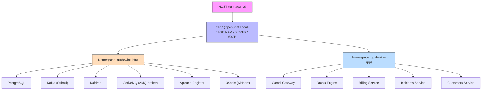

# Lab Environment — Documentación

> [Volver a OpenSpecs](../../../README.md) · [Volver al README principal](../../../../README.md)

## Descripción

Entorno de laboratorio sobre CRC (OpenShift Local). Dos namespaces organizan el stack: `guidewire-infra` para infraestructura (PostgreSQL, Kafka, ActiveMQ, Apicurio, 3Scale, Kafdrop) y `guidewire-apps` para los microservicios de negocio. Todo se despliega con manifiestos Kubernetes nativos via `oc apply`.

## Arquitectura



## Requisitos del Host

Solo necesitas instalar:

```bash
# 1. Descargar CRC desde la consola de Red Hat
#    https://console.redhat.com/openshift/create/local

# 2. Instalar y configurar
crc setup
crc start --cpus 6 --memory 14336 --disk-size 60
```

**Necesitas**: Cuenta gratuita en Red Hat (para descargar CRC y el pull secret).

**NO necesitas**: Docker, Podman, Java, Node.js, Maven, ni ninguna herramienta de desarrollo.

## Ciclo de Vida

### Desde el HOST

| Accion | Comando | Descripcion |
|--------|---------|-------------|
| Encender | `crc start` | Inicia el cluster OpenShift |
| Apagar | `crc stop` | Detiene el cluster (datos persisten) |
| Estado | `crc status` | Muestra estado del cluster |
| Consola web | `crc console` | Abre la consola OpenShift en el navegador |
| Destruir | `crc delete` | Elimina el cluster completo |
| Config oc | `eval $(crc oc-env)` | Configura el CLI `oc` en tu shell |
| Login | `oc login -u developer -p developer https://api.crc.testing:6443` | Autenticarse (o usar `KUBECONFIG=~/.crc/machines/crc/kubeconfig`) |

### Operaciones con oc

| Accion | Comando |
|--------|---------|
| Ver pods | `oc get pods -n guidewire-infra` |
| Ver logs | `oc logs -f deploy/billing-service -n guidewire-apps` |
| Shell en pod | `oc exec -it deploy/postgres -n guidewire-infra -- bash` |
| Reconstruir imagen | `oc start-build billing-service -n guidewire-apps --from-dir=../../components/billing-service --follow` |
| Escalar | `oc scale deploy/billing-service --replicas=2 -n guidewire-apps` |
| Borrar namespace | `oc delete project guidewire-infra guidewire-apps` |
| Desplegar todo | `cd lab/openshift && ./deploy-all.sh` |
| Solo infra | `./deploy-all.sh --infra` |
| Solo apps | `./deploy-all.sh --apps` |

## Routes (servicios accesibles)

Los servicios se exponen como Routes de OpenShift con TLS automatico:

| Servicio | URL |
|----------|-----|
| OpenShift Console | https://console-openshift-console.apps-crc.testing |
| 3Scale Gateway | https://apicast-guidewire-infra.apps-crc.testing |
| Apicurio UI | https://apicurio-guidewire-infra.apps-crc.testing |
| Kafdrop | https://kafdrop-guidewire-infra.apps-crc.testing |
| Billing Service | https://billing-service-guidewire-apps.apps-crc.testing |
| Incidents Service | https://incidents-service-guidewire-apps.apps-crc.testing |
| Customers Service | https://customers-service-guidewire-apps.apps-crc.testing |
| Camel Gateway | https://camel-gateway-guidewire-apps.apps-crc.testing |
| Drools Engine | https://drools-engine-guidewire-apps.apps-crc.testing |

## Recursos

| Recurso | CRC (cluster) | Stack estimado | Libre |
|---------|---------------|----------------|-------|
| RAM | 14 GB | ~6 GB | ~8 GB |
| CPU | 6 cores | ~4 cores | ~2 cores |
| Disco | 60 GB | ~15 GB | ~45 GB |

> **Nota**: CRC reserva recursos para el propio OpenShift (~3-4GB RAM para etcd, API server, ingress, etc.). El stack Guidewire usa ~6GB adicionales.

## Estructura de Archivos

```
lab/openshift/
├── deploy-all.sh                  # Script de despliegue completo
├── namespaces.yml                 # guidewire-infra + guidewire-apps
├── operators/
│   ├── strimzi-subscription.yml   # Operador Strimzi (Kafka)
│   ├── amq-broker-subscription.yml# Operador AMQ Broker (ActiveMQ)
│   └── apicurio-subscription.yml  # Operador Apicurio Registry
├── infra/
│   ├── postgres/
│   │   ├── secret.yml
│   │   ├── configmap-init-db.yml
│   │   ├── pvc.yml
│   │   ├── deployment.yml
│   │   └── service.yml
│   ├── kafka/
│   │   ├── kafka-cluster.yml      # Strimzi Kafka CR
│   │   └── kafka-topics.yml       # KafkaTopic CRs
│   ├── activemq/
│   │   ├── activemq-broker.yml    # ActiveMQArtemis CR
│   │   └── activemq-addresses.yml # ActiveMQArtemisAddress CRs
│   ├── apicurio/
│   │   └── apicurio-registry.yml  # ApicurioRegistry CR
│   ├── kafdrop/
│   │   ├── deployment.yml
│   │   ├── service.yml
│   │   └── route.yml
│   └── threescale/
│       ├── configmap-apicast.yml
│       ├── deployment.yml
│       ├── service.yml
│       └── route.yml
└── apps/
    ├── billing-service/
    │   ├── buildconfig.yml
    │   ├── deployment.yml
    │   ├── service.yml
    │   └── route.yml
    ├── camel-gateway/
    │   └── ...
    ├── incidents-service/
    │   └── ...
    ├── customers-service/
    │   └── ...
    └── drools-engine/
        └── ...
```

## Spec de referencia

- [spec.yml](../../../infra/lab-environment/spec.yml)
- Issue: [#34](../../../../issues/34)

---

## Documentación relacionada

- [UNINSTALL.md](../../../../../lab/openshift/UNINSTALL.md) — Guía de desinstalación del entorno OpenShift
