# 3Scale API Gateway (APIcast) — Documentacion

> [Volver a OpenSpecs](../../../README.md) · [Volver al README principal](../../../../README.md)

API Gateway empresarial que actua como **punto de entrada unico** para todas las APIs del ecosistema Guidewire. Proporciona autenticacion por API Key, rate limiting por servicio, CORS y enrutamiento a los 5 backends. Desplegado como APIcast standalone (sin base de datos) con configuracion declarativa JSON.

---

## Tabla de Contenidos

1. [Que es 3Scale APIcast](#que-es-3scale-apicast)
2. [Rol en la Arquitectura](#rol-en-la-arquitectura)
3. [Configuracion](#configuracion)
4. [Autenticacion](#autenticacion)
5. [Rate Limiting](#rate-limiting)
6. [Tabla de Rutas](#tabla-de-rutas)
7. [Cadena de Politicas](#cadena-de-politicas)
8. [Metricas por Endpoint](#metricas-por-endpoint)
9. [Despliegue en OpenShift](#despliegue-en-openshift)
10. [Ejemplos de Uso](#ejemplos-de-uso)
11. [Documentacion relacionada](#documentacion-relacionada)

---

## Que es 3Scale APIcast

**3Scale** es la plataforma de gestion de APIs de Red Hat. En produccion, 3Scale incluye un portal de desarrollador, analytics, monetizacion y gestion de planes. En este POC usamos solo el componente **APIcast** (el gateway de proxy) en modo **standalone**, que es suficiente para demostrar:

- Autenticacion centralizada (API Key)
- Rate limiting diferenciado por servicio
- Enrutamiento a multiples backends
- CORS para consumidores frontend
- Metricas de uso por endpoint

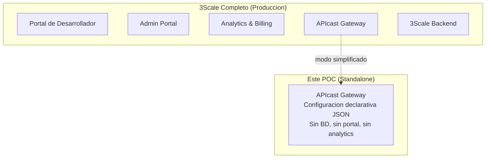

> **APIcast standalone** = el gateway puro de 3Scale, configurado via archivo JSON en vez de la API de 3Scale. Ideal para POCs y entornos de laboratorio.

---

## Rol en la Arquitectura

APIcast es el **unico punto de entrada externo** al ecosistema. Todas las peticiones de clientes pasan por el gateway antes de llegar a los microservicios.

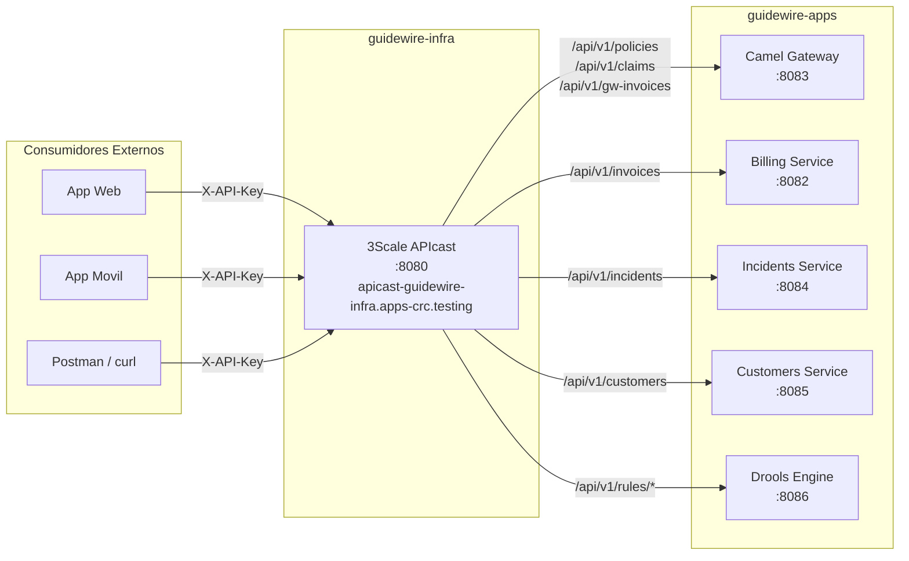

### Flujo de una peticion

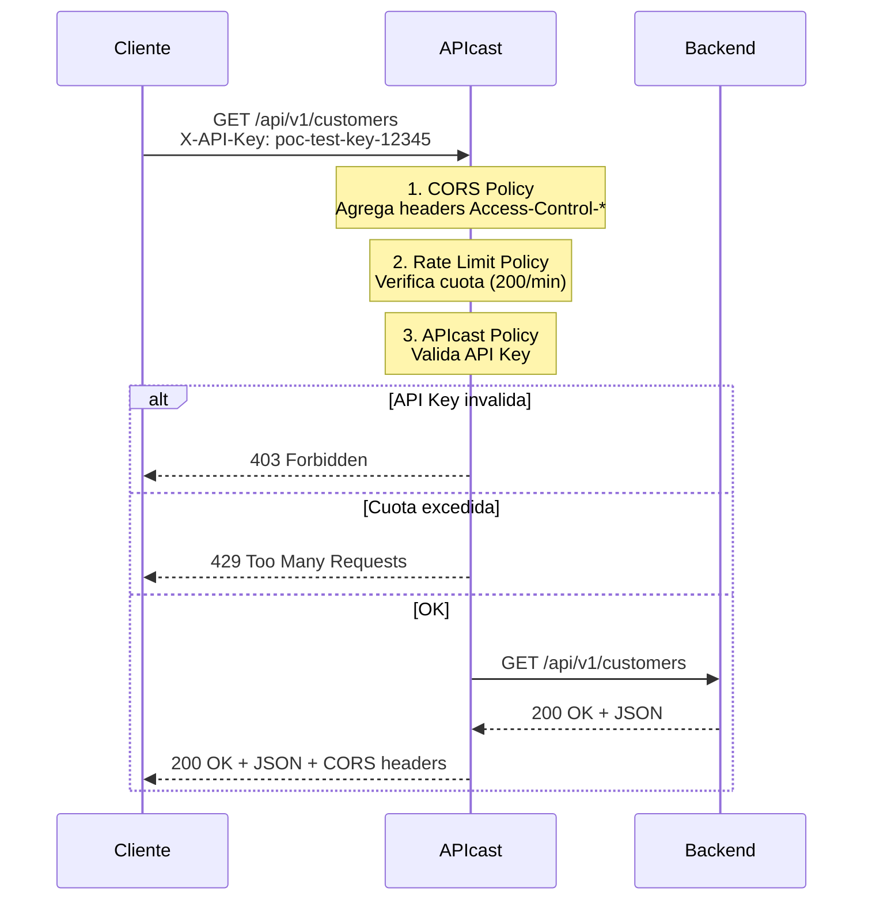

### Por que usar un API Gateway

| Sin Gateway | Con Gateway (APIcast) |
|-------------|----------------------|
| Cada servicio implementa su propia autenticacion | Autenticacion centralizada en un solo punto |
| No hay control de trafico | Rate limiting por servicio (100-300 req/min) |
| CORS configurado en cada servicio | CORS centralizado y consistente |
| Clientes deben conocer las URLs de cada servicio | Una sola URL de entrada para todas las APIs |
| Sin metricas de uso | Metricas por endpoint automaticas |
| Sin proteccion contra abuso | Proteccion contra DDoS/abuso via rate limiting |

---

## Configuracion

APIcast se configura con un archivo JSON montado como ConfigMap. No necesita base de datos ni conexion a 3Scale SaaS.

### Estructura del archivo de configuracion

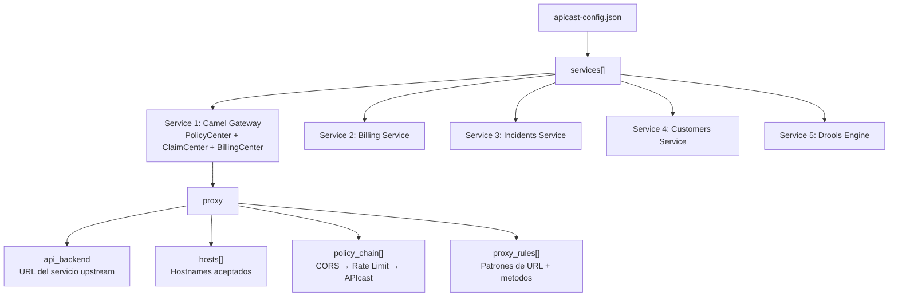

### Parametros por servicio

Cada servicio en el JSON define:

| Campo | Descripcion | Ejemplo |
|-------|-------------|---------|
| `id` | Identificador unico del servicio | `1` |
| `backend_version` | Version del protocolo backend | `1` (API Key) |
| `proxy.api_backend` | URL del servicio upstream | `http://billing-service.guidewire-apps.svc.cluster.local:8082` |
| `proxy.hosts` | Hostnames que acepta el gateway | `["apicast-guidewire-infra.apps-crc.testing"]` |
| `proxy.policy_chain` | Cadena de politicas (CORS, Rate Limit, APIcast) | Ver seccion Cadena de Politicas |
| `proxy.proxy_rules` | Reglas de enrutamiento por patron URL | Ver seccion Tabla de Rutas |

### Variables de entorno del contenedor

| Variable | Valor | Descripcion |
|----------|-------|-------------|
| `THREESCALE_CONFIG_FILE` | `/opt/app-root/src/config/apicast-config.json` | Ruta al archivo de configuracion |
| `APICAST_LOG_LEVEL` | `info` | Nivel de log (`debug`, `info`, `warn`, `error`) |
| `THREESCALE_DEPLOYMENT_ENV` | `production` | Modo de despliegue |

---

## Autenticacion

### API Key

Todas las peticiones requieren un header `X-API-Key` con una clave valida.

| Parametro | Valor |
|-----------|-------|
| Header | `X-API-Key` |
| Clave de test | `poc-test-key-12345` |
| Metodo | `backend_version: 1` (API Key simple) |

### Respuestas de autenticacion

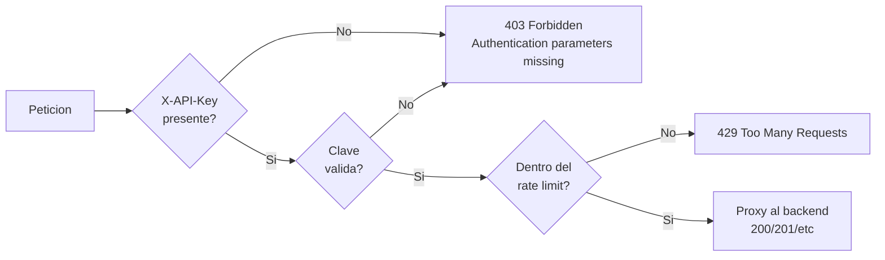

---

## Rate Limiting

APIcast implementa **fixed-window rate limiting** por servicio. Cada servicio tiene una cuota independiente de peticiones por minuto.

### Cuotas por servicio

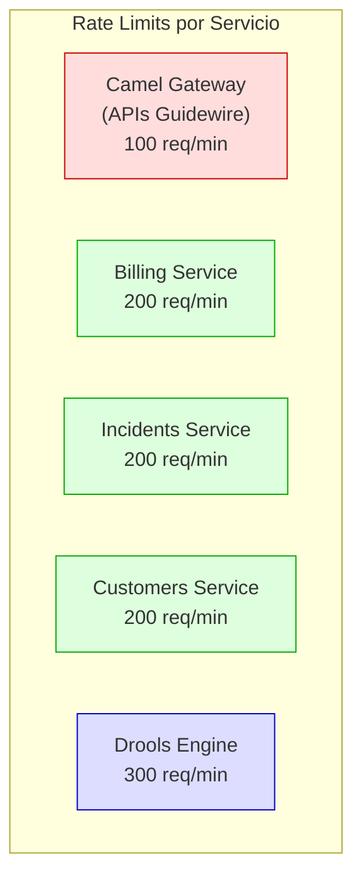

| Servicio | Cuota | Ventana | Razon |
|----------|-------|---------|-------|
| Camel Gateway (PolicyCenter, ClaimCenter, BillingCenter) | **100 req/min** | 60s | APIs Guidewire — menor carga esperada, proteccion del sistema core |
| Billing Service | **200 req/min** | 60s | Microservicio interno — trafico moderado |
| Incidents Service | **200 req/min** | 60s | Microservicio interno — trafico moderado |
| Customers Service | **200 req/min** | 60s | Microservicio interno — trafico moderado |
| Drools Engine | **300 req/min** | 60s | Motor de reglas — invocado por multiples servicios, mayor carga |

### Respuesta al exceder la cuota

```
HTTP/1.1 429 Too Many Requests
X-RateLimit-Limit: 200
X-RateLimit-Remaining: 0
Retry-After: 60
Content-Type: text/plain

Rate limit exceeded
```

### Algoritmo: Fixed Window

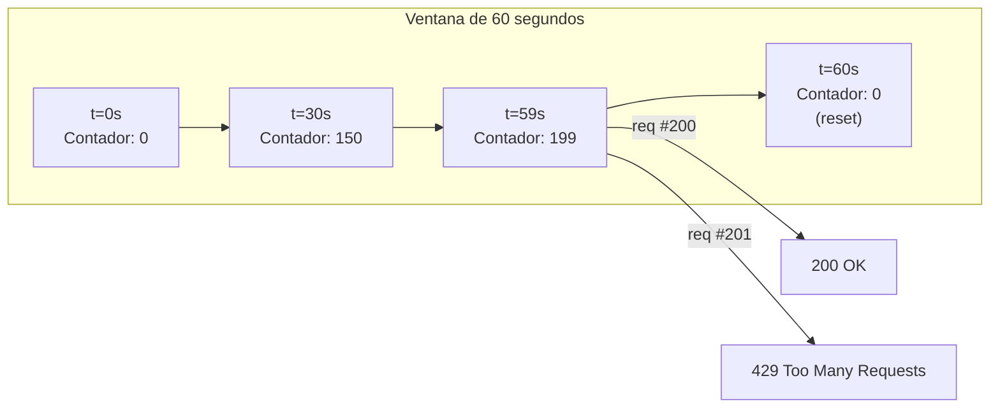

---

## Tabla de Rutas

Todas las APIs se exponen a traves de un unico hostname: `apicast-guidewire-infra.apps-crc.testing`

### Camel Gateway (id: 1) — 100 req/min

| Ruta | Metodo | Backend | Metrica |
|------|--------|---------|---------|
| `/api/v1/policies` | GET | camel-gateway:8083 | `policies_get` |
| `/api/v1/policies` | POST | camel-gateway:8083 | `policies_post` |
| `/api/v1/policies/{id}` | GET | camel-gateway:8083 | `policies_get_by_id` |
| `/api/v1/policies/{id}` | PATCH | camel-gateway:8083 | `policies_patch` |
| `/api/v1/claims` | GET | camel-gateway:8083 | `claims_get` |
| `/api/v1/claims` | POST | camel-gateway:8083 | `claims_post` |
| `/api/v1/claims/{id}` | GET | camel-gateway:8083 | `claims_get_by_id` |
| `/api/v1/claims/{id}` | PATCH | camel-gateway:8083 | `claims_patch` |
| `/api/v1/gw-invoices` | GET | camel-gateway:8083 | `gw_invoices_get` |
| `/api/v1/gw-invoices` | POST | camel-gateway:8083 | `gw_invoices_post` |

### Billing Service (id: 2) — 200 req/min

| Ruta | Metodo | Backend | Metrica |
|------|--------|---------|---------|
| `/api/v1/invoices` | GET | billing-service:8082 | `invoices_get` |
| `/api/v1/invoices` | POST | billing-service:8082 | `invoices_post` |
| `/api/v1/invoices/{id}` | GET | billing-service:8082 | `invoices_get_by_id` |
| `/api/v1/invoices/{id}` | PATCH | billing-service:8082 | `invoices_patch` |

### Incidents Service (id: 3) — 200 req/min

| Ruta | Metodo | Backend | Metrica |
|------|--------|---------|---------|
| `/api/v1/incidents` | GET | incidents-service:8084 | `incidents_get` |
| `/api/v1/incidents` | POST | incidents-service:8084 | `incidents_post` |
| `/api/v1/incidents/{id}` | GET | incidents-service:8084 | `incidents_get_by_id` |
| `/api/v1/incidents/{id}` | PATCH | incidents-service:8084 | `incidents_patch` |

### Customers Service (id: 4) — 200 req/min

| Ruta | Metodo | Backend | Metrica |
|------|--------|---------|---------|
| `/api/v1/customers` | GET | customers-service:8085 | `customers_get` |
| `/api/v1/customers` | POST | customers-service:8085 | `customers_post` |
| `/api/v1/customers/{id}` | GET | customers-service:8085 | `customers_get_by_id` |
| `/api/v1/customers/{id}` | PATCH | customers-service:8085 | `customers_patch` |

### Drools Engine (id: 5) — 300 req/min

| Ruta | Metodo | Backend | Metrica |
|------|--------|---------|---------|
| `/api/v1/rules/fraud-check` | POST | drools-engine:8086 | `rules_fraud_check` |
| `/api/v1/rules/validate-policy` | POST | drools-engine:8086 | `rules_validate_policy` |
| `/api/v1/rules/calculate-commission` | POST | drools-engine:8086 | `rules_calculate_commission` |
| `/api/v1/rules/route-incident` | POST | drools-engine:8086 | `rules_route_incident` |

### Resumen: 26 proxy rules totales

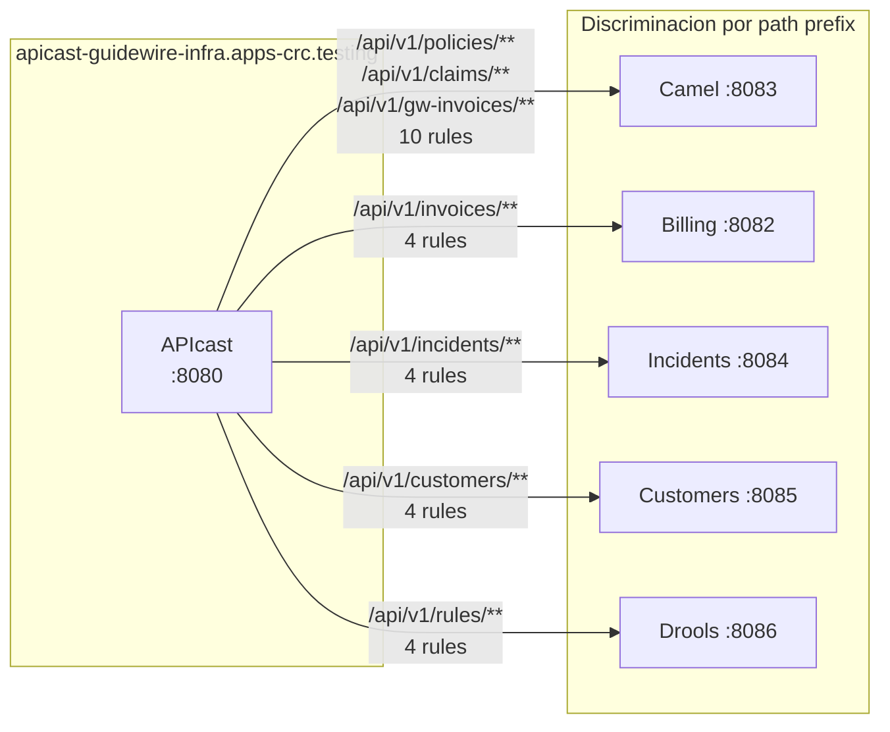

> **Nota**: los 5 services comparten los mismos `hosts` en la configuracion, por lo que APIcast **no discrimina por hostname sino por path prefix**. Esto funciona porque cada servicio expone paths unicos (`/policies`, `/invoices`, `/incidents`, `/customers`, `/rules`).

---

## Cadena de Politicas

Cada peticion pasa por una cadena de 3 politicas en orden. Todas las peticiones, de todos los servicios, usan la misma cadena.

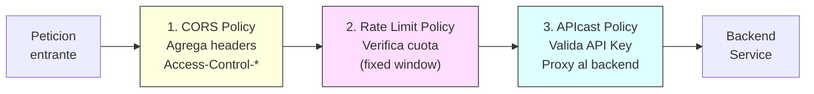

### 1. Politica CORS

Agrega los headers CORS a todas las respuestas para permitir que aplicaciones web (SPAs, frontends) consuman las APIs desde cualquier origen.

| Parametro | Valor |
|-----------|-------|
| `allow_origin` | `*` (todos los origenes) |
| `allow_methods` | GET, POST, PUT, PATCH, DELETE, OPTIONS |
| `allow_headers` | Content-Type, X-API-Key, Authorization, Accept |
| `allow_credentials` | false |

### 2. Politica de Rate Limiting

Aplica un limitador de ventana fija por servicio. Cada servicio tiene su propio contador independiente.

```json
{
  "name": "apicast.policy.rate_limit",
  "configuration": {
    "fixed_window_limiters": [
      {
        "key": { "name": "customers-limiter" },
        "count": 200,
        "window": 60
      }
    ]
  }
}
```

### 3. Politica APIcast

La politica principal del gateway. Valida la API Key, resuelve el backend upstream y hace el proxy de la peticion.

---

## Metricas por Endpoint

APIcast registra una metrica por cada peticion que llega. Cada `proxy_rule` define un `metric_system_name` y un `delta` (cuanto incrementar el contador por peticion).

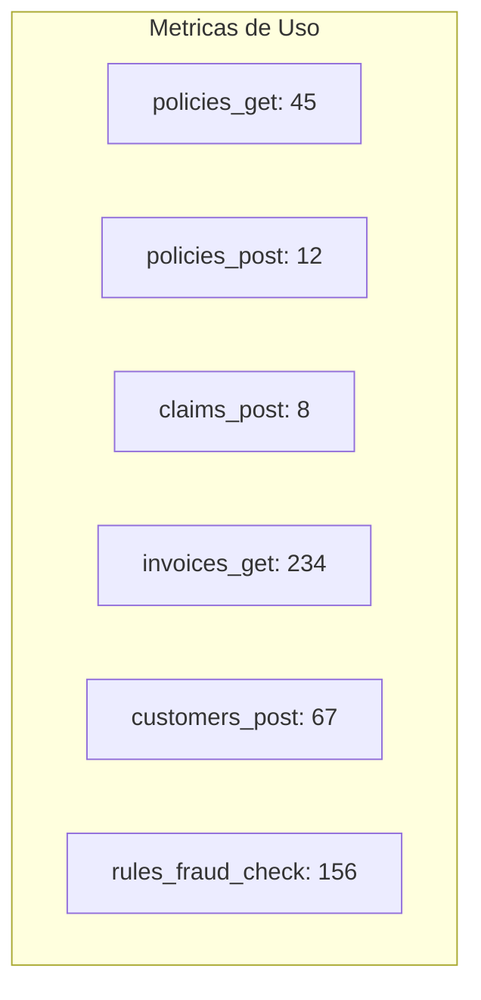

### Metricas disponibles

| Grupo | Metricas |
|-------|----------|
| PolicyCenter | `policies_get`, `policies_post`, `policies_get_by_id`, `policies_patch` |
| ClaimCenter | `claims_get`, `claims_post`, `claims_get_by_id`, `claims_patch` |
| BillingCenter | `gw_invoices_get`, `gw_invoices_post` |
| Billing Service | `invoices_get`, `invoices_post`, `invoices_get_by_id`, `invoices_patch` |
| Incidents Service | `incidents_get`, `incidents_post`, `incidents_get_by_id`, `incidents_patch` |
| Customers Service | `customers_get`, `customers_post`, `customers_get_by_id`, `customers_patch` |
| Drools Engine | `rules_fraud_check`, `rules_validate_policy`, `rules_calculate_commission`, `rules_route_incident` |

---

## Despliegue en OpenShift

### Manifiestos

| Archivo | Tipo | Descripcion |
|---------|------|-------------|
| `configmap-apicast.yml` | ConfigMap | Configuracion JSON completa del gateway |
| `deployment.yml` | Deployment | Pod APIcast con 1 replica |
| `service.yml` | Service | ClusterIP en puertos 8080 (proxy) y 8090 (management) |
| `route.yml` | Route | Expone el gateway externamente |

### Recursos del pod

| Recurso | Request | Limit |
|---------|---------|-------|
| CPU | 100m | 250m |
| Memoria | 128Mi | 256Mi |

### Health probes

| Probe | Endpoint | Puerto | Initial Delay | Period |
|-------|----------|--------|---------------|--------|
| Readiness | `/status/ready` | 8090 (management) | 10s | 10s |
| Liveness | `/status/live` | 8090 (management) | 15s | 15s |

### DNS y acceso

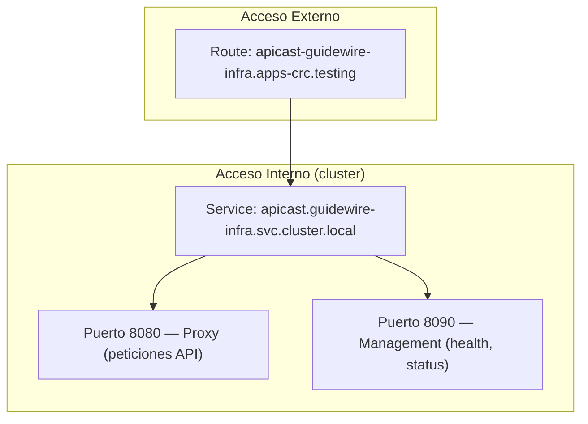

| Contexto | URL |
|----------|-----|
| Externo (navegador/curl) | `http://apicast-guidewire-infra.apps-crc.testing` |
| Interno (mismo namespace) | `http://apicast:8080` |
| Interno (cross-namespace) | `http://apicast.guidewire-infra.svc.cluster.local:8080` |
| Management | `http://apicast.guidewire-infra.svc.cluster.local:8090` |

### Orden de despliegue (deploy-all.sh)

APIcast se despliega en la **Fase 8** (despues de toda la infraestructura y antes de las aplicaciones):

```
Fase 1:  Namespaces
Fase 2:  Operadores (Strimzi, Apicurio)
Fase 3:  PostgreSQL
Fase 4:  Kafka
Fase 5:  Apicurio Registry
Fase 6:  Kafdrop
Fase 7:  3Scale APIcast  ← aqui
Fase 8:  Application BuildConfigs
Fase 9:  Build images
Fase 10: Deploy applications
```

---

## Ejemplos de Uso

### Peticion basica con API Key

```bash
# Listar clientes via gateway
curl -H "X-API-Key: poc-test-key-12345" \
  http://apicast-guidewire-infra.apps-crc.testing/api/v1/customers
```

### Crear un recurso via gateway

```bash
# Crear cliente via gateway
curl -X POST \
  -H "X-API-Key: poc-test-key-12345" \
  -H "Content-Type: application/json" \
  http://apicast-guidewire-infra.apps-crc.testing/api/v1/customers \
  -d '{
    "firstName": "Maria",
    "lastName": "Garcia Lopez",
    "email": "maria.garcia@example.com",
    "documentType": "RFC",
    "documentNumber": "GALM850101ABC"
  }'
```

### Sin API Key (error 403)

```bash
curl http://apicast-guidewire-infra.apps-crc.testing/api/v1/customers
# → 403 Forbidden: Authentication parameters missing
```

### Evaluacion de fraude via gateway

```bash
curl -X POST \
  -H "X-API-Key: poc-test-key-12345" \
  -H "Content-Type: application/json" \
  http://apicast-guidewire-infra.apps-crc.testing/api/v1/rules/fraud-check \
  -d '{
    "claimId": "CLM-001",
    "customerId": "CUST-001",
    "claimedAmount": 750000,
    "claimType": "THEFT",
    "hasPoliceReport": false
  }'
```

### Acceso directo (sin gateway) — solo para debug

Los servicios tambien son accesibles directamente via sus routes individuales (sin autenticacion ni rate limiting):

```bash
# Acceso directo al billing service (sin gateway, sin API Key)
curl http://billing-service-guidewire-apps.apps-crc.testing/api/v1/invoices

# Acceso via gateway (con API Key y rate limiting)
curl -H "X-API-Key: poc-test-key-12345" \
  http://apicast-guidewire-infra.apps-crc.testing/api/v1/invoices
```

### Verificar health del gateway

```bash
# Readiness (desde dentro del cluster o port-forward)
curl http://apicast.guidewire-infra.svc.cluster.local:8090/status/ready

# Logs del pod
oc logs -f deployment/apicast -n guidewire-infra
```

### Test de rate limiting

```bash
# Enviar 201 peticiones en rapida sucesion (cuota: 200/min)
for i in $(seq 1 201); do
  HTTP_CODE=$(curl -s -o /dev/null -w "%{http_code}" \
    -H "X-API-Key: poc-test-key-12345" \
    http://apicast-guidewire-infra.apps-crc.testing/api/v1/customers)
  echo "Request $i: HTTP $HTTP_CODE"
done
# Las primeras 200 devuelven 200, la 201 devuelve 429
```

---

## Comparativa: APIcast vs Alternativas

| Caracteristica | 3Scale APIcast | Kong | Traefik | Envoy |
|---------------|---------------|------|---------|-------|
| Ecosistema Red Hat | Nativo | No | No | No |
| Configuracion declarativa | JSON file | YAML/DB | YAML/Docker | xDS API |
| Rate limiting | Built-in | Plugin | Middleware | Filter |
| API Key auth | Built-in | Plugin | BasicAuth | Filter |
| CORS | Built-in | Plugin | Middleware | Filter |
| Footprint | ~128Mi | ~256Mi | ~64Mi | ~128Mi |
| OpenShift integration | Nativa | Manual | Manual | Istio |
| Uso en este POC | Si | No | No | No |

> **Decision**: Se eligio APIcast por la alineacion con el stack enterprise Red Hat (OpenShift, Fuse/Camel, AMQ Streams). Ver [ADR-006](../../architecture/README.md#adr-006-3scale-api-gateway) en la documentacion de arquitectura.

---

## Documentacion relacionada

- [Integracion y Testing E2E](../../integration/README.md) — registro de APIs y tests Postman
- [Camel Integration Gateway](../../components/camel-gateway/README.md) — backend principal del gateway
- [Arquitectura](../../architecture/README.md) — ADR-006 (3Scale vs alternativas)
- [DevOps / CI-CD](../../devops/README.md) — pipelines de despliegue

## Spec de referencia

- [spec.yml](../../../infra/threescale/spec.yml)
- [3Scale Registration spec.yml](../../../integration/threescale-registration/spec.yml)
- Issue: [#31](../../../../issues/31)
