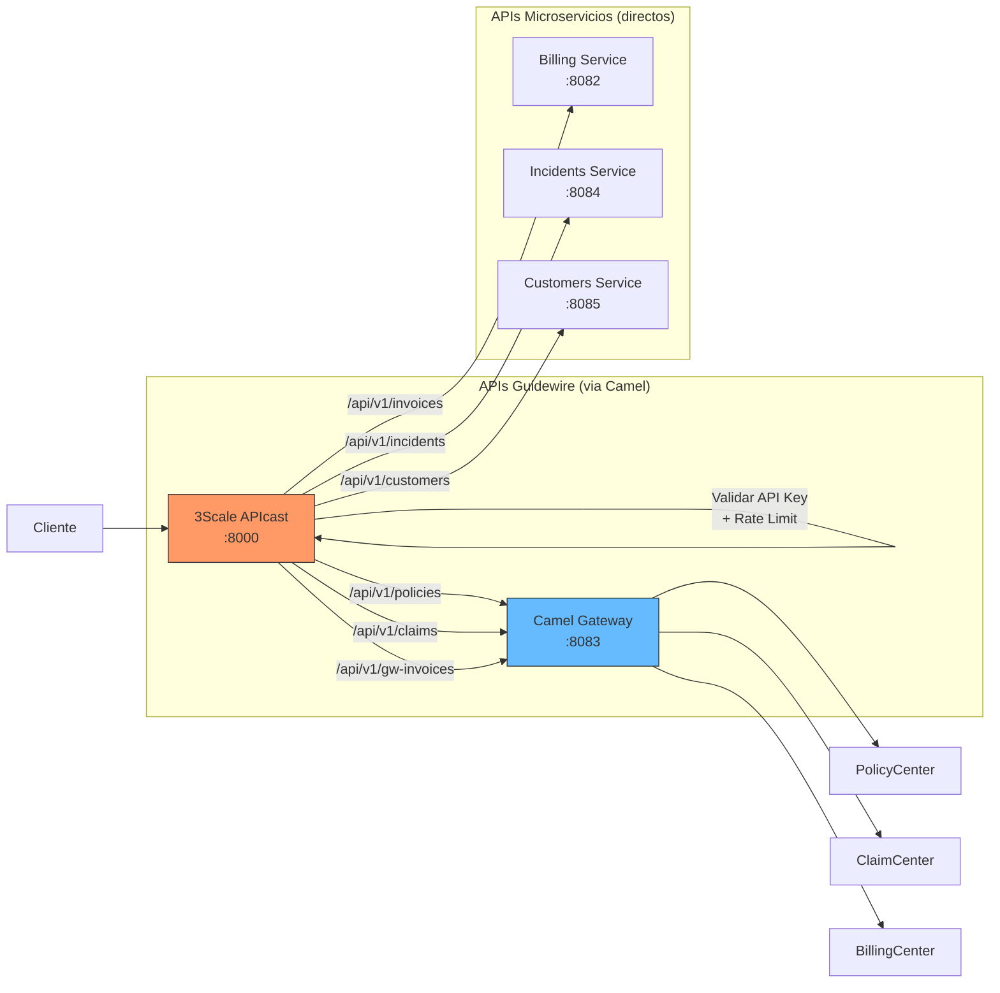

# 3Scale API Gateway — Documentación

## Descripción

API Gateway empresarial que expone todas las APIs del ecosistema. Gestiona autenticación (API Key), rate limiting, CORS y routing hacia los servicios internos.

## Configuración

| Parámetro | Valor |
|-----------|-------|
| Imagen | `quay.io/3scale/apicast:v3.11` |
| Puerto proxy | **8000** |
| Puerto management | **8001** |
| Modo | Standalone (config declarativa) |

## DNS (OpenShift)

| Contexto | Dirección |
|----------|-----------|
| Mismo namespace | `apicast:8080` |
| Route | `https://apicast-guidewire-infra.apps-crc.testing` |

## Servicios Registrados

### APIs Guidewire (via Camel Gateway)

| Servicio | Ruta | Upstream | Rate Limit |
|----------|------|----------|------------|
| PolicyCenter | `/api/v1/policies` | `camel-gateway.guidewire-apps.svc.cluster.local:8083` | 100 req/min |
| ClaimCenter | `/api/v1/claims` | `camel-gateway.guidewire-apps.svc.cluster.local:8083` | 100 req/min |
| BillingCenter | `/api/v1/gw-invoices` | `camel-gateway.guidewire-apps.svc.cluster.local:8083` | 100 req/min |

### APIs Microservicios (directos)

| Servicio | Ruta | Upstream | Rate Limit |
|----------|------|----------|------------|
| Billing | `/api/v1/invoices` | `billing-service.guidewire-apps.svc.cluster.local:8082` | 200 req/min |
| Incidents | `/api/v1/incidents` | `incidents-service.guidewire-apps.svc.cluster.local:8084` | 200 req/min |
| Customers | `/api/v1/customers` | `customers-service.guidewire-apps.svc.cluster.local:8085` | 200 req/min |

## Autenticación

Todas las APIs requieren API Key en el header `X-API-Key`:

```bash
# Request sin key → 403
curl https://apicast-guidewire-infra.apps-crc.testing/api/v1/customers

# Request con key → 200
curl -H "X-API-Key: poc-test-key-12345" https://apicast-guidewire-infra.apps-crc.testing/api/v1/customers
```

## Rate Limiting

Al exceder el límite se recibe HTTP 429:

```
HTTP/1.1 429 Too Many Requests
X-RateLimit-Limit: 100
X-RateLimit-Remaining: 0
Retry-After: 60
```

## Flujo de Request



## Spec de referencia

- [spec.yml](../../../infra/threescale/spec.yml)
- Issue: [#31](../../../../issues/31)
