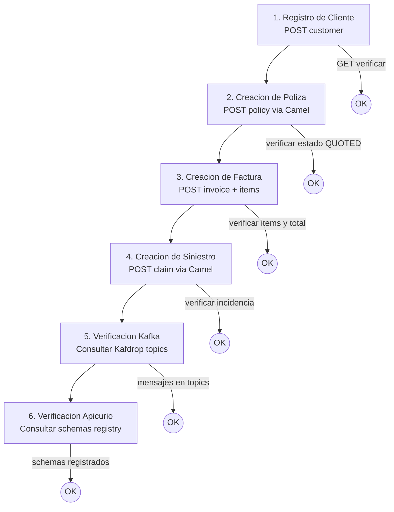

# Integración y Testing E2E — Documentación

> [Volver a OpenSpecs](../../README.md) · [Volver al README principal](../../../README.md)

## 3Scale API Registration

Registro de las APIs en el gateway 3Scale (ver [3Scale docs](../infra/threescale/README.md) para detalle completo de las 26 proxy rules):

| API | OpenAPI Source | Plan | Rate Limit |
|-----|---------------|------|------------|
| PolicyCenter | `policycenter-api.yml` | guidewire-standard | 100 req/min |
| ClaimCenter | `claimcenter-api.yml` | guidewire-standard | 100 req/min |
| BillingCenter | `billingcenter-api.yml` | guidewire-standard | 100 req/min |
| Billing Service | `billing-service-api.yml` | microservices-standard | 200 req/min |
| Incidents Service | `incidents-service-api.yml` | microservices-standard | 200 req/min |
| Customers Service | `customers-service-api.yml` | microservices-standard | 200 req/min |
| Drools Engine | `drools-engine-api.yml` | microservices-standard | 300 req/min |

## Diagrama de Routing 3Scale

```mermaid
graph LR
    CLIENT[API Consumer] --> GW[3Scale Gateway]

    subgraph guidewire-standard plan<br>100 req/min
        GW --> PC[PolicyCenter]
        GW --> CC[ClaimCenter]
        GW --> BC[BillingCenter]
    end

    subgraph microservices-standard plan<br>200 req/min
        GW --> BS[Billing Service]
        GW --> IS[Incidents Service]
        GW --> CS[Customers Service]
    end
```

## Flujo E2E Tests



## Postman E2E Tests

### Flujos de prueba

1. **Registro de Cliente** — POST cliente → GET verificar
2. **Creación de Póliza** — POST póliza via Camel → verificar estado QUOTED
3. **Creación de Factura** — POST factura → verificar items y total
4. **Creación de Siniestro** — POST claim via Camel → verificar incidencia creada
5. **Verificación Kafka** — Consultar Kafdrop → mensajes en topics
6. **Verificación Apicurio** — Consultar registry → schemas registrados

### Ejecución con Newman

```bash
newman run contracts/postman/guidewire-e2e.postman_collection.json \
  -e contracts/postman/local.postman_environment.json \
  --reporters cli,junit \
  --reporter-junit-export reports/e2e-results.xml
```

## Specs de referencia

- [3Scale Registration spec.yml](../../integration/threescale-registration/spec.yml)
- [Postman E2E spec.yml](../../integration/postman-e2e/spec.yml)
- Issues: [#66](../../../issues/66), [#67](../../../issues/67)

## Documentacion relacionada

- [3Scale API Gateway (APIcast)](../infra/threescale/README.md)
- [DevOps / CI-CD](../devops/README.md)
